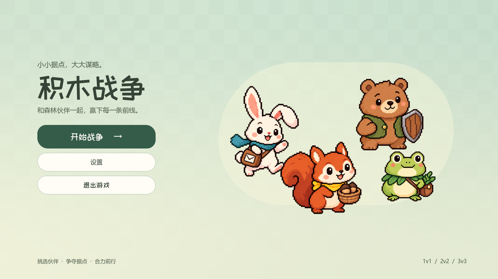

# 积木战争 · Block Conquest

Godot 4.7.2 制作的独立据点策略游戏。本仓库只开发积木战争：选择动物指挥官，调遣积木军团，夺取建筑，在河流、桥梁、山脊与湖泊之间争夺战场。

- 松鼠、兔子、熊、青蛙四位可用指挥官，各有四个技能。
- 九张原生 3D 地图，覆盖 1v1、2v2、3v3；新增可沿土坡登上的台地、双关山脊与环形高地，支持真人与电脑组队。
- 住宅生产、炮塔防守、铁匠铺加成、升级与改建，以及每位指挥官独立的五星气势。
- 独立首页、指挥官选择、地图预览、设置、背景音乐与菜单动效。

## 开始游戏

使用 Godot 4.7.2 打开本目录的 `project.godot`，按 F5 运行完整产品。正式入口是 `scenes/lobby.tscn`：开始战争 → 选择指挥官 → 选择地图 → 开始对局。

左键选择、拖动框选，右键派兵；Q/W/E/R 施放技能，1–4 切换出兵比例，F3 暂停／继续，Esc 打开战场菜单，F1 查看帮助。完整规则见 [玩法说明](docs/block_war.md)，实际操作以游戏内帮助为准。

## 构建与开发

Windows 导出：`pwsh -File tools/build_windows.ps1`。输出位于 `builds/windows/`，程序名为 `积木战争.exe`，需要同目录 PCK。离线地图与美术工具、验证方法见 [开发约定](DEVELOPMENT.md)。

本项目的设置保存在 Godot 的 `app_userdata/积木战争/`；首次运行只继承旧“积木争霸”的显示、声音与镜头偏好。它与 Block-RTS 的设置及远征存档相互独立。单机运行无需 Python、中继服务器或其他项目目录；多人模式连接东京中继，由开房玩家负责战斗计算。

## 产品拆分

传统 RTS、传统 RTS 联机、肉鸽远征、自由沙盘、MOBA 和对应开发资料已迁移到独立仓库 **[Block-RTS](https://github.com/wanheng20031114/Block-RTS)**。两个仓库保留拆分前历史，共享素材以各自本地副本保存，不依赖相邻目录。边界与迁移方式见 [产品拆分说明](docs/product-split.md)。

旧版“积木争霸”的历史 Release 对应拆分前产品，不是当前积木战争独立版。音效和音乐许可见 [音频署名](assets/audio/CREDITS.md) 与 [音乐来源](assets/audio/block_war/music/CREDITS.md)，字体许可见 [OFL](assets/ui/medieval/fonts/OFL.txt)。
