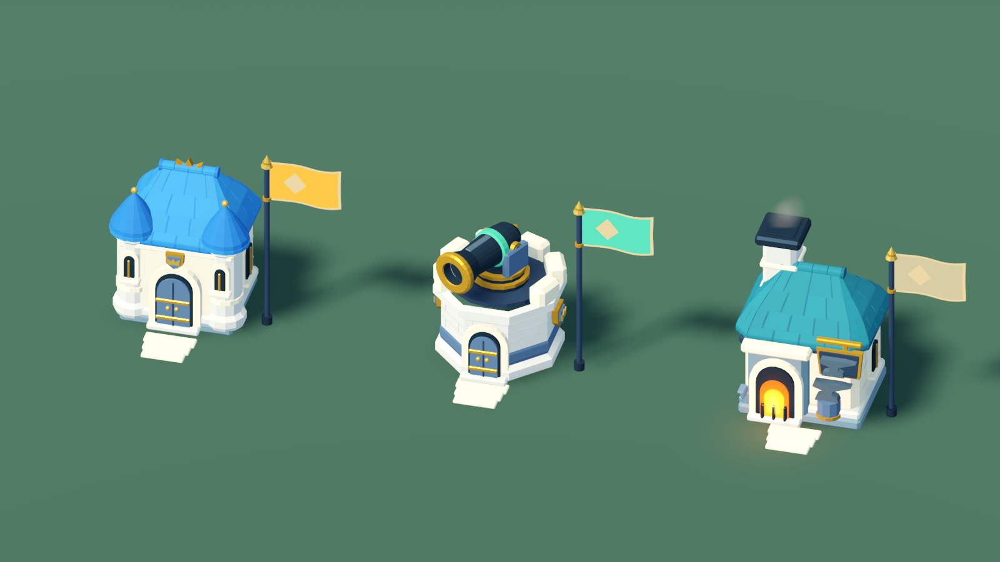

# 积木战争：王国溪谷场景重建

## 参考与比例约束

2026-09-22 根据用户补充的三张《蘑菇战争 2》实机参考重新确定方向。单位、建筑与战场的相对尺度参考《蘑菇战争 2》：小单位组成可读队列，建筑是紧凑的据点，环境为部队预留空间。《皇室战争》仅参考建筑造型、配色、材质与轮廓组织，不采用它的夸张单位/建筑比例，也不复刻其中的具体建筑。

此前生成的概念图 `block_war_royale_direction.png` 是历史探索，不能作为新版实机效果或尺寸依据。本次交付以 Godot 中可编辑的原生场景、烘焙网格和真实渲染截图为准。





## 新的视觉语言

- 住宅：奶油白石、蓝瓦、清晰门廊与少量金色装饰，保持紧凑据点轮廓。
- 炮塔：低矮石砌炮台与本模式独立的炮身网格；炮管转向、后坐与炮口跟随继续工作。
- 铁匠铺：青蓝屋顶、高烟囱、橙色炉膛与锻造标志，使用不同于住宅的轮廓。
- 桥岸：重建石桥、自然起伏草唇与分层石岸；桥头局部砌石，河道仍保留原来的通行约束。
- 景观：重建橡树、桦树、松树、垂柳、灌木、岩石、蕨、草、芦苇和花。树干有分叉、根盘与树皮起伏，树冠有成组立体叶片；通过成年树、幼树与低矮植被的大小和疏密组织林缘，保留道路附近的视野。
- 地表：自然草色变化、砂土过渡和水边色差，避免明显棋盘格以及铺满画面的碎草噪点。
- 灯光：原生 ProceduralSkyMaterial 提供天空与地面环境色，暖色方向光配合冷色阴影和局部接触阴影，保持远景建筑与近景材质都可读。

阵营仍由金色/薄荷色旗帜、军服与已有 UI 识别。人口花牌、派兵比例、技能按钮和操作方式保留。

## 不变的玩法边界

13 座建筑的 ID、位置、类型、初始归属和人口保持；46 个导航树障碍的位置、缩放和半径保持。建筑门口、拾取碰撞、六列编队、单位模型缩放、桥梁有效通行区和导航参数保持。模型细节不得成为新的隐形阻挡，也不能把桥栏、石岸放进既有队列净空。

不修改人口、产速、升级/改建成本、攻防倍率、技能冷却与持续时间、AI 或胜负逻辑。

## 原生资源与构建

运行时直接使用 `.tscn` 中的 MeshInstance3D、MultiMeshInstance3D、材质与动画节点。Python 工具只在离线构建时制作 glTF；Godot 烘焙工具将其转换为原生 ArrayMesh。自然网格保留原生 LOD，小植物按区域使用 MultiMesh，风动继续由模式时钟驱动并支持暂停。

建筑：`tools/build_war_architecture.py` → `tools/build_war_architecture.gd`。

自然模型：`tools/build_war_nature.py` → `tools/build_war_nature.gd`。

地图：`tools/bake_war_map_details.gd` → `tools/dress_war_map.py`。布景器保存固定种子的场景结果，运行时不生成景观节点。

Python 依赖为 numpy、trimesh、shapely。工程内 `.local/war_model_python` 如果已经装有这些包，可临时加入 `PYTHONPATH`；该机器本地目录不提交。正式运行游戏不需要 Python。

## 验证与实机预览

使用 `tests/block_war_visual_review.gd` 查看默认全景、实际行军、桥头近景与林缘；使用 `tests/block_war_architecture_visual.gd` 查看三建筑细节、阵营标记、暂停和炮口跟随；使用 `tests/block_war_environment_visual.gd` 查看四树种、树干与冠叶、岩石与林下植被的独立近景。玩法回归执行 `block_war_test.gd`、`block_war_input_test.gd`、`block_war_marches_test.gd`、`block_war_campaign_test.gd`，后者遍历全部 156 条有向建筑路线。

真实截图输出到被 Git 忽略的 `artifacts/block_war_*.png`。具体结果见 `report/block-war-rebuild-2026-09-22.md`。

## 官方能力参考

- [Supercell《皇室战争》官方介绍与视觉参考](https://supercell.com/en/games/clashroyale/)
- [Godot MeshInstance3D](https://docs.godotengine.org/en/stable/classes/class_meshinstance3d.html)
- [Godot MultiMesh](https://docs.godotengine.org/en/stable/classes/class_multimesh.html)
- [Godot Environment 与后处理](https://docs.godotengine.org/en/stable/tutorials/3d/environment_and_post_processing.html)

## 历史概念图生成记录（已停用）

- 模式：内置 image_gen，未使用 CLI。
- 保存：`docs/art/block_war_royale_direction.png`。
- 最终提示词：

```text
Use case: stylized-concept. Create an environment and architectural art-direction concept for an original 2.5D strategy game named Block Conquest, inspired by Clash Royale's clear chunky mobile-game 3D art style. No text, no UI, no numerical bubbles, no cards, no logos. Wide 16:9, elevated orthographic 52-degree gameplay view. Show a miniature woodland battle clearing split by two parallel narrow turquoise river ravines, with broad small wooden bridges. Only 3 or 4 original small buildings: a stout cream-stone timber cottage with a handful of broad terracotta roof tiles and a large readable doorway, a squat cannon turret made of a few chunky warm grey stone blocks, a squat blacksmith shop with slate teal roof and a small orange forge. Buildings sit directly within the grass, with a few flat doorstep stones, NO display plinth, NO detached circular platforms. Show a modest formation of original blocky spear militia crossing one bridge: large expressive toy soldiers, about half cottage eaves height, clearly readable hands, upright spears and broad heads; terracotta-gold and mint-teal team accents. The grass is a CLEAN, soft saturated spring green playing surface with gentle alternating broad lawn diamonds/squares and very restrained painterly tonal variation, NOT detailed realistic grass noise. Trees use several large sculpted puffed beveled clusters on a branching trunk, wide layered cartoon pine skirts, stout warm grey rounded rocks and sparse thick-leaved grass tufts. Simplified substantial geometry with carefully designed asymmetrical silhouettes, soft bevel highlights and warm sunlight with cool occlusion shadows. Rich but disciplined green/cream/coral/teal palette, crisp shapes, clean smooth surfaces, premium charming handcrafted 3D game miniature. Avoid microscopic leaf detail, photographic texture, grain, random detailed clutter, shiny plastic, realistic forest rendering, tiny ant-like soldiers, giant houses, crude stacked primitives. This is an ART DIRECTION CONCEPT, not an actual game screenshot.
```
