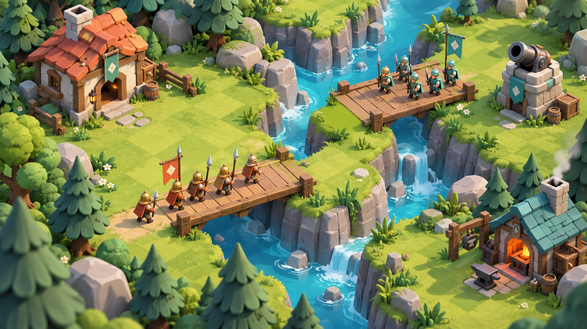

# 积木战争：厚实卡通竞技场方向

用户指定建筑、草地和景观学习《皇室战争》的清晰轮廓、厚实块面和简洁材质。原有四瓣花人口牌与游戏 UI 保持独立设计。参照：[Supercell 官方游戏页](https://supercell.com/en/games/clashroyale/)。



这是通过内置 image_gen 工具生成的美术概念，不是 Godot 实机截图。最终运行资源是仓库内可编辑的模型、场景和材质；地面由原生 NoiseTexture2D 与低对比草坪格 shader 绘制。概念用于指导大瓦片、小建筑、大士兵、胖树冠、宽桥板、暖灰岩岸与蓝绿水色。

## 生成记录

- 模式：内置 image_gen，未使用 CLI。
- 保存：`docs/art/block_war_royale_direction.png`。
- 最终提示词：

```text
Use case: stylized-concept. Create an environment and architectural art-direction concept for an original 2.5D strategy game named Block Conquest, inspired by Clash Royale's clear chunky mobile-game 3D art style. No text, no UI, no numerical bubbles, no cards, no logos. Wide 16:9, elevated orthographic 52-degree gameplay view. Show a miniature woodland battle clearing split by two parallel narrow turquoise river ravines, with broad small wooden bridges. Only 3 or 4 original small buildings: a stout cream-stone timber cottage with a handful of broad terracotta roof tiles and a large readable doorway, a squat cannon turret made of a few chunky warm grey stone blocks, a squat blacksmith shop with slate teal roof and a small orange forge. Buildings sit directly within the grass, with a few flat doorstep stones, NO display plinth, NO detached circular platforms. Show a modest formation of original blocky spear militia crossing one bridge: large expressive toy soldiers, about half cottage eaves height, clearly readable hands, upright spears and broad heads; terracotta-gold and mint-teal team accents. The grass is a CLEAN, soft saturated spring green playing surface with gentle alternating broad lawn diamonds/squares and very restrained painterly tonal variation, NOT detailed realistic grass noise. Trees use several large sculpted puffed beveled clusters on a branching trunk, wide layered cartoon pine skirts, stout warm grey rounded rocks and sparse thick-leaved grass tufts. Simplified substantial geometry with carefully designed asymmetrical silhouettes, soft bevel highlights and warm sunlight with cool occlusion shadows. Rich but disciplined green/cream/coral/teal palette, crisp shapes, clean smooth surfaces, premium charming handcrafted 3D game miniature. Avoid microscopic leaf detail, photographic texture, grain, random detailed clutter, shiny plastic, realistic forest rendering, tiny ant-like soldiers, giant houses, crude stacked primitives. This is an ART DIRECTION CONCEPT, not an actual game screenshot.
```
