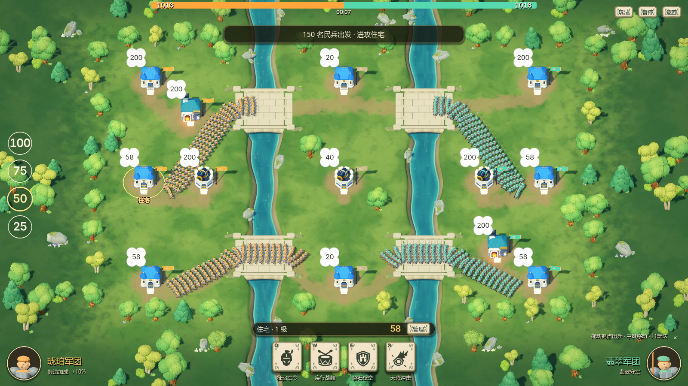
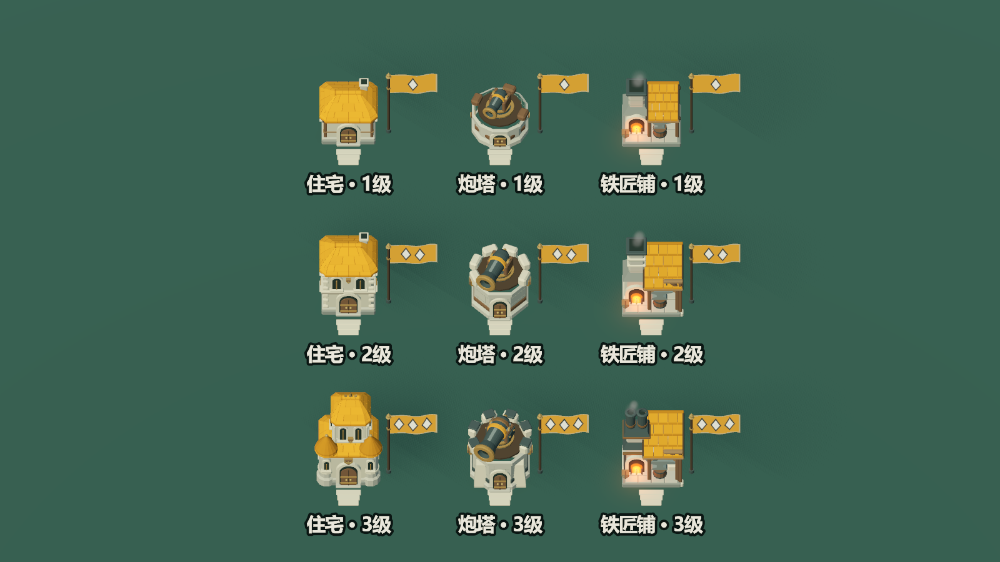
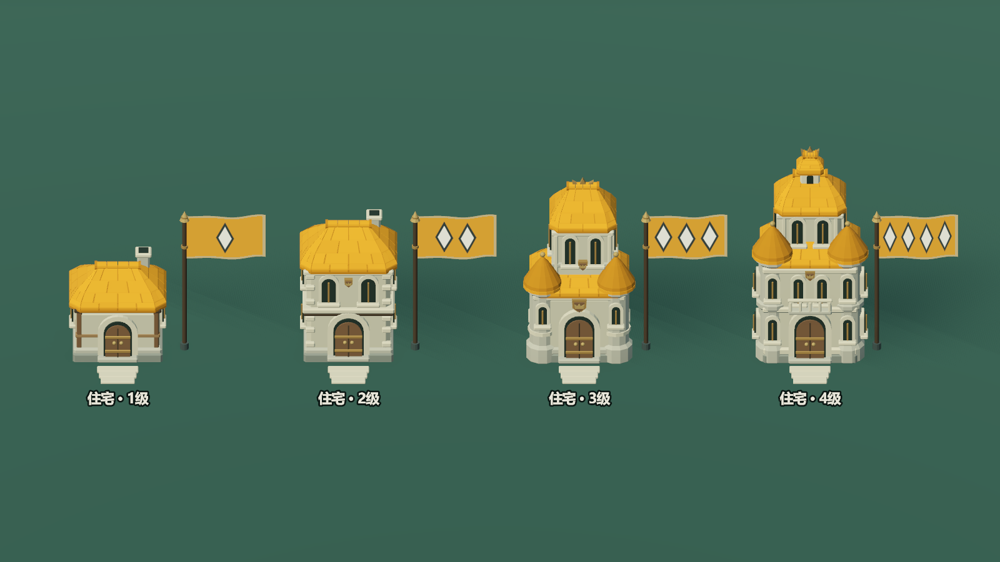
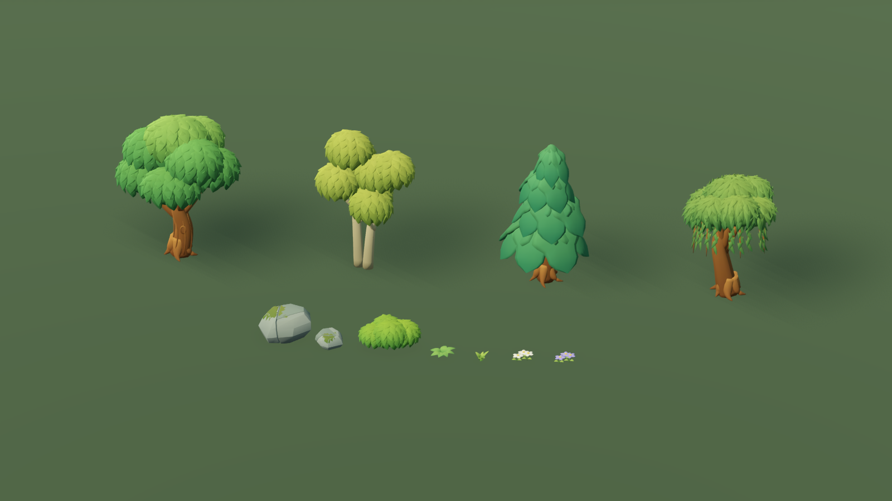
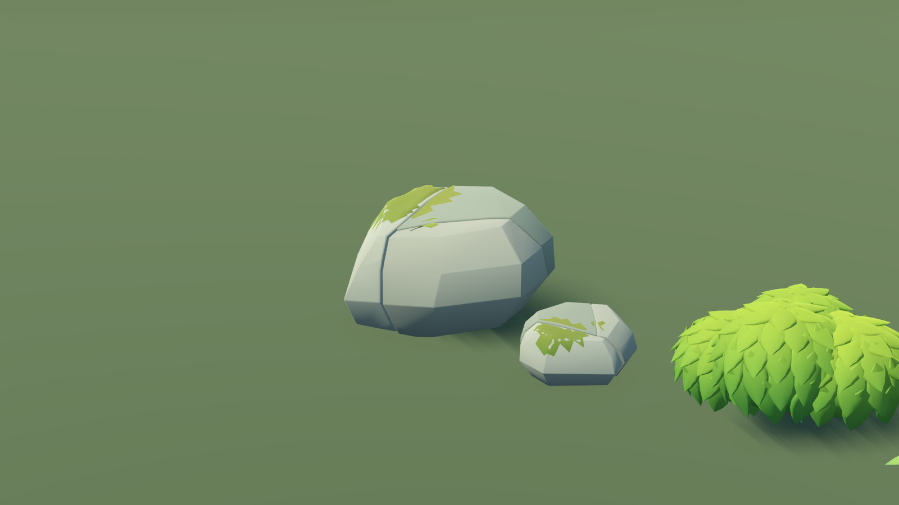

# 积木战争：王国溪谷场景重建

## 参考与比例约束

2026-09-22 根据用户补充的三张《蘑菇战争 2》实机参考重新确定方向。单位、建筑与战场的相对尺度参考《蘑菇战争 2》：小单位组成可读队列，建筑是紧凑的据点，环境为部队预留空间。《皇室战争》仅参考建筑造型、配色、材质与轮廓组织，不采用它的夸张单位/建筑比例，也不复刻其中的具体建筑。

此前生成的概念图 `block_war_royale_direction.png` 是历史探索，不能作为新版实机效果或尺寸依据。本次交付以 Godot 中可编辑的原生场景、烘焙网格和真实渲染截图为准。











## 新的视觉语言

- 住宅：单层木框矮屋、双层石屋、高中央主堡、双层角楼大宅四个等级。一级压低屋脊，二级通过上下两排窗与层间石檐表现新增楼层，三级采用独立高主堡、低侧翼与双角塔，四级加入双层角楼、门上露台与冠顶小楼。暖灰石、棕木、旧铜与阵营色瓦顶保持紧凑据点轮廓；新增房间向上发展，地面占地仍留在原有行军周界内。橙金和青绿屋顶直接标示归属，中立为砂灰；占领后同步更新。
- 炮塔：低石台轻炮、环形城垛中炮、扶壁护甲重炮三个等级，具有各自的建筑和炮身网格；炮管转向、后坐与炮口跟随共用稳定接口。
- 铁匠铺：彻底改为开放锻造工坊，一级采用低木棚与短烟囱，保留裸露炉体和前置铁砧；二级升高带石箍的烟囱，增加加固梁架与木吊架；三级改为宽铁烟罩、双金属烟管和双工位。烟囱、开敞空间和工具形成明显不同于住宅的轮廓；棚顶仍使用阵营色，炉火保持局部暖光。
- 桥岸：重建石桥、自然起伏草唇与分层石岸；桥头局部砌石，河道仍保留原来的通行约束。
- 景观：重建橡树、桦树、松树、垂柳、灌木、岩石、蕨、草、芦苇和花。树干有分叉、根盘与树皮起伏，树冠有成组立体叶片；通过成年树、幼树与低矮植被的大小和疏密组织林缘，保留道路附近的视野。
- 地表：低饱和草色、暖灰土路和灰青溪水，与桥石、建筑墙体共用自然色系；减少水面白纹与反光，避免抢占阵营色的注意力。
- 灯光：主场景与两套模型预览共用原生 `woodland_daylight.tres`。中性天空补光、柔暖方向光、克制高光与接触阴影保留瓦片、树叶和石缝的层次；不使用额外饱和度和对比度增益。

阵营主要由橙金/青绿屋顶、旗帜、军服与已有 UI 识别。染色只作用于屋顶，墙体、木门与铜件保持自身材质。人口花牌、派兵比例、技能按钮和操作方式保留。

住宅四级主体总高（含烟囱与冠饰，不含独立旗杆）分别为 2.68、3.90、5.15、6.13 米。各级采用独立楼层和屋顶结构，保留门窗比例。地脚均为 -0.082 米。原点击盒覆盖至 5.5 米，四级屋顶和冠饰包围盒的 16 个角点在游戏摄像机下仍能投影选中本建筑，因此无需改变点击盒。包含四级墙体的路线验证为 156 条、494340 次完整编队采样，零穿墙。

旗帜的等级标记固定为一、二、三个等大的菱形，分别表示一至三级。旗面为 2.25 × 1.35 米，上缘仍固定在原旗杆高度；浅色菱形配深色描边与抗锯齿，三枚之间保留独立间距。已用正常 58 米与最远 95 米正交镜头检查，等级标记随升级、占领降级及改建更新。

## 不变的玩法边界

13 座建筑的 ID、位置、类型、初始归属和人口保持；46 个导航树障碍的位置、缩放和半径保持。建筑从任意方向的周界进出，六列编队、单位模型缩放与桥梁有效通行区保持。九套模型都接受同一周界和路径净空检查，升级或改建不会使既有路线穿墙。模型细节不得成为新的隐形阻挡。

不修改人口、产速、升级/改建成本、攻防倍率、技能冷却与持续时间、AI 或胜负逻辑。

## 原生资源与构建

运行时直接使用 `.tscn` 中的 MeshInstance3D、MultiMeshInstance3D、材质与动画节点。Python 工具只在离线构建时制作 glTF；Godot 烘焙工具将其转换为原生 ArrayMesh。自然网格保留原生 LOD，小植物按区域使用 MultiMesh，风动继续由模式时钟驱动并支持暂停。

建筑：`tools/build_war_architecture.py` → `tools/build_war_architecture.gd`。只重建四级住宅时，Python 使用 `--model house_4`，Godot 烘焙脚本后传入 `-- house_4`；运行时切换现有 MeshInstance3D 的原生网格，不新增节点。

自然模型：`tools/build_war_nature.py` → `tools/build_war_nature.gd`。

地图：`tools/bake_war_map_details.gd` → `tools/dress_war_map.py`。布景器保存固定种子的场景结果，运行时不生成景观节点。

Python 依赖为 numpy、trimesh、shapely，仅供离线建模工具使用。正式运行游戏不需要 Python。

## 验证与实机预览

使用 `tests/block_war_visual_review.gd` 查看默认全景、实际行军、桥头近景与林缘；使用 `tests/block_war_architecture_visual.gd` 查看十套模型总览、住宅四级与炮塔/铁匠铺三级细节、阵营标记，以及每级暂停和炮口跟随；架构预览输出到系统 TEMP。使用 `tests/block_war_environment_visual.gd` 查看四树种、树干与冠叶、岩石与林下植被的独立近景。`block_war_residence_test.gd` 检查产兵边界、征召叠加、升级扣费、占领降级、改建和低级住宅集结；`block_war_routes_test.gd` 对所有类型与等级的墙体包围遍历全部 156 条有向路线。

真实截图输出到被 Git 忽略的 `artifacts/block_war_*.png`。初次重建结果见 `report/block-war-rebuild-2026-09-22.md`；阵营屋顶、材质统一和光照复核见 `report/block-war-style-lighting-2026-09-22.md`。

## 多尺寸地图的环境制作规范（2026-09-25）

五张新增地图沿用「裂谷交汇」的石桥、草地、树木和灯光。林湖回廊采用绕湖林道和湖岸树团；双河平原保留三条战线与六座完整石桥；断脊山道采用高低错落的岩脊与松林；群岛长滩以桦林、橡林、松林区分三片中央岛屿；环湖高原采用中央石台和南北绕湖道路。地图尺寸、建筑布点、人口与队伍配置保持原设计。

- 桥的轴向由穿越的水道决定，不能由桥面矩形长宽判断。桥面板顶面为 −0.02 米，铺石顶面约 +0.03 米，避开 y=0 的陆地。高原中央桥拆成西桥臂、中央平台和东桥臂，各表面只覆盖一次；护栏位于通行宽度之外。
- 岸线根据水域并集的外轮廓烘焙，群岛交汇处不生成内部岸墙。草唇、岩坡向不可通行水域内延伸，导航地面始终有可见陆地承接。水面网格不重复，顶点颜色存储实际岸线的浅水权重。
- 土路先设计主路，再连接建筑前庭。逐段检查水域、山脊与桥梁，避免最邻近建筑直连造成跨水土路。五张地图分别使用 16、38、46、52、46 段道路，均在现有 64 段着色器容量内。
- 树木以成年树、幼树和林下植被组成疏密有别的树团，桥头和建筑周边留出空地。可走区域的树石带有实际导航障碍半径；低地被按 32 米区域使用原生 MultiMesh，复用已有网格 LOD。

离线重建顺序：

1. `python tools/build_block_war_maps.py` 保存可编辑 `.tscn` 和地图定义，桥梁、道路、自然布景分别由三个 `block_war_*_authoring.py` helper 负责。
2. Godot 无头运行 `res://tools/bake_block_war_shores.gd`，保存四张有水地图的草岸、石岸和水面 `.res`；断脊山道无需水面资源。
3. Godot 无头运行 `res://tools/bake_block_war_routes.gd -- lake rivers ridges islands highland`，重新保存包含景观障碍的行军路线。修改景观障碍后必须重烘焙，原图可跳过。

`tests/block_war_map_authoring_test.py` 检查真实网格包围盒和层级变换，覆盖桥梁朝向、与地面的高度关系、平台表面无重叠、栏杆净空及土路连通。`tests/block_war_maps_test.gd` 在实际对局场景遍历全部建筑对，并检查六列士兵的完整脚印。`tests/block_war_maps_visual.gd` 保存全景、正常缩放近景、桥面静止间隔帧及小幅移动镜头截图，支持 `-- rivers highland` 等地图筛选。截图输出至 `artifacts/block_war_maps/`。

## 官方能力参考

- [Supercell《皇室战争》官方介绍与视觉参考](https://supercell.com/en/games/clashroyale/)
- [Godot MeshInstance3D](https://docs.godotengine.org/en/stable/classes/class_meshinstance3d.html)
- [Godot MultiMesh](https://docs.godotengine.org/en/stable/classes/class_multimesh.html)
- [Godot Environment 与后处理](https://docs.godotengine.org/en/stable/tutorials/3d/environment_and_post_processing.html)

## 历史概念图生成记录（已停用）

- 模式：内置 image_gen，未使用 CLI。
- 保存：`docs/art/block_war_royale_direction.png`。
- 最终提示词：

```text
Use case: stylized-concept. Create an environment and architectural art-direction concept for an original 2.5D strategy game named Block Conquest, inspired by Clash Royale's clear chunky mobile-game 3D art style. No text, no UI, no numerical bubbles, no cards, no logos. Wide 16:9, elevated orthographic 52-degree gameplay view. Show a miniature woodland battle clearing split by two parallel narrow turquoise river ravines, with broad small wooden bridges. Only 3 or 4 original small buildings: a stout cream-stone timber cottage with a handful of broad terracotta roof tiles and a large readable doorway, a squat cannon turret made of a few chunky warm grey stone blocks, a squat blacksmith shop with slate teal roof and a small orange forge. Buildings sit directly within the grass, with a few flat doorstep stones, NO display plinth, NO detached circular platforms. Show a modest formation of original blocky spear militia crossing one bridge: large expressive toy soldiers, about half cottage eaves height, clearly readable hands, upright spears and broad heads; terracotta-gold and mint-teal team accents. The grass is a CLEAN, soft saturated spring green playing surface with gentle alternating broad lawn diamonds/squares and very restrained painterly tonal variation, NOT detailed realistic grass noise. Trees use several large sculpted puffed beveled clusters on a branching trunk, wide layered cartoon pine skirts, stout warm grey rounded rocks and sparse thick-leaved grass tufts. Simplified substantial geometry with carefully designed asymmetrical silhouettes, soft bevel highlights and warm sunlight with cool occlusion shadows. Rich but disciplined green/cream/coral/teal palette, crisp shapes, clean smooth surfaces, premium charming handcrafted 3D game miniature. Avoid microscopic leaf detail, photographic texture, grain, random detailed clutter, shiny plastic, realistic forest rendering, tiny ant-like soldiers, giant houses, crude stacked primitives. This is an ART DIRECTION CONCEPT, not an actual game screenshot.
```
