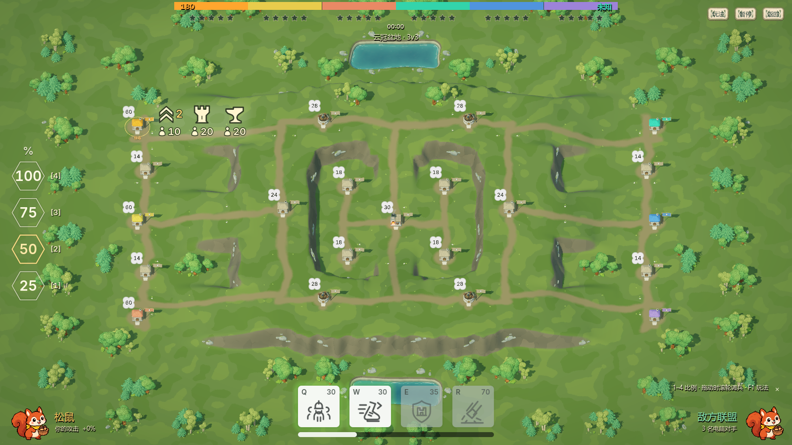
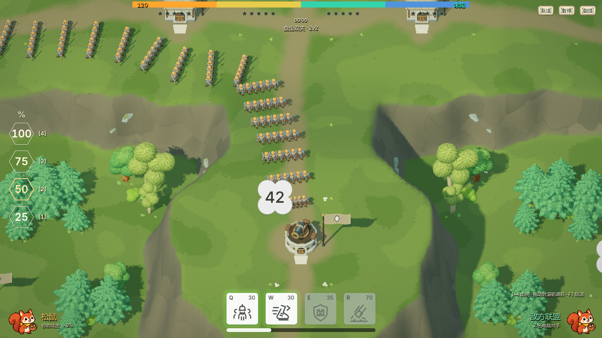
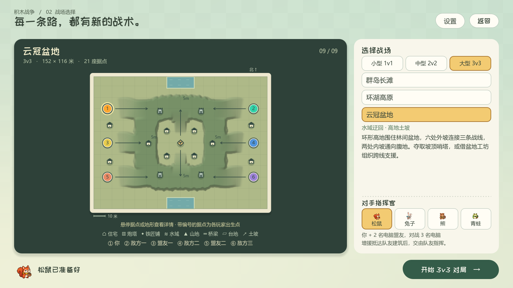

# 自然曲线地形 · 1.3.1

日期：2026-09-29。重做三张高差战场的轮廓、坡面和岩壁，原有六张平地地图保留。

| 地图 | 队伍 / 据点 | 地形与路线选择 |
| --- | --- | --- |
| 叠翠台地 | 1v1 / 11 | 四处展宽坡口进入 4.5 米中央台地，南北低地可包抄 |
| 盘山双关 | 2v2 / 15 | 南北弯曲台地经缓坡连接 8 米山脊要塞，山脚道路可换线 |
| 云冠盆地 | 3v3 / 21 | 5 米环形高地、六处外坡、两处内坡、腹地工坊与两端水塘 |

双方出生点、地形和据点配置沿左右轴镜像。高度影响通行与真实行军距离；土坡可上，陡崖不可跨越。高地本身不增加伤害或射程，炮塔和技能继续按水平半径计算。

## 从矩形拼接改为连续曲面

台地和盆地由原生 `Curve2D` 闭合轮廓编辑，坡道由开放曲线、起止高度和两端宽度编辑。坡脚与坡顶使用缓入缓出的高度变化，坡肩向周围地面平滑融合；轮廓保留岩岬、内凹和局部碎裂。建筑仍有完整平地与门前编队净空。

盘山双关的内坡起点移到两侧建筑院坪之后，避免院坪与坡道交叠形成横向陡肩。岩壁使用疏密不一的岩面和少量嵌入式石簇，坡脚点缀蕨草。装饰石的完整水平投影只占不可通行崖面，不添加不可见路障。

地图运行时直接加载保存的原生场景、ArrayMesh 和 Resource；不生成景观节点。保存的曲线位于 `tools/terrain/`，普通重建读取编辑后的曲线，不重置控制点。

## 视觉与玩法共用真实表面

离线生成 0.5 米浮点高度场，网格、CPU 采样、射线、坡度、预览和 RF 纹理共享相同的三角形划分。GPU 使用精确三角插值，不采用会偏离网格的双线性高度采样。选点射线命中实际最近的崖面，不能穿透高地选择背后的低地。

所有行军路线重新烘焙；六列编队及士兵足迹逐兵贴地。归巢、兔洞出口、浮空、地面技能圈、火焰烟雾、炮塔虚线圈、网络位置修正和队友鼠标都使用同一表面。高地资源字节加入多人兼容性指纹，避免客户端使用不同地形参战。

选图预览按真实高度场绘制轮廓，显示上坡箭头及高度；高度文字避开据点图标。

## 原生实现参考

- [Godot ArrayMesh](https://docs.godotengine.org/en/stable/classes/class_arraymesh.html)：保存离线生成的三角网格。
- [Godot Curve2D](https://docs.godotengine.org/en/stable/classes/class_curve2d.html)：编辑轮廓与坡道控制点。
- [Godot Image](https://docs.godotengine.org/en/stable/classes/class_image.html)：RF 纹理保留浮点米制高度。

完整重建顺序见 [玩法与开发说明](../block_war.md)。验证工具为 `block_war_heights_test.gd`、`block_war_surface_runtime_test.gd`、`block_war_height_replication_test.gd`、`block_war_camera_bounds_test.gd` 和 `block_war_heights_visual.gd`。

## 验证与发行

- 三图全部 370 对据点路线重新烘焙，分图路线、六列编队、士兵足迹与归巢检查全部通过；三图原生几何专项 1171 项通过，包含每条坡道完整编队净空。
- 核心射线专项包含 384 条随机射线与 Godot 原生三角求交对照；GPU 地表运行时 213 项通过，联机高度复制 210 项通过。
- 九图相机边界 2611 项、地图预览 904 项、地图选择 114 项、离线制作 11 项均通过。
- 核心战斗、快照、复制、兔子、熊、归巢编队、暂停投降复制共 7 套回归，8334 项通过。
- 正式 PCK 从空资源目录运行九图，102 项通过，包含高度数组、嵌入纹理尺寸和 RF 格式；最终日志无脚本或资源错误。构建会刷新原生导入并重建资源导出缓存，防止被删除的旧属性类型留在包中。
- 源码及最终 PCK 均运行 Vulkan 实机检查，复核自然坡口、崖壁、坡道行军、技能贴地、塔圈与地图选择画面。上文截图来自最终 PCK。

Windows 1.3.1：`builds/积木战争-1.3.1-Windows-x64.zip`。

- PCK SHA256：`ac1e45f6a2b6f79477e438eaf9a9f9d11453cee24dc2c5742e806d2a12f77a7c`
- ZIP SHA256：`b44806a1b0990c22ae987767b0c3b522e95a1becd7696b5f3354852422585b73`
- 多人内容指纹：`d195884a33a412a6a32dee21a77da4ed01e451a36b7795a350d6b72fd98655b2`（110 个文件，包含三份高度资源）。

Tokyo UDP 42300 已部署相同指纹，release `80fdbb9629edb81d`。公网原生 DTLS 60 项、三图房间专项 67 项通过；测试结束后零房间、零连接，服务重启计数为零，其他游戏 Relay 未变。受控断线期间服务端记录 4 条原生 TLS 诊断；客户端专项无 TLS 错误，服务无脚本错误。
