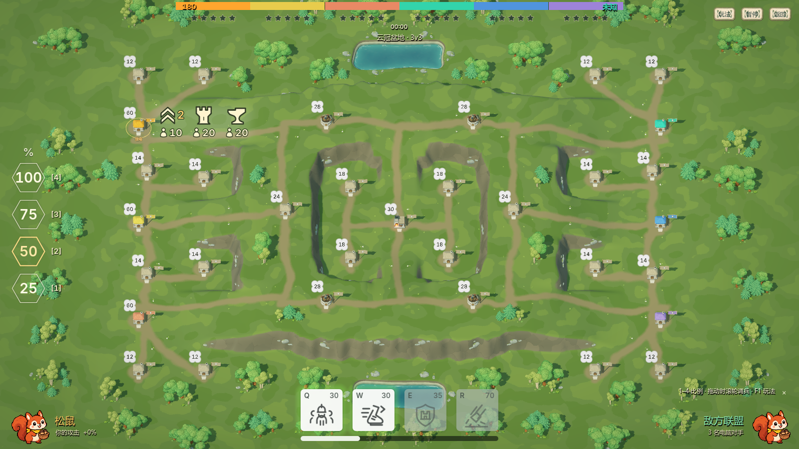

# 住宅扩张平衡 · 1.3.2

按全部参战席位计算住宅容量，仅住宅计入，炮塔与工坊另算。九张地图人均住宅均达到4–5座；这是包含出生住宅在内的地图发展容量，中立据点仍需派兵占领。

| 地图 | 总席位 | 住宅 | 人均住宅 | 全部据点 |
| --- | ---: | ---: | ---: | ---: |
| 裂谷交汇 | 2 | 8 | 4.00 | 13 |
| 林湖回廊 | 2 | 8 | 4.00 | 14 |
| 双河平原 | 4 | 16 | 4.00 | 25 |
| 断脊山道 | 4 | 18 | 4.50 | 27 |
| 群岛长滩 | 6 | 26 | 4.33 | 41 |
| 环湖高原 | 6 | 26 | 4.33 | 41 |
| 叠翠台地 | 2 | 10 | 5.00 | 15 |
| 盘山双关 | 4 | 16 | 4.00 | 19 |
| 云冠盆地 | 6 | 28 | 4.67 | 33 |

## 调整布局

云冠盆地新增12座住宅，住宅16→28、全部据点21→33。上下外翼各补两处后方村庄，中路两侧增设靠近低地道路的住宅，让三路玩家有连续扩张和协同占点的空间。

叠翠台地新增4座近郊住宅；盘山双关新增4座山脚住宅；环湖高原补4座中路后方住宅。其余五图原有数量及分布通过审查，保留原布局。新增住宅守军为12或14；不改变出生据点、起始60兵和建筑升级规则。

## 通行与公平

新增住宅追加在原有据点之后，保留全部旧ID。每座住宅有完整平地、门前接路和足够的模型空间；树林、道路和坡肩一起重新烘焙，运行时仍加载原生场景。

密度回归除检查全图总量，还用二分匹配确认每位玩家能分到两座不与队友重复计算的早期中立住宅。这些住宅在34米内、位于己方一侧，最近两处的守军与占领成本可由初始兵力承担；同时检查双方距离和守军预算公平。

四张改动地图的全部1624对据点路线重新烘焙：叠翠105、盘山171、云冠528、环湖820。路线沿真实坡面和桥梁通行，保留六列编队净空；住宅增加不放宽坡度或障碍判定。

后续重新编辑地图时，必须通过 `tests/block_war_housing_density_test.gd`，并同步重建地图、路线和多人内容清单。地面材质的64据点上限也有明确作者断言。

## 正式包验收

本文截图来自1.3.2 Windows正式PCK，在空目录中运行并通过真实GPU捕获。九图总览及四图村落近景共13张已生成，重点复核四张改动地图的住宅落地、树林遮挡、标签间距、道路与坡口净空。

住宅密度与扩张公平性927项（源码与正式PCK分别通过）；高差几何1231项；叠翠及盘山路线、编队、归巢2325项；云冠同类3391项；环湖桥梁与完整编队路线1789项。地图预览952项、地图流程114项、GPU地表213项、高度联机复制210项、离线制作11项、正式包九图加载102项均通过。四图共1624对路线全部有效。

东京中继已同步1.3.2，公网原生DTLS60项与地图专项67项全部通过。测试后服务正常、无重启、无遗留房间或连接，其他游戏中继保持原样。全部本轮本地辅助进程已通过CIM核实退出。

发行与校验信息见 [机器可读验收记录](../reviews/2026-09-29-housing-balance-verification.json)。
