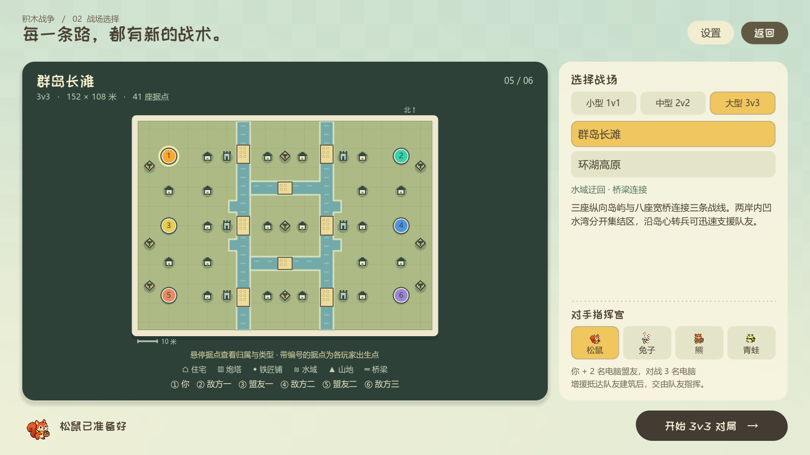
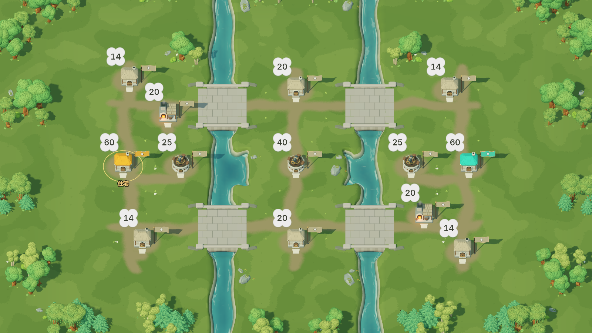
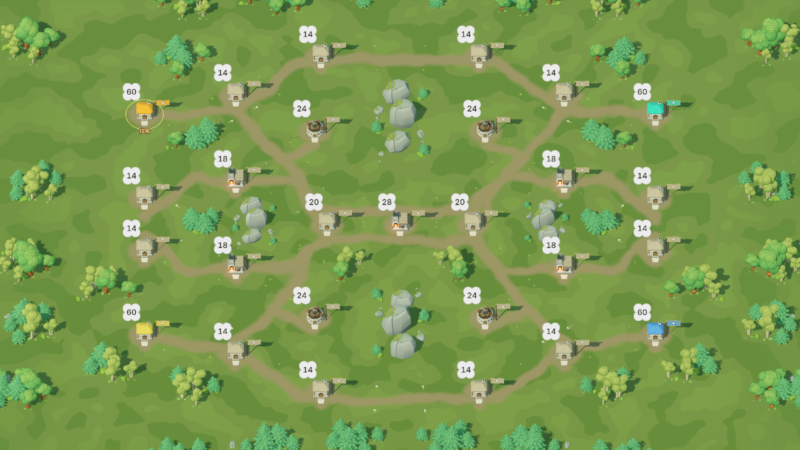
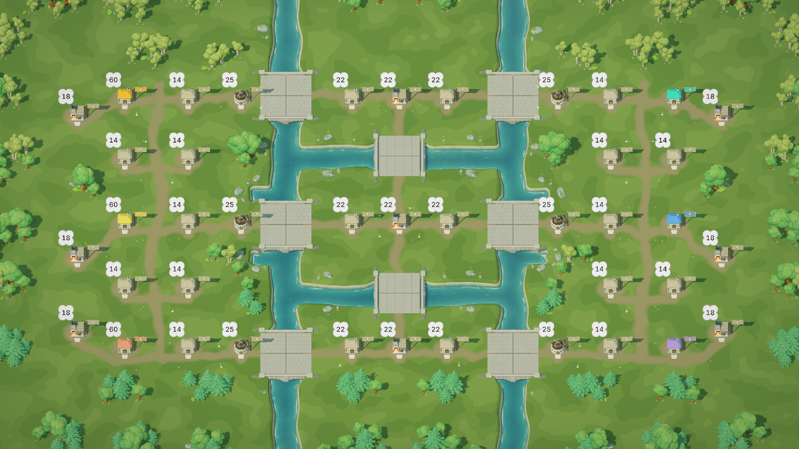

# 战场预览与紧凑地图（2026-09-28）

六张地图保留原有据点数量、建筑类型、初始人口和队伍编排，重新安排位置与地形。平均最近据点间距缩短约 10%–14%，同时加入内湾、分叉谷口和湖岸岩岬，为抢桥、绕后及跨线支援提供更清楚的路线选择。

## 地图预览

大幅战术地图与右侧选项分区显示。地图按实际长宽比例绘制，提供十米比例尺、建筑类型图标、玩家出生编号和阵营图例；悬停据点显示归属与类型。水域轮廓合并重叠与相邻边界，保留群岛内部陆地。1280×720 和 1600×900 均可完整操作。

## 布局与地形

| 战场 | 据点 | 最近据点平均中心距，修改前 → 后 | 主要地形变化 |
| --- | ---: | --- | --- |
| 裂谷交汇 | 13 | 12.69 → 11.42 米（−10.0%） | 两处内湾收紧谷心，四座桥连接中央据点；桥宽增至 7.2 米，留出顺畅转弯空间 |
| 林湖回廊 | 14 | 14.04 → 12.04 米（−14.2%） | 十字湖湾伸向工坊，南北形成完整包抄线 |
| 双河平原 | 25 | 14.29 → 12.43 米（−13.0%） | 河湾划分中央前哨，保留六座桥和三条战线；关键炮塔与住宅保留原射程间隔 |
| 断脊山道 | 27 | 16.11 → 14.29 米（−11.3%） | 两处侧峰与长岩脊共同形成分叉谷口及外围山道 |
| 群岛长滩 | 41 | 13.08 → 11.56 米（−11.6%） | 两岸内湾分隔集结区，保留三岛八桥和岛间支援通道 |
| 环湖高原 | 37 | 15.63 → 13.61 米（−12.9%） | 四处岩岬分出贴湖通道与外围绕行路线，中央石台连接长桥 |

中心距取每个据点到最近其他据点的直线距离，再对全图平均。按已烘焙路线计算的平均最近行军距离降低约 16%–22%；六列编队、建筑模型尺寸和导航净空均未缩小。

## 制作与验证

全部布局显式定义，重复运行不会继续缩放。六图统一使用离线制作流程，直接保存可编辑的 Godot 场景、岸坡网格和行军路线。小内湾的岸坡会按转角半径收窄，并与直岸连续衔接，避免几何翻折；小型岩岬按实际区域缩放装饰。

- 六图实际场景检查共 5203 项通过，覆盖 2306 对据点路线、完整编队足迹、反向路线一致性、出生平衡及电脑开局升级。
- 裂谷专项 17 项通过：156 条双向路线、445380 次足迹采样，落水与穿墙均为零，最大相邻转角 9.24°。
- 选图、开始、重开和返回大厅流程 54 项通过。
- 原生鼠标选图、悬停、两档分辨率和十二张截图保存共 535 项通过。
- 小内湾岸坡层序及接缝检查 888 项通过；道路与桥梁制作 10 项、自然物支撑与相交检查 3 项通过。
- 群岛 3v3 战役 52 项通过，约 818 秒模拟时间分出胜负，所有电脑均成功向外扩张。
- 双河 2v2 战役 32 项通过，约 386 秒模拟时间分出胜负。初版缩距使住宅进入中央三级炮塔射程并加重侧塔互保，曾超过原 1800 秒时限；恢复关键射程间隔后通过，保留原时限及 AI/战斗数值。

构建顺序与工具说明见 [环境制作规范](block_war_environment_direction.md)。

## 多人地图进一步收窄（2026-09-30）

本轮针对六张 2v2 / 3v3 地图压缩建筑之间的空带，可玩面积再减少约 16%–25%。群岛长滩两侧外圈建筑从 x=±60 移至 ±52，内圈仍在 ±40，两列中心距由 20 米收至 12 米；纵向道路移到两列之间，三条战线的间距由 36 米收至 30 米。河湾、桥位及外围植被随布局一起调整。

| 战场 | 据点 | 可玩尺寸，修改前 → 后 | 最近据点平均中心距 | 最近据点平均行军距离 |
| --- | ---: | --- | --- | --- |
| 双河平原 | 25 | 108 × 80 → 96 × 72 米 | 12.43 → 11.08 米 | 7.53 → 6.18 米 |
| 断脊山道 | 27 | 108 × 80 → 96 × 76 米 | 14.29 → 12.09 米 | 9.39 → 7.19 米 |
| 群岛长滩 | 41 | 152 × 108 → 134 × 92 米 | 11.56 → 10.31 米 | 6.66 → 5.41 米 |
| 环湖高原 | 41 | 152 × 116 → 132 × 100 米 | 13.48 → 11.39 米 | 8.59 → 6.50 米 |
| 盘山双关 | 19 | 108 × 88 → 98 × 80 米 | 15.58 → 14.18 米 | 10.81 → 9.39 米 |
| 云冠盆地 | 33 | 152 × 116 → 132 × 100 米 | 15.83 → 13.59 米 | 13.06 → 10.74 米 |

本表基线为本轮开始时的布局，区别于上方 9 月 28 日记录。最近行军距离按每个据点到其他据点的最短已保存路线取值并平均，包含门口偏移与坡道高度；六图降低约 13%–24%，全图所有据点对的平均行军距离降低约 7%–14%。

建筑数量、类型、阵营、初始人口、模型尺寸与六列编队尺寸保持一致。双河保留关键炮塔与住宅的射程间隔；环湖同步收短湖面和长桥。盘山、云冠直接调整原生 Curve2D 地形源，保留原高度和坡宽，将院坪对齐半米高度网格，并修正云冠中部坡道的局部陡肩。三个 1v1 地图与本轮基线完全一致。

验证结果：

- 六图共 2990 对据点路线全部通过；四张平地图 5076 项检查、两张高差地图 4808 项检查均无失败，覆盖正反路线、完整士兵足迹、坡道贴地与镜像出生行军成本。
- 双河 2v2、群岛 3v3 战役合计 84 项通过，分别约 488 秒和 775 秒模拟时间结束，电脑均正常扩张。
- 九图相机边界 2611 项通过；两档分辨率的选图预览 979 项通过，含尺寸、实际比例、悬停与截图保存。
- 道路及桥梁制作 11 项通过；六张平地图自然物支撑和相交检查 3 项通过。旧自然物测试将高差地图内嵌的崖壁石簇按独立平地石头处理，因此该项仅检查平地图，高差地形由原生几何专项验证。
- 六张改动地图均检查了 1600 × 900 实机全景及正常游戏缩放细节。

更新资源依次使用 `build_natural_terrain.py`、地图定义生成、`bake_block_war_heights.gd`、`bake_block_war_shores.gd`、`export_war_shore_support.gd`、完整地图生成和 `bake_block_war_routes.gd`。已编辑的 `tools/terrain/*.tres` 是地形制作源，重建时不运行会覆盖这些曲线的初始源生成器。
