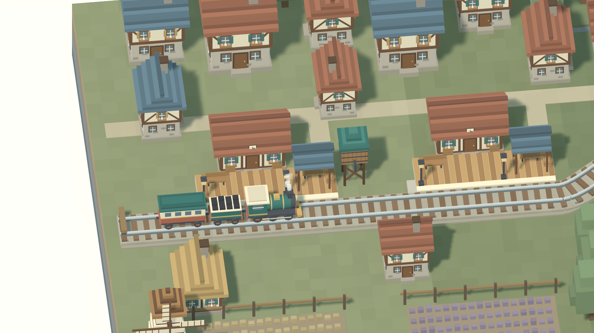
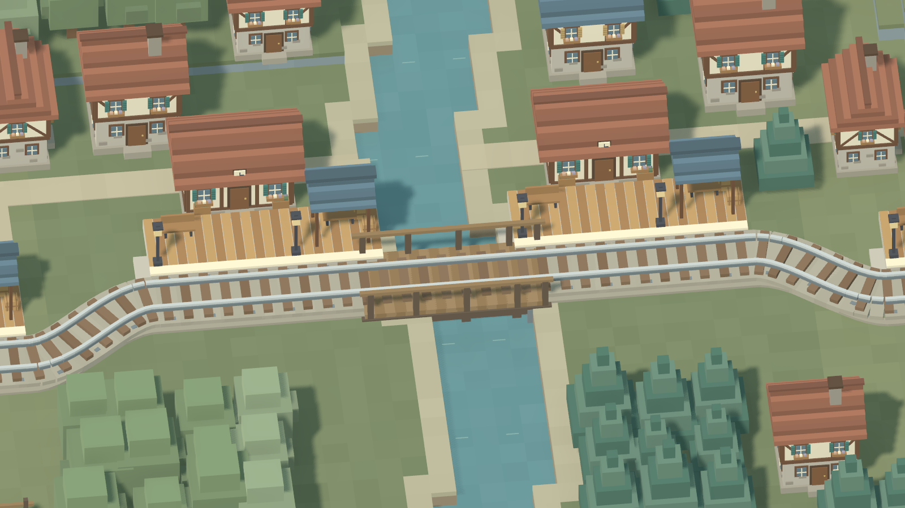
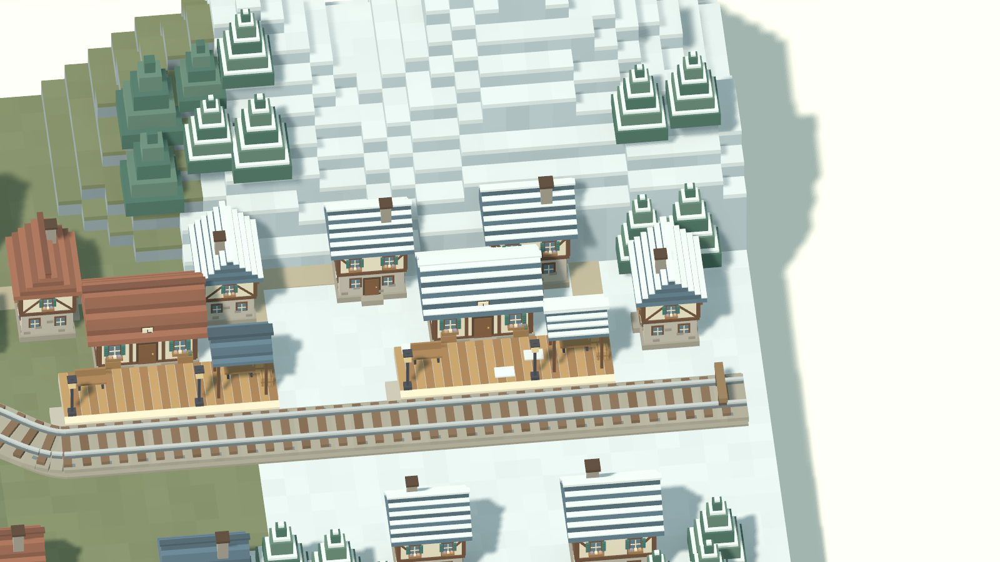

# 六站铁路战役（2026-10-02）

主菜单「单人战役」进入可游玩的铁路选关地图。林野始发站、橡木镇站、溪桥站、山麓站、霜林站、雪冠终点站依次连接，邻站路程约 7.2–7.6 个世界单位。每站对应一张现有战场，从单人对阵逐渐过渡到有电脑盟友的团队战斗。


## 关卡与进度

选择车站后点击「进入关卡」，选择英雄，再进入本站指定战场。首次只开放始发站；胜利后解锁下一站并保存至 `user://campaign.cfg`。失败、平局、中途退出、自由对战和联机比赛均不会推进战役。

已通过的车站显示「再次挑战」，重玩时仍能选择英雄。列车始终停在最远已解锁站，浏览或重玩旧站不会把它退回去。六站全部通过后列车留在终点，全部车站继续开放。新通关返回铁路时默认选中下一站；暂停退出和战斗结果页都会返回铁路地图。

| 车站 | 战场 | 对手 |
| --- | --- | --- |
| 林野始发站 | 裂谷交汇 / rift | 松鼠 |
| 橡木镇站 | 林湖回廊 / lake | 兔子 |
| 溪桥站 | 双河平原 / rivers | 青蛙 |
| 山麓站 | 断脊山道 / ridges | 熊 |
| 霜林站 | 盘山双关 / switchback | 狐狸 |
| 雪冠终点站 | 云冠盆地 / crown | 猪猪 |

## 参考与建模

造型参考用户提供的 `medieval-voxel-railway参考用/medieval-voxel-railway`。根据其中 `props.js`、`train.js`、`world.js` 与 `track.js` 的结构，制作 Godot 原生可编辑模型：连续阶梯人字屋顶、奶油抹灰墙、外露木骨架、石基、百叶窗和花箱，整块团簇树冠与分层松树，站台木板、雨棚、灯柱和时钟。

列车为青绿与奶油色蒸汽机车、煤水车、客车；锅炉和车轮使用八边柱体，并保留锅炉箍、车窗、连接杆和少量方块蒸汽。草地使用低饱和灰绿，搭配灰褐地层、陶土与灰蓝屋顶，避免参考里鲜艳的黄绿草地。

连续地形尺寸 47 × 18，包含六站、23 栋村屋、59 棵树、麦田、薰衣草田、风车、水塔与铁路木桥。道砟、枕木、钢轨和桥面相接，轨面高 0.52。铁路保留平直站段和两处缓弯，始发站后方留足三节车厢空间。







## 原生场景与维护

- `scenes/campaign/campaign_map.tscn`：车站选择、状态、进度和出战按钮。
- `scenes/campaign/campaign_diorama.tscn`：独立 3D 视口、正交相机、灯光和原生相机动画。
- `scenes/campaign/campaign_landscape.tscn`：保存地形、车站、村屋、树群、铁路与三节列车。
- `scenes/campaign/railway_models/`：15 个独立可编辑模型场景。
- `data/campaign/journey_3d.tres`：连续 Curve3D；六个 Marker3D 对应实际停靠点。
- `scripts/session.gd`：顺序解锁、通关存档与战役场景切换。

列车使用三个原生 PathFollow3D，距车头偏移 0、1.51、2.94。UI 通过 Camera3D 投影真实车站位置；选站只更新详情。运行时不生成地形、建筑或列车节点。重复方块以 MultiMesh 合批，锅炉与车轮以 CylinderMesh 保存。

离线重建入口，仅依赖 Python 标准库：

```powershell
python tools/campaign_railway_models.py
python tools/build_campaign_railway.py
```

修改生成资源时同步修改对应作者工具。相机、灯光、UI 和关卡文案直接编辑各自场景或资源。`tools/build_campaign_diorama.py` 及旧地貌工具保留历史造型代码，不能用于重建当前铁路场景。

揭幕采用两秒原生 AnimationPlayer 动画。设置窗口暂停动画与环境显示，空格跳过，数字行或数字小键盘 1–6 直接选择车站，方向键巡览，Esc 返回。1600 × 900 设计画面在其他比例下等比完整显示。

实现前查阅官方 [MultiMeshInstance3D](https://docs.godotengine.org/en/stable/classes/class_multimeshinstance3d.html)、[CylinderMesh](https://docs.godotengine.org/en/stable/classes/class_cylindermesh.html)、[PathFollow3D](https://docs.godotengine.org/en/stable/classes/class_pathfollow3d.html)、[GPUParticles3D](https://docs.godotengine.org/en/stable/classes/class_gpuparticles3d.html)、[AnimationPlayer](https://docs.godotengine.org/en/stable/classes/class_animationplayer.html)。

## 验证

- `tests/campaign_progress_test.gd`：真实选英雄、开战和胜负结算，存档重读、锁定站、重玩、退出、自由对战隔离及最终站停车；84 项通过，存档使用独立测试目录。
- `tests/campaign_construction_test.gd`：真实 MultiMesh 轨面、枕木和桥面，六站间距、三车停靠、揭幕完整生命周期；159 项通过。
- `tests/campaign_map_test.gd`：真实鼠标和键盘操作、锁定与重玩状态、浏览不移动列车、设置隔离、返回记忆及多分辨率适配；250 项通过。
- `tests/campaign_model_visual.gd`：全图、村落列车、铁路桥及终点实机截图，可选光照问题定位截图。
- `tools/validate_product.py`：运行资源引用和产品边界检查。

```powershell
python tools/run_godot_private_desktop.py res://tests/campaign_model_visual.gd --output artifacts/campaign_railway_final --godot .local/network/runtime/Godot_v4.7.2-stable_win64.exe --timeout 65
```

验证在私有 Windows 桌面运行，任务结束时检查并关闭验证进程，保留用户正常编辑器。
