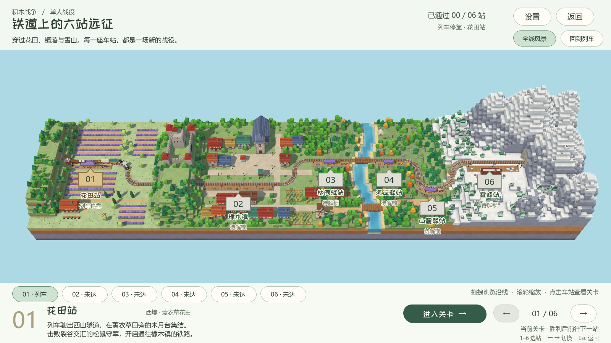
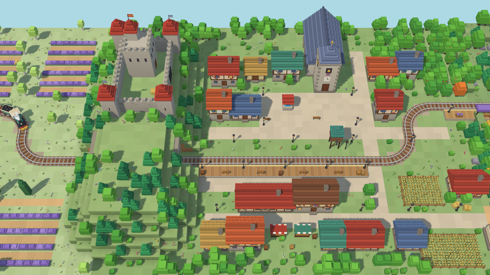

# 六站铁路战役（2026-10-02）

主菜单「单人战役」进入六站铁路地图。现采用用户提供的 `medieval-voxel-railway参考用/medieval-voxel-railway` 的实际模型与完整地图：横向 168、纵深 40 个世界单位，原铁路长约 186.26。六站按花田、橡木镇、林间、河岸、山麓、雪峰排列，停车点沿轨间距约 49.36、25.26、22.00、23.21、24.52，包含足够的建筑、田地、森林、河谷与爬山路段。




## 关卡与进度

选择车站后点击「进入关卡」，选择英雄，再进入本站指定战场。首次只开放花田站；胜利后解锁下一站并保存至 `user://campaign.cfg`。失败、平局、中途退出、自由对战和联机比赛不会推进战役。

已通过的关卡可再次挑战。列车停在最新解锁站，浏览、重玩旧站不会让进度或列车倒退。六站全部通过后列车留在雪峰站，全部关卡继续开放。停车点和界面站名标记分开保存，长编组不会为了将车头对齐站台中心而错误退进隧道。

| 车站 | 战场 | 对手 |
| --- | --- | --- |
| 花田站 | 裂谷交汇 / rift | 松鼠 |
| 橡木镇 | 林湖回廊 / lake | 兔子 |
| 林间驿站 | 双河平原 / rivers | 青蛙 |
| 河岸驿站 | 断脊山道 / ridges | 熊 |
| 山麓驿站 | 盘山双关 / switchback | 狐狸 |
| 雪峰站 | 云冠盆地 / crown | 猪猪 |

## 直接使用参考模型

`tools/railway_reference/src/` 保存九个原始建模文件的逐字节快照：`builder.js`、`config.js`、`mesher.js`、`noise.js`、`path.js`、`props.js`、`track.js`、`train.js`、`world.js`。已与用户原目录逐一核对 SHA-256；源文件不修改。`source-package.json` 保存原 Three.js 版本和 ISC 许可声明，`assets/campaign/reference_railway/manifest.json` 记录各源码 SHA、资产 SHA、范围、顶点数和三角形数。

导出器真实执行原 `TrackPath`、`World`、`meshTerrain`、`meshWater`、`buildProps`、`buildTrack` 和 `Train`，通过 Three.js 0.170.0 官方 GLTFExporter 生成 GLB。保留原城堡、教堂、村屋、露天市场、风车、果园、麦田、薰衣草田、树林、跨河桥、隧道和雪山；原铁路圆弯与爬坡一并保留。九节原列车完整导入：机车、煤水车、两节客车、货车、花卉货车、罐车、木材车和守车。

花田、橡木镇和雪峰站保留原站台。新增三站直接执行原 `haltPlatform`，完整复用木板、雨棚、长椅、箱子、灯柱和站牌，沿原铁路布置。曲线与坡道上的复制站台先沿长度每 0.4 单位细分，再映射到原轨道，避免整块长台基用直弦切入铁路；坡下补同色石柱。新增占地在原植被生成前留出。没有缩小整个地图或重画简化版场景。

## 配色和光照

仅四种地表草地采用较低饱和的明亮鼠尾草色，保留地层、树木、屋顶、花朵、水面与列车原色：

| 草地 | 顶面 | 侧面 |
| --- | --- | --- |
| 普通草地 | `#93b675` | `#85a56b` |
| 林地草地 | `#86a86f` | `#779961` |
| 山坡草地 | `#9dbd7b` | `#8cad6d` |
| 花田草地 | `#b5cf97` | `#a4bd88` |

草地混色高光同步调整为 `#b2c58c` 和 `#cadbb2`。这些改动只发生在导出内存和经过原语句校验的运行副本中，原快照保持不变。原顶点颜色已由 Three.js 转为线性空间，Godot 材质明确启用 `vertex_color_use_as_albedo` 并关闭 `vertex_color_is_srgb`，避免丢失颜色或重复转换。使用原生 Lambert 漫反射、粗糙度 1、金属度 0。

场景以原参考的暖主光、冷补光和明亮天空环境为依据，在 Godot 中通过原生 `DirectionalLight3D`、`WorldEnvironment` 和阴影调光，不叠加整景灰暗滤镜。光照和镜头的最终效果以实机截图为准。

最终使用线性色调映射，暖主光 0.9、冷补光 0.1、环境光 0.25；不同引擎的光照强度不能直接照搬。该组合保留红瓦、木材与树冠的色彩，同时让雪山亮面和背光面保持层次。




## 原生场景与重建

- `scenes/campaign/campaign_map.tscn`：选站、关卡状态、进度和出战按钮。
- `scenes/campaign/campaign_diorama.tscn`：3D 视口、相机、灯光和相机动画。
- `scenes/campaign/campaign_landscape.tscn`：原场景实例、六站标记、九节列车和字牌。
- `assets/campaign/reference_railway/`：14 个 GLB 及来源清单；`native/` 为离线烘焙后的原生 PackedScene。
- `data/campaign/journey_3d.tres`：按原路径每 0.2 单位采样的 Curve3D，保留原 +0.27 轨面车轮偏移。
- `scripts/session.gd`：顺序解锁、通关存档与战役场景切换。

九个原生 `PathFollow3D` 使用清单中原车厢偏移，按轨道坡度旋转。原模型车头为本地 +X，子模型绕 Y 旋转 `PI / 2` 后符合默认跟随方向；实测车头世界方向与轨道切线点积约 0.9997。运行时实例化保存好的场景，不动态搭建地形、建筑和车厢。

重建必须按以下顺序运行：

```powershell
npm install --prefix .local/railway-import three@0.170.0
node tools/import_reference_railway.mjs
& '.local/network/runtime/Godot_v4.7.2-stable_win64.exe' --headless --path . --log-file .local/reference-bake.log --script res://tools/bake_reference_railway.gd
```

第一步仅用于准备缺失的本地依赖。Node 工具导出真实几何、来源清单和原字牌元数据；Godot 工具用 `GLTFDocument` 转为原生资源，并保存铁路、站点、列车和 `Label3D`。草色或新增站台修改在 `import_reference_railway.mjs` / `campaign_stations.mjs` 中维护；原快照仅在用户明确更换参考源后更新。相机、灯光和界面在对应场景中维护。

旧 `build_campaign_railway.py` 和 `build_campaign_diorama.py` 已退役为明确报错的提示入口，不能覆盖新场景。旧造型代码可从 Git 历史恢复；旧 `campaign_railway_models.py` 仅对应历史 `railway_models/`，不参与当前构建链。

官方依据：[Importing 3D scenes](https://docs.godotengine.org/en/stable/tutorials/assets_pipeline/importing_3d_scenes/index.html)、[GLTFDocument](https://docs.godotengine.org/en/stable/classes/class_gltfdocument.html)、[PathFollow3D](https://docs.godotengine.org/en/stable/classes/class_pathfollow3d.html)、[Label3D](https://docs.godotengine.org/en/stable/classes/class_label3d.html)。

## 验证

- `tests/campaign_progress_test.gd`：英雄选择、开战、胜负结算、解锁存档、旧关重玩、退出及最终停车。
- `tests/campaign_construction_test.gd`：真实参考资源、地图规模、六站间距、九车方向和原生结构。
- `tests/campaign_map_test.gd`：鼠标和键盘操作、锁定与重玩、浏览不移动列车、返回记忆及分辨率适配。
- `tests/campaign_model_visual.gd`：实际 GPU 渲染的花田、城镇、城堡、河岸、山麓、雪峰与全图截图。
- `tools/validate_product.py`：运行资源引用和产品边界检查。

本次结果：进度测试 84 项、原生场景测试 483 项、GPU 交互测试 208 项全部通过；产品引用检查 327 个运行源文件、0 项失败。截图由同一 Godot 场景通过 Forward+ 实际渲染，包含 1600×900 与 1280×720 界面。验证结束后用命令核实并关闭本任务的辅助进程，保留用户正常编辑器。
