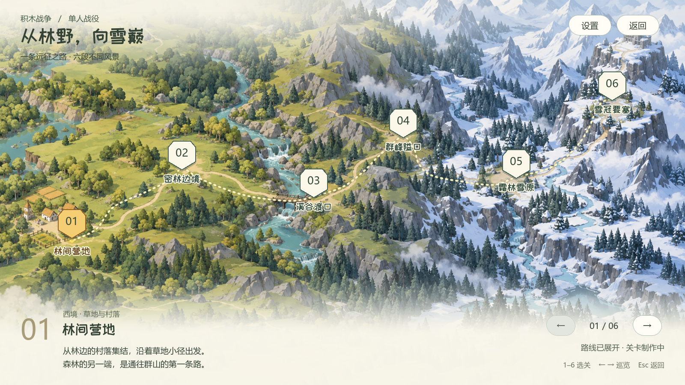

# 单人战役路线大地图（2026-10-02）

主菜单新增「单人战役」，进入从西侧草地森林过渡至东侧雪山的 2D 路线地图。原来的自由选地图对战保留为「自由对战」。

这次完成路线与选关界面。六处关卡都可浏览，当前明确显示「关卡制作中」，没有接入战斗、虚构通关记录或提前解锁内容。关卡名称和风景描述作为后续关卡制作的第一版定位。

| 顺序 | 关卡 | 地域 |
| --- | --- | --- |
| 01 | 林间营地 | 草地与村落 |
| 02 | 密林边境 | 森林与丘陵 |
| 03 | 溪谷渡口 | 河流与桥梁 |
| 04 | 群峰隘口 | 高地与山口 |
| 05 | 霜林雪原 | 雪原与针叶林 |
| 06 | 雪冠要塞 | 雪山与要塞 |

## 交互与表现

地图是一张连续的插画，原生六边形关卡标记与虚线路径叠加其上。悬停轻抬，选中变为暖金色并抬升，光点沿路线在 0.38 秒内抵达选择位置，详情短暂淡入。森林有稀疏浮尘，雪域有轻微飘雪；设置弹窗打开时暂停环境粒子。

鼠标可选择六个节点或前后翻页；方向键沿关卡顺序移动，数字行与数字小键盘 1–6 直接选择，Esc 返回主菜单。返回后恢复关卡选择与入口焦点。选择仅保存在本次运行的 Session 元数据中，不写入战役进度或用户偏好。

地图以 1600 × 900 设计坐标制作，使用原生 AspectRatioContainer 等比适配；宽屏和 4:3 窗口保留完整路线。文字、关卡、路线及界面没有烘焙进底图。

## 编辑入口

- 场景：`scenes/campaign/campaign_map.tscn`。
- 关卡标记：`scenes/campaign/campaign_stop.tscn`。
- 六份关卡资源：`data/campaign/01_woodland.tres` 至 `06_summit.tres`；名称、地域、描述和 `atlas_position` 在资源内编辑。
- 路线：`data/campaign/journey_curve.tres`，原生 Curve2D 控制点。移动关卡时同步调整对应曲线点。
- 美术：`assets/ui/campaign/forest_to_summit.png`，独立无文字底图。
- 原生 GPUParticles2D、Line2D、Path2D、PathFollow2D 均直接保存在场景中，没有运行时创建节点。

采用 Godot 官方文档确认 [AspectRatioContainer](https://docs.godotengine.org/en/stable/classes/class_aspectratiocontainer.html)、[Curve2D](https://docs.godotengine.org/en/stable/classes/class_curve2d.html)、[Line2D](https://docs.godotengine.org/en/stable/classes/class_line2d.html)、[PathFollow2D](https://docs.godotengine.org/en/stable/classes/class_pathfollow2d.html) 和 [GPUParticles2D](https://docs.godotengine.org/en/stable/classes/class_gpuparticles2d.html) 的适配、采样、纹理平铺及粒子行为。

## 验证

Godot 4.7.2 / Forward+。在独立 Windows 桌面运行，不发送系统输入，不抢占用户窗口。

- `tests/campaign_map_test.gd`：173 项通过；包括真实入口、六节点点击、两种数字键、原生方向键、快速打断动效、弹窗输入隔离、返回与选择记忆、两档截图、宽屏与 4:3 完整性。
- `tests/lobby_ui_test.gd`：64 项通过；新增入口布局、主菜单设置、原对战入口与返回流程。
- `tools/validate_product.py`：运行时资源引用与产品边界检查通过。
- 查看 1600 × 900 与 1280 × 720 的森林端、雪山端实拍，录制 168 帧、24 FPS 的六关切换预览。最终渲染日志无脚本或着色器错误。
- 新增菜单项后缩短大厅入场错峰间隔，保持所有按钮及时就位。

## 生图来源与提示词

底图使用内置 `image_gen` 工具（imagegen 技能）生成，未使用 CLI/API 兜底。生成结果原样复制至 `assets/ui/campaign/forest_to_summit.png`；关卡控制、虚线和微小粒子使用代码及原生节点，底图不通过脚本绘制或修改。附件仅作为氛围参考，未复制其中的列车、角色或 UI。

最终使用的提示词：

> Use case: stylized-concept. Asset type: production 2D illustrated overworld background for a Chinese indie strategy game's six-stage single-player campaign, without UI. Create one very wide 16:9 landscape image, high resolution 2560x1440 or higher. A continuous charming handcrafted atlas landscape seen from a high oblique top-down view, filling the canvas, with no horizon: LEFT is rich soft sage/olive meadows and clustered broadleaf forests; MIDDLE transitions through winding turquoise creeks, a small timber bridge, warm grassy foothills and grey-green rocky mountain passes; RIGHT becomes alpine fir forests, pale blue snowfields and layered majestic snowy mountains. Make the progression west to east unmistakable, with the final snow summit on the upper right. Six visually calm small clearings along a gentle winding journey, approximately at these fractions of the canvas: (0.12,0.67), (0.27,0.43), (0.43,0.62), (0.58,0.37), (0.74,0.53), (0.89,0.29). A thin pale earth footpath meanders naturally through these places and crosses a timber bridge near the third. Give the first clearing a tiny welcoming settlement of a few cream houses with warm ochre roofs; the final clearing a small elegant snow-covered watchfort. Leave open breathing room around all six locations for game controls to be added later. Style: sophisticated flat 2D storybook cartography, crisp softly irregular cut-paper silhouettes, restrained stepped/faceted tree crowns and rocks suggesting a block-built world, selective layered shading, delicate almost invisible paper grain, warm ivory highlights, muted olive/teal/icy blue palette. The forest is composed in dense harmonious groves alternating with clear meadows, not an evenly scattered noisy field. Snow peaks feel sculpted and dimensional through a few elegant flat blue shadow shapes. Good readable large shapes and abundant negative space, beautiful crafted game art, soft daylight from upper left. Terrain continues naturally to every edge; quieter top-left and bottom edges for overlaid interface text. NO text, NO letters, NO numbers, NO UI, NO buttons, NO pins, NO level circles, NO banners, NO compass, NO frame, NO watermark, NO railways, NO characters, NO photorealism, NO 3D voxel render. This is the original usable art asset itself, not a mockup inside a screen.
