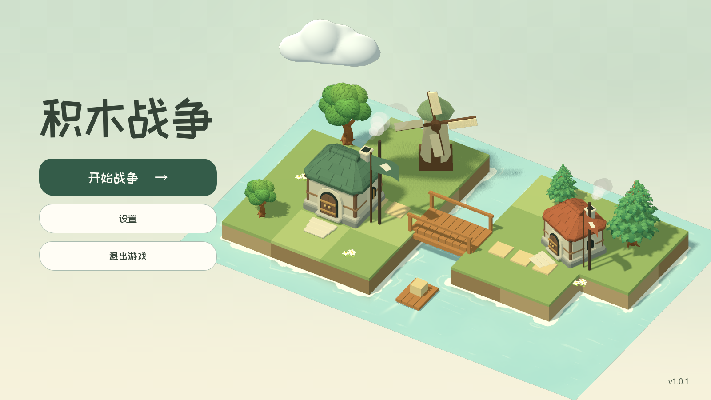

# 主菜单立体云（2026-09-29）

云已改为一个封闭的三维网格，具有连续的顶部、侧面与底面，随场景光线受光并真实投影。轮廓采用错落的大弧线和较平缓的底部，使用哑光原生材质。旧的 billboard 贴图与贴图资源已移除。

模型是离线雕塑后导入的 Godot ArrayMesh：1,250 个顶点、2,496 个三角形，单一连续表面。几个宽阔体块在建模时平滑融合，没有运行时重叠球体、广告牌或伪造的平面阴影。源文件为 `assets/models/lobby/cloud.obj`，可用常规建模工具继续编辑；`python tools/build_lobby_cloud.py` 可确定性重建模型，只依赖 numpy。脚本检查封闭边和表面误差。

场景中的云心位于 Y = 6.8 左右，底部高于树木和屋顶。原生 AnimationPlayer 控制 24 秒的缓慢飘动与小幅转向；相机视差下可看到真实厚度，云不再自动朝向镜头。打开设置时仍随整个微缩场景暂停。

调整主菜单日照仰角，使云影落在岛岸和河道内；同时将日照能量从 1.15 调整为 0.93，补偿仰角对水平表面的照度影响。所有物体使用同一光源，影子方向一致。方向光使用 1.3 度原生 PCSS 柔影，让高处云影自然比贴地物体更柔和。

验证在已提交的主菜单基线加本次改动的独立副本中进行，避免混入并行开发的联机文件。Godot 4.6.3 / Forward+ 后台实录 600 帧、25 秒，覆盖完整飘动周期与鼠标视差；每秒采样云网格顶点，轮廓均位于视口内并保留边距。复核 1600×900、1280×720、960×540。

在 0、6、12、18 秒分别固定场景，对比开启和关闭云自身投影的真实渲染，地面区域分别有 7,645、10,624、10,252、9,091 个像素产生可辨识的亮度变化，确认阴影在整个路径内可见。原有 41 项原生主菜单交互检查通过，没有运行错误。录制使用隔离桌面和 Dummy 音频驱动，没有切换用户桌面、移动系统鼠标或播放声音。

[查看完整飘动周期](lobby_motion/cloud_volume.mp4)

原生 API 依据：[GeometryInstance3D 投影](https://docs.godotengine.org/en/stable/classes/class_geometryinstance3d.html)、[Light3D 柔影](https://docs.godotengine.org/en/stable/classes/class_light3d.html#class-light3d-property-light-angular-distance)、[ArrayMesh](https://docs.godotengine.org/en/stable/classes/class_arraymesh.html)、[BaseMaterial3D](https://docs.godotengine.org/en/stable/classes/class_basematerial3d.html)。
