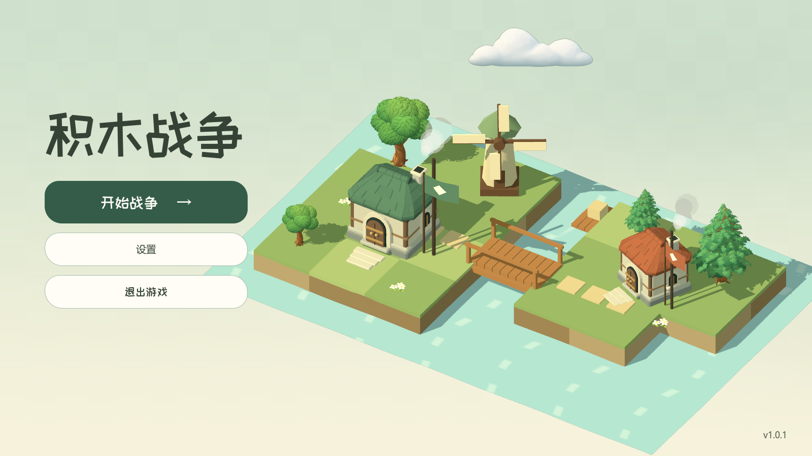

# 主菜单云素材（2026-09-29）

将三个重叠球体换成一体化云形：横向舒展的轮廓、平缓下沿、错落的大弧形云顶，暖白受光面和淡灰蓝底部阴影。轻微块面保留积木场景的风格。

最终素材：`assets/ui/block_war/lobby_cloud.png`。采用内置 image_gen 工具生成，原生 RGBA 透明背景；后处理仅依据原生 Alpha 边界裁切透明外边距，并补 16 像素透明边。保留原生透明度，没有按 RGB 推断 Alpha。

场景使用 Godot 原生 Sprite3D，启用 billboard 和 mipmaps，保留既有 12 秒飘动动画。取消外部灯光对云贴图的再次染色，避免云变黄、出现塑料高光。旧球体、网格和材质已移除。

验证：后台 Vulkan 录制 288 帧／12 秒完整周期；云持续移动，全周期四周均未被视口裁切；复核 1600×900、1280×720、960×540 下的轮廓和边缘。资源导入无脚本或场景加载错误。没有操作系统鼠标、桌面切换或声音播放。



[查看飘动效果](lobby_motion/cloud_redesign.mp4)

生成最终素材的完整提示词：

```text
Use case: stylized-concept. Asset type: a production-ready standalone cloud sprite for a cozy low-poly isometric block strategy game with mint green grass, wooden bridges, cream cottages and restrained pastel colors. Create exactly ONE beautifully designed cohesive cumulus cloud, isolated on a genuinely transparent RGBA background. A wide horizontal silhouette, approximately 2.7:1 width to height, with a softly flattened continuous underside and three broad, generously joined upper lobes of asymmetric heights, tallest just left of center. Sculpt it as one seamless unified airy volume; the whole shape should read instantly as a graceful cloud at 220 pixels wide. Simplified chunky 3D game art, restrained large soft facets and matte surfaces, delicate broad shading rather than detailed texture. Chalk white and pearl white top surfaces, a subtle cool pale sage-blue shadow along the lower edge. Soft daylight from the upper left, low contrast, no specular shine. Near-front view with just a little top surface visible; the long bottom edge is horizontal, not diagonally tilted. Keep the object fully visible, centered with transparent padding. Avoid separate stacked ellipsoids, hard intersections, bubble clusters, shiny plastic, yellow potatoes, flat vector icon outlines, photorealistic wisps, noise, sparkles, detached puffs, drop shadows, platforms, environment, lettering, animals, watermark or multiple cloud variants. Output only the one cloud asset, native transparent background.
```

原生 API：[Sprite3D](https://docs.godotengine.org/en/stable/classes/class_sprite3d.html)、[SpriteBase3D](https://docs.godotengine.org/en/stable/classes/class_spritebase3d.html)。
