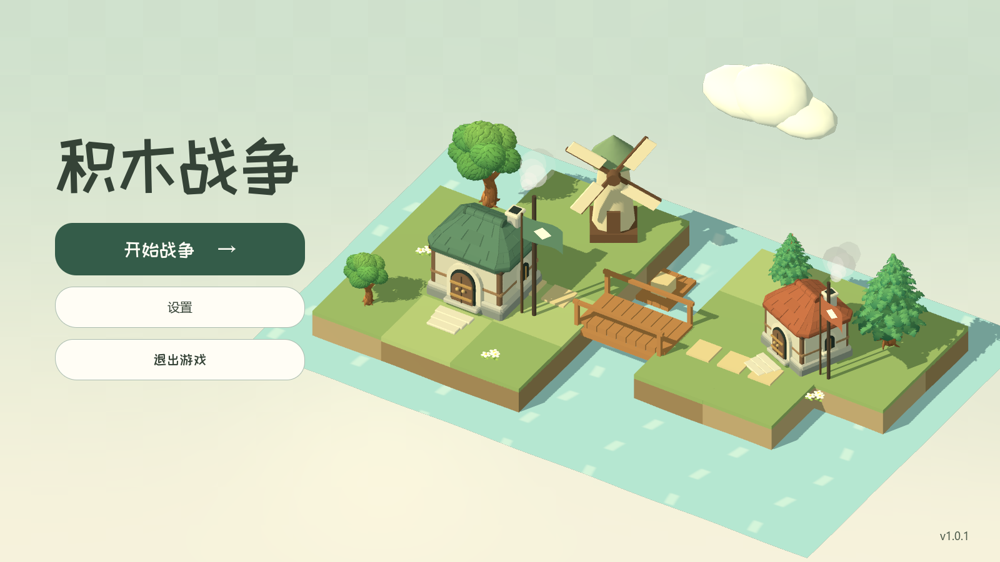

# 动态主菜单：扩展构图与环境活动（2026-09-29）

保留原版的积木、薄荷绿和奶油白风格，将微缩场景从两栏布局中的小块画面改为全屏背景层。相机拉近并稍微俯视，建筑在同分辨率下约放大到原来的 1.6 倍，河岸和水面延伸至下方与右侧。标题字号 106，按钮宽 400；标题与按钮保留独立、稳定的左侧操作区域。版本仍为 `1.0.1`。

本轮增加能够直接观察到的持续活动：

- 风车以 10 秒一圈的速度旋转，叶片在草地上投下移动阴影。
- 木筏沿原生 `Path3D / PathFollow3D` 的闭合河道以 0.9 单位／秒行驶，从桥下穿过，两端圆滑掉头；有轻微起伏、倾斜和水面尾流。
- 两座房屋原有烟囱持续冒出淡烟，原生 GPU 粒子在 2.8 秒内上升、膨胀、淡出，不增加多余的烟囱模型。
- 云的活动范围与速度增加，水流、旗帜和树梢的运动增强；镜头视差仍保持小幅度，文字不参与摇摆。

建筑的悬停抬起、点击回弹和水面涟漪保留。背景容器位于菜单后方，透明布局节点不拦截背景拾取，实际按钮优先接收点击。打开设置时暂停风车、木筏、场景时钟、拾取及视口渲染；关闭后恢复。场景仍与战斗世界隔离，没有增加动物角色或改动战斗画面。

验证：后台 Vulkan 原生输入检查 41 项、大厅设置与选角往返 34 项通过，175 个运行时资源文件引用检查通过。录制 18 秒、24 FPS 的真实画面，并复核风车、烟雾、木筏进出桥下、鼠标交互、设置遮挡及 1600×900／1280×720／960×540 布局。后台验证通过每个物理帧注入视口事件维持鼠标位置，不切换用户桌面，不移动系统鼠标，不播放音频。



[查看新动效](lobby_motion/main_menu_expanded.mp4) · [第一版对照](lobby_motion/main_menu.mp4)

复现检查与录制：

```text
python tools/run_godot_private_desktop.py res://tests/lobby_diorama_test.gd --output .local/lobby-living/test --timeout 45
python tools/run_godot_private_desktop.py res://tests/lobby_motion_visual.gd --output .local/lobby-living/frames --timeout 90
ffmpeg -framerate 24 -i .local/lobby-living/frames/frame_%04d.png -c:v libx264 -pix_fmt yuv420p -crf 20 -movflags +faststart docs/art/lobby_motion/main_menu_expanded.mp4
```

参考同级 `bot-jump` 的动态世界背景与短促按钮反馈。原生 API 依据：[SubViewportContainer](https://docs.godotengine.org/en/stable/classes/class_subviewportcontainer.html)、[AnimationPlayer](https://docs.godotengine.org/en/stable/classes/class_animationplayer.html)、[PathFollow3D](https://docs.godotengine.org/en/stable/classes/class_pathfollow3d.html)、[GPUParticles3D](https://docs.godotengine.org/en/stable/classes/class_gpuparticles3d.html)、[ParticleProcessMaterial](https://docs.godotengine.org/en/stable/classes/class_particleprocessmaterial.html)、[Camera3D](https://docs.godotengine.org/en/stable/classes/class_camera3d.html)。
