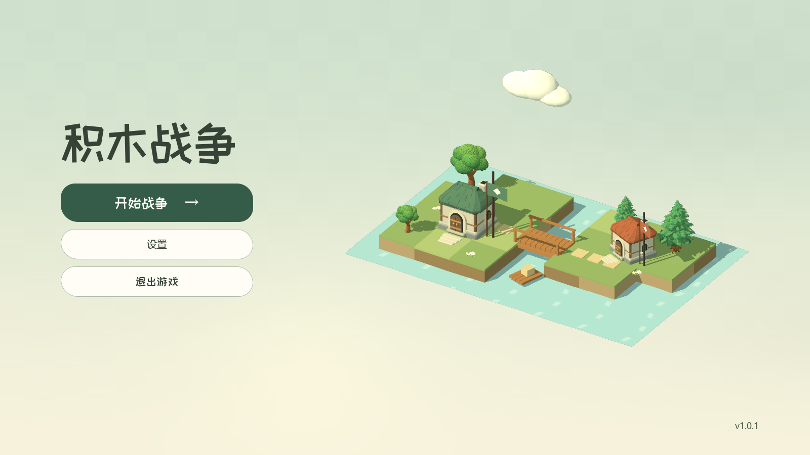

# 动态主菜单（2026-09-29）

主菜单以微缩积木据点替换动物立绘：两座房屋、桥、树木和水面构成右侧场景，左侧保留标题及三个入口，版本保持 `1.0.1`。场景复用项目已有建筑和植被模型，不依赖指挥官阵容。

参考同级 `bot-jump` 的 `scenes/main.tscn`、`scripts/game.gd`、`scripts/track_world.gd` 和按钮动效：菜单覆盖一个持续运动的世界，主要操作用短反馈响应。这里使用独立 `SubViewport`、原生 `AnimationPlayer`、`Tween` 和材质动画实现。

- 水流、旗帜、树梢持续缓动；云和木筏沿 16 秒曲线循环，背景有很淡的云影。
- 鼠标带来有阻尼的小幅视差及柔和光照；悬停建筑用 0.18 秒抬起 0.16 单位，离开原位收回。
- 点击建筑约 0.38 秒内完成轻微点头，旗帜短暂迎风，使用已有轻声选择音；点击水面出现一圈逐渐消散的涟漪。
- 拾取体固定在原位，只有建筑外观运动，快速交替悬停不会因外观变形反复进出拾取区。
- 标题和版本在入场结束后保持固定；三个按钮悬停缩放为 1.018。场景容器不做入场缩放，避免原生 SubViewportContainer 的尺寸失真。
- 打开设置时暂停微缩场景动画、渲染和拾取；关闭恢复。离开主菜单时一起释放。战斗和选角界面不受影响。

后台 Vulkan 实录为 18 秒、24 FPS；演示中的鼠标图形只存在于录制场景，不属于游戏 UI。已复核入场、悬停、点击、涟漪及设置展开帧，并检查 1600×900、1280×720、960×540 的画面。标题与操作区清晰，动效主要集中在右侧，装饰没有遮挡按钮。

验证结果：`lobby_diorama_test.gd` 37 项、`lobby_ui_test.gd` 34 项通过；原生录制验证两次建筑点击和设置往返成功且未更改偏好；174 个运行时资源文件的边界／引用检查通过。后台桌面没有实体鼠标，测试每个物理帧向视口注入同一位置的鼠标事件，避免原生被动拾取回读用户的系统光标，全程不移动系统鼠标。



[查看实际动效](lobby_motion/main_menu.mp4)

复现检查与录制：

```text
python tools/run_godot_private_desktop.py res://tests/lobby_diorama_test.gd --output .local/lobby-motion/test --timeout 45
python tools/run_godot_private_desktop.py res://tests/lobby_motion_visual.gd --output .local/lobby-motion/frames --timeout 90
ffmpeg -framerate 24 -i .local/lobby-motion/frames/frame_%04d.png -c:v libx264 -pix_fmt yuv420p -crf 20 -movflags +faststart docs/art/lobby_motion/main_menu.mp4
```

原生 API 依据：[SubViewport](https://docs.godotengine.org/en/stable/classes/class_subviewport.html)、[SubViewportContainer](https://docs.godotengine.org/en/stable/classes/class_subviewportcontainer.html)、[AnimationPlayer](https://docs.godotengine.org/en/stable/classes/class_animationplayer.html)、[CollisionObject3D](https://docs.godotengine.org/en/stable/classes/class_collisionobject3d.html)。
