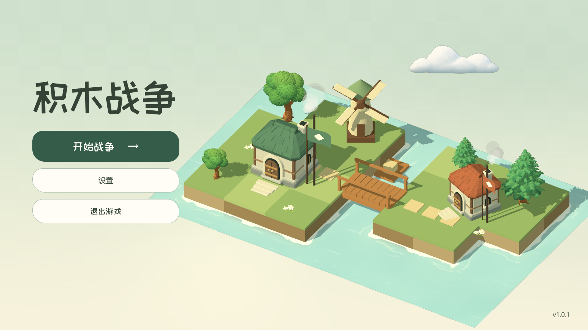

# 主菜单水岸质感（2026-09-29）

参考用户提供的岛屿截图中贴岸浪沫的厚薄变化与浅水过渡，保留原有薄荷绿色水面、草地和土层配色。

- 浅奶油色浪沫紧贴两座岛的岸线，以较大的柔和弧线缓慢移动；外侧保留断续、较淡的退水痕迹。
- 近岸水色逐渐过渡到原来的水面颜色。原生深度纹理控制吸收，让水下岸壁轻微显露并随深度淡去。
- 方块状重复亮斑改为稀疏、细长的流动高光。木筏尾流、水面点击涟漪继续使用原有交互和可暂停时钟。

实现位于 `assets/ui/block_war/lobby_water.gdshader` 和 `scenes/ui/lobby_diorama.tscn`，没有新增运行时节点。材质的 `shore_rects` 保存两座岛的四块矩形占地：每项依次为 X/Z 中心、X/Z 半尺寸。距离场取这些矩形的并集，避免相邻积木接缝产生假岸线；以后调整岛形时应同步修改此参数。

水面采用原生透明管线，渲染优先级设为 `-10`，使其先于位于水面上方的烟雾和云绘制。深度重建采用逆投影矩阵，适配当前正交相机；浅水渐隐不依赖屏幕颜色拷贝。

验证：Godot 4.6.3 / Forward+ 后台实录 432 帧，检查岸角、阴影、烟雾、木筏进出桥下和点击涟漪；复核 1600×900、1280×720、960×540，以及 4:3 窗口请求被游戏校正为 1024×576 后的画面。最终 41 项原生主菜单交互检查在已提交基线加本次两个运行时文件的独立副本上通过，无运行错误。工作区并行开发中的联机文件没有纳入本次修改。验证使用隔离桌面和 Dummy 音频驱动，没有切换桌面或操作系统鼠标。

[查看 12 秒实录](lobby_motion/shoreline.mp4)

官方实现依据：[深度纹理与逆投影](https://docs.godotengine.org/en/stable/tutorials/shaders/advanced_postprocessing.html#depth-texture)、[空间着色器透明管线](https://docs.godotengine.org/en/stable/tutorials/shaders/shader_reference/spatial_shader.html)、[着色器数组](https://docs.godotengine.org/en/stable/tutorials/shaders/shader_reference/shading_language.html#global-arrays)。
