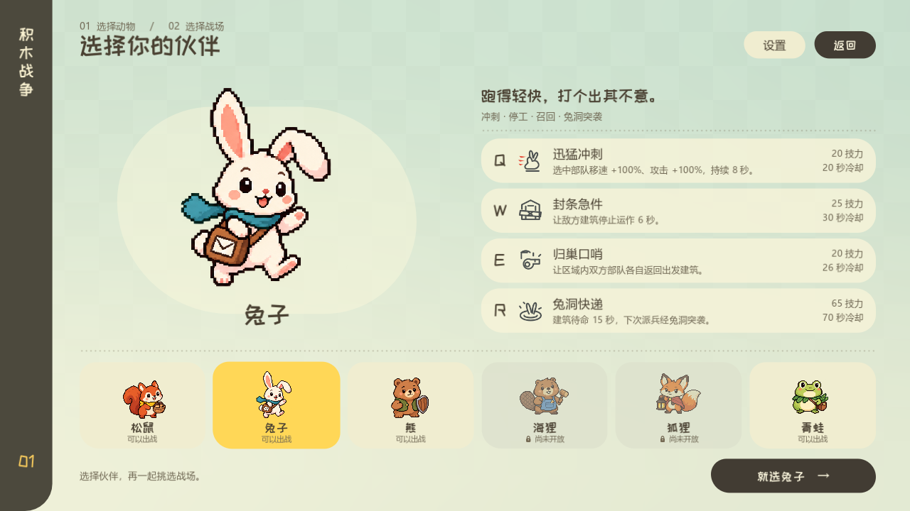
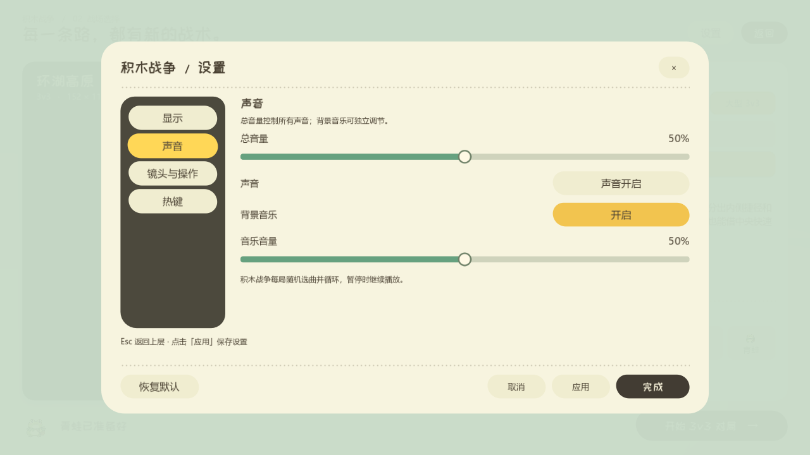

# 非战斗菜单动效（2026-09-28）

参考同级 `GodotGameUI` 项目中 `scripts/tween_manager.gd` 的缩放、淡入、分组延迟，以及 `shaders/loop_rotion.gdshader` 的缓慢背景运动。参考工程的动画管理器尚未接通全部行为，本项目采用自己的 Godot 原生 Tween 与场景节点实现。

## 交互变化

- 大厅标题、主菜单和版本信息依序进入；单人／联机面板分组展开。房间首次显示播放一次，席位状态刷新不会让整张面板反复闪动。
- 将领选择按页头、画像、技能、角色列表和底部操作错峰入场。切换将领时画像、名字及四条技能顺序显现。
- 地图选择按预览、选项和底部操作分组入场；切换地图只更新战术地图和相关说明，选项按钮保持在原位。
- 菜单中的设置分组进入，分类切换带淡入和轻微回弹；关闭立即生效，连续重开也能恢复完整显示。
- 将领与地图页的背景格纹缓慢漂移，并有轻微明暗变化。

菜单按钮按下缩至 96%，松开用 0.18 秒回弹；菜单面板用 0.30 秒 `TRANS_BACK / EASE_OUT`，起始缩放 96%，入场间隔默认 0.045 秒。透明度单独限制在有效范围，回弹不会导致亮度闪烁。容器仍控制布局，直接子节点不做位置偏移；按钮入场只改变透明度，悬停与按下独立控制缩放。没有位置偏移的菜单动画会跟随容器尺寸变化，首次打开设置或分类页不会因布局调整而跳过入场。

## 范围与生命周期

三张菜单场景中保存原生 `MenuEntrance` 节点及显式 sections。先等待原生容器布局，再等 `UITransition.completed` 开始入场，让动效发生在转场纸幕退去之后。等待信号与控件 Tween 都绑定节点，离开页面后自动清理。

新方法只在菜单中显式启用。战斗 HUD、暂停、结果及战斗中打开的设置保留原来的 98% 按压、98.5% 面板起始缩放和 0.18 秒显示时间。设置通过当前场景的 `animated_menu` 分组区分上下文。

## 验证

六组自动检查共 1199 项通过：新菜单动效 200、原共用动效 36、将领到实际战斗的菜单流程 51、设置 162、大厅原生输入 228、六地图预览 522。覆盖快速切换、重复选择、禁用角色、转场期间等待、首次布局、关闭重开、1280×720／1600×900，以及战斗动效参数保持不变。原生 Vulkan 录制另通过 353 项检查，输出 336 帧、14 秒的 24 FPS 演示；逐帧复核设置首次展开与切页确实呈现中间状态。

[查看 24 FPS 动效演示](menu_motion/menu_flow.mp4)





可复现录制：

```text
python tools/run_godot_private_desktop.py res://tests/menu_motion_visual.gd --output .local/menu_motion/visual --timeout 120
ffmpeg -framerate 24 -i .local/menu_motion/visual/frame_%04d.png -c:v libx264 -pix_fmt yuv420p -crf 20 -movflags +faststart .local/menu_motion/menu_flow.mp4
```

原生 API 依据：[Control 容器缩放](https://docs.godotengine.org/en/stable/classes/class_control.html#class-control-property-scale)、[Node.create_tween](https://docs.godotengine.org/en/stable/classes/class_node.html#class-node-method-create-tween)、[Tween](https://docs.godotengine.org/en/stable/classes/class_tween.html)。
