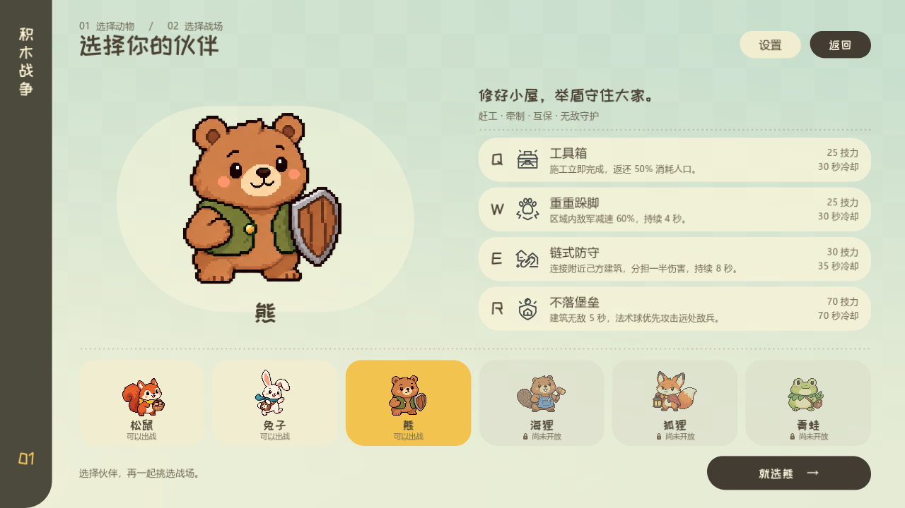

# 熊角色实装验收 · 2026-09-28

熊已在动物选择和敌方角色选择中开放，后面三种动物保持不可选择。规则、费用、电脑判断和边界行为见[指挥官说明](block_war_commanders.md#03-熊建设牵制与据点互保已实装)。

## 原生画面

四项演示均为 Godot 4.6.3 Forward+ 原生渲染，24 帧/秒，保持模拟速度，静音。使用不会激活的隔离 Windows 桌面，没有系统鼠标、键盘或切换桌面操作。

- [Q 工具箱：即时完工、工具与木屑](art/block_war_bear/toolbox.mp4)
- [W 重重跺脚：熊掌地印与土粒](art/block_war_bear/stomp.mp4)
- [E 链式防守：链节与受击传递](art/block_war_bear/link.mp4)
- [R 不落堡垒：扫光、动态护罩与真实弹体](art/block_war_bear/fortress.mp4)
- [下方四技能与角色 HUD](art/block_war_bear/bear_hud.png)
- [E 的双建筑拖拽预览](art/block_war_bear/link_preview.png)

检查了 1600×900、1280×720 的菜单，四项悬停说明、拖拽预览，以及战场正常缩放和近景特效。最终渲染日志无脚本或着色器错误。复用已有音效事件，没有修改音频文件。

## 规则与输入验证

为避免同时进行的士气系统工作影响测试和提交，以下结果来自以 `ccd07e7` 为基础、只包含本次熊改动的独立检验工作树。它们验证本次技能实现，不代表对尚在制作的其他系统作出验收。

| 检查范围 | 通过项 |
| --- | ---: |
| 熊技能、电脑施放、四按钮原生拖拽 | 131 |
| 施工与转换 | 210 |
| 攻防换损 | 194 |
| 区域加速 | 43 |
| 动物选择、地图与返回流程 | 48 |
| 既有电脑技能 | 178 |
| 行军 | 29 |
| 兔子冲刺 | 55 |
| **合计** | **888** |

关键结果：21 点整批或连续逐兵攻击均由支援端承担 11 人、所选端承担 10 人；20 次 1.05 系数攻击得到同样结果；支援不足不产生负人口；火攻同样分摊；无敌阻止驻军伤害和攻占，敌兵在门外继续承受真实攻击；减速、加速、冲刺的穿越与到期在长短帧下结果一致。上述测试无失败、无脚本错误。

行军回归中 700 名士兵的平均模拟 tick 为约 2.71 ms。该数值是无头规则测试数据，不代表 GPU 帧耗时或六方同时开技能的性能上限。

## 初版对局观察

固定地图 `rift`、`lake`，分别对阵松鼠、兔子，交换熊的出生阵营，每局模拟 240 秒，共八局。两边使用相同的基础电脑策略；[原始结果](art/block_war_bear/balance_initial.json)记录终局前的人口、建筑和 Q/W/E/R 使用次数。

| 地图 | 对手 | 熊阵营 | 240 秒时建筑数：熊 / 对手 | 人口：熊 / 对手（四舍五入） | 熊使用 Q/W/E/R 次数 |
| --- | --- | ---: | --- | --- | --- |
| rift | 松鼠 | 0 | 5 / 8 | 100 / 443 | 3 / 3 / 4 / 1 |
| rift | 松鼠 | 1 | 5 / 7 | 242 / 429 | 4 / 3 / 2 / 2 |
| rift | 兔子 | 0 | 4 / 9 | 142 / 624 | 3 / 3 / 1 / 2 |
| rift | 兔子 | 1 | 2 / 11 | 133 / 745 | 3 / 1 / 0 / 1 |
| lake | 松鼠 | 0 | 7 / 7 | 392 / 456 | 5 / 2 / 3 / 1 |
| lake | 松鼠 | 1 | 6 / 8 | 359 / 440 | 3 / 3 / 4 / 1 |
| lake | 兔子 | 0 | 5 / 9 | 192 / 558 | 3 / 2 / 2 / 2 |
| lake | 兔子 | 1 | 5 / 9 | 270 / 589 | 3 / 2 / 2 / 2 |

八局在 240 秒均未结束，不能统计为八场胜负，也不能宣称已达到 50% 胜率。熊的四项技能均有实际使用；对兔子出现明显人口与据点劣势，对松鼠在 lake 较接近、rift 压力较大。这提示当前电脑对建设与互保窗口的利用、以及防守角色的反攻能力仍需继续校准，尤其要区分技能本身强度和电脑决策质量。

本轮优化了 W 判断：只对即将抵达己方据点或受到己方炮塔威胁的敌群施放，避免耗能减速远处无关部队或已被无敌建筑挡住的敌兵。四技能全部按冷却使用需要约 3.52 技力/秒，高于自然恢复的 2；E+R 消耗整管 100 技力。初版保留这些费用与已确认机制，后续以真实对局、两种出生位置、多人组合及不同策略的样本继续校准。
