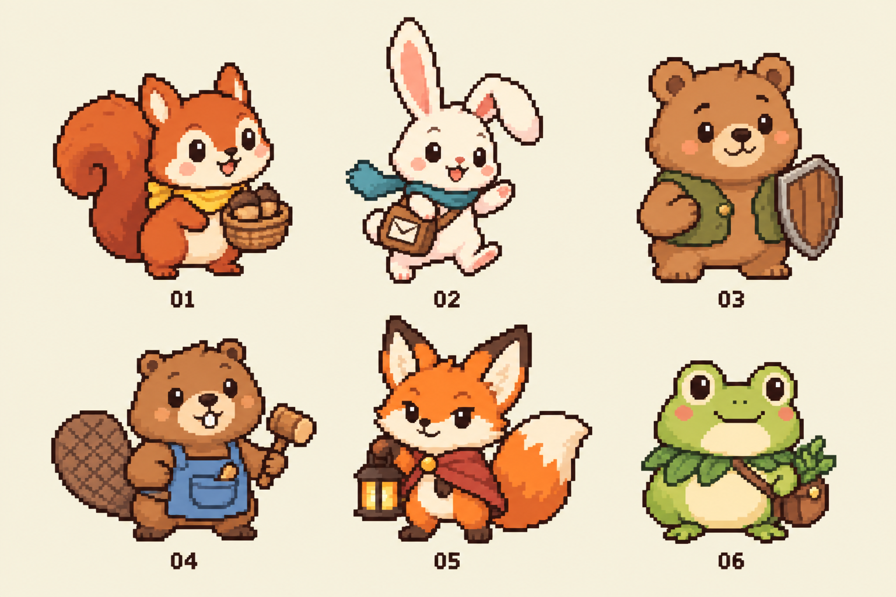

# 动物指挥官 · 默认松鼠与后续提案

六名可爱像素动物的造型已采用，透明立绘已收入 `assets/ui/block_war/commanders/`。01 榛果松鼠是当前默认指挥官，玩家和电脑均沿用原有 Q/W/E/R，使用下表平衡参数；松鼠 W 为拖放的局部疾行区域。02 跳豆兔子的技能方向已获认可，W 按用户要求改为使一座建筑失效 6 秒，完整技能组待实装。03—06 的专属技能仍是提案，02—06 均尚未开放选择；以下设计数字不代表已验证的对战平衡。

六名指挥官统一采用可爱的二维像素动物：大头、短手短脚、圆润表情，用耳朵、尾巴、体型和一件职业道具区分角色。角色自身配色不替代阵营色，HUD 用橙/青名称与部队旗色区分双方；透明立绘不使用圆形裁切或深色底盘。

造型板使用内置 image_gen 生成；[完整提示词](art/block_war_commanders_prompt.md)。采用批准造型做原生透明背景提取，按 Alpha 裁切并无损补边为六张独立 PNG，Godot 使用最近邻纹理过滤。[素材说明](../assets/ui/block_war/commanders/README.md) 记录提取与裁切过程；当前素材是静态立绘。

## 六个方向

| 编号 | 指挥官 | 轮廓、性格 | 擅长 | 必须保留的弱点 |
| --- | --- | --- | --- | --- |
| 01 | 榛果 · 松鼠管家（默认） | 圆脸、大卷尾、蜂蜜色小领巾、橡果篮；热心、有条理 | 征召、局部调动、守备与火攻的均衡组合 | 四技能共用技力，无法兼顾全部；火攻存在误伤 |
| 02 | 跳豆 · 兔子信使 | 长耳朵一立一垂、白色圆肚、青色短围巾、小邮包；机灵急性子 | 调动、短时停工、增援、两线切换 | 不凭空增加人口，正面换损没有常驻优势 |
| 03 | 栗团 · 小熊守卫 | 最宽的圆身、圆耳、小橄榄背心、宽木盾；温厚可靠 | 守住关键据点、抵挡一波进攻 | 反攻慢，保护效果到期后有空窗 |
| 04 | 木丁 · 海狸工匠 | 小门牙、扁桨尾、蓝灰围裙、短木锤；好奇、爱修东西 | 施工节奏、炮塔支援 | 依赖已有建筑，不能免费获得升级或常驻射程 |
| 05 | 灯芯 · 狐狸火守 | 大尖耳、奶白脸颊、白尖蓬尾、砖红小披肩、方提灯；机灵但做事谨慎 | 预判密集行军、封住短时通路 | 火焰误伤真实存在，落点有清晰预告 |
| 06 | 苔铃 · 青蛙药师 | 低矮圆身、头顶大眼、奶油肚皮、叶片领与小药包；温和、有耐心 | 减速牵制、缓解持续损耗 | 没有瞬间歼灭或大规模征召，节奏偏慢 |

**01** 的默认体验已实装；**02** 的技能方向已确认，当前记录包含新版 W 的完整规则，等待实装。后续再比较 02 与 03 的调动/守备专长，逐步加入其他指挥官。

## 首轮技能组

表内“30 / 35”表示消耗 30 技力、冷却 35 秒。所有角色统一开局与上限 100 技力，每秒恢复 2；没有额外常驻攻防或技力特权。全部沿用拖拽瞄准、松手施放。建筑技能拖到建筑，地面技能拖到范围。

### 01 榛果：原四技能的均衡型指挥官（已实装）

| 键 | 技能 | 起始数值与限制 | 原生特效方向 |
| --- | --- | --- | --- |
| Q | 征召军令 | 30 / 35；自己或盟友住宅 +4 人/秒，6 秒，共 24 人；同目标不叠加 | 金赭谷粒飘向门口、断续地面细光 |
| W | 疾行战鼓 | 30 / 28；拖放半径 4.5 米区域，持续 8 秒；仅圈内自己的部队 +60% 移速，离开恢复 | 清晰风场边界、缓慢流动的细风纹、零星叶屑；圈内受益士兵才有脚后风迹 |
| E | 磐石壁垒 | 35 / 45；自己或盟友建筑守备 +25 个百分点，8 秒；同目标不叠加 | 半透明低护墙、上浮碎光 |
| R | 天降冲击 | 70 / 70；0.8 秒预警，4.5 米外扩火焰；接触的双方士兵全部死亡，敌方/中立驻军基础伤害 25，不能占领 | 从内向外的火舌、余火、飞散火星、薄烟与焦痕 |

保留熟悉的四技能，削弱征召滚雪球，缩短壁垒窗口，提高火攻费用与预警时间。W 的价值来自把区域放在部队将经过的位置；圈外没有速度加成。数值、HUD 提示和电脑预测共用 `war_skill_rules.gd`，详细推导见 [技能平衡记录](block_war_skill_balance.md)。

### 02 跳豆：把已有的部队送到更有用的位置（方向已确认，未实装）

2026-09-26 首轮完整设计，用户认可迅捷的整体方向，并将 W 调整为让一座建筑失效 6 秒。沿用已采用的白兔、青色围巾和小邮包造型，以信使的疾跑、封条急件、集合哨和兔洞表达调动与干扰能力。四个技能分别解决抢时间、暂时压制建筑功能、撤回部队和短距离运兵。当前行军部队彼此不会交战，因此“包夹”指从不同方向抵达建筑或切换进攻目标，不能把缩窄队形、绕到部队背后当成伤害优势。以下均为待实战校准的起始参数。

| 键 | 技能与拖放目标 | 起始数值与限制 | 像素特效方向 |
| --- | --- | --- | --- |
| Q | 蹦蹦小径 · 地面区域 | 25 / 24；半径 3.5 米，持续 6 秒；仅区域内自己的行军 +70% 移速，离开恢复 | 贴地短草随风偏转，受益士兵脚后出现两三粒浅色方块尘；边界保持清楚 |
| W | 封条急件 · 敌方建筑 | 25 / 30；使一座敌方建筑失效 6 秒：铁匠铺暂停提供攻击增益、炮塔停止射击、住宅停止产兵 | 小封条啪地贴上，少量像素纸屑散开；铁锤停摆、炮口熄火或产兵粒子暂停，结束时封条卷起脱落 |
| E | 归巢口哨 · 自己的建筑 | 20 / 26；使建筑周围 6 米内最多 24 名已出门的自己的士兵改为返回该建筑，按正常速度行军 | 门口短旗抖一下；被召回士兵脚下有一次短小方向提示和转身尘点 |
| R | 兔洞快递 · 建筑 | 65 / 70；从附近一座自己的建筑运送最多 30 人到目标附近；来源保留至少 10 人，合法地面路线最长 18 米；1.2 秒出口预告，随后每 0.4 秒钻出 6 人 | 入口与出口先松土、冒少量土粒；士兵分排钻出，伴随短土尘，最后洞口回填 |

#### 施法边界与反制

- **Q：更灵活的小范围疾跑。** 同类加速取最高值；只作用于自己的士兵，尚未出门或处于兔洞中的单位不受益。移动速度增加不改变受击规则。区域有效时后续走入的自己的士兵也受益。
- **W：松手后使一个敌方建筑停工 6 秒。** 仅以敌方拥有的建筑为目标，不作用于自己、盟友或中立建筑；同一建筑不能在停工期间叠加或刷新。失效只暂停下列功能，驻军、出兵、增援、守备、升级和改建照常；不能由“失效”额外推导出清空人口或清除炮塔防御。
  - 铁匠铺：该座建筑的 +10 个百分点攻击增益暂时不计入所属阵营，其他铁匠铺仍正常。攻防仍先内部加减，再乘兵力；已经出发的部队也按实际抵达时的有效增益结算。
  - 炮塔：停止发射新炮弹，已经射出的炮弹继续正常飞行和命中。装填计时正常推进，恢复后按当前装填状态正常射击，不补射停工期间错过的齐射。原有 5% / 10% / 15% 守备保留。
  - 住宅：自然产兵和征召等额外产兵均暂停。已有征召的持续时间继续流逝，失效结束后只恢复剩余时间内的效果；停工期间不积攒人口，也不在恢复后补产。
  - 到期立即恢复当前建筑类型的功能；途中完成升级或改建不会刷新或清除剩余停工时间，新形态按对应规则继续停工。建筑被攻占时清除停工，不把旧阵营的负面状态转给新占领者。
- **E：召回，保留真实风险。** 只选范围内已经出门、可沿合法路线回到该建筑、且尚未以该建筑为目的地的自己的士兵；按离建筑的路线距离由近到远选最多 24 人，其他人继续原命令。转向从当前位置开始，维持原兵力与阵营，不瞬移、不免疫炮弹或火焰、不召回盟友的部队。目的建筑途中易手时，按普通抵达战斗规则结算。没有合格士兵时不可释放。
- **R：一次运兵，不留下常驻通道。** 可以支援自己或盟友的建筑，也可以向敌方或中立建筑发起进攻。来源是与目标不同、合法路线在 18 米以内、扣除保留的 10 人后至少能派 12 人的自己的建筑，取路线最近的一座。派出数为 `min(30, floor(来源人口) - 10)`，释放时从来源扣除，全程保留施法者阵营，不借用盟友驻军、不凭空增兵。
- **R 的出口与拦截。** 出口位于通往目标的合法地面路线、距建筑入口沿路 3 米的位置，必须有可用地面；不能出现在建筑内部、水面或不可行走区域。预告从释放时开始，对双方可见。地下阶段不受地面炮火或火焰攻击，但士兵出洞后仍需正常走完最后 3 米，照常受炮火、火攻和建筑守备影响；预先在出口放火可以烧死出洞士兵。建筑易手不会删除已扣费派出的士兵，到达仍按当前归属结算。

每个技能都只需一次拖拽松手。Q 预览范围；W 高亮将失效的单座敌方建筑，悬停技能图标时说明三种停工效果；E 预览召回人数和返程方向；R 同时标明来源、实际派出数、出口和最后一段行军路线。R 不要求先点来源建筑；同一目标悬停期间锁定已预览的来源，若来源失效则提示无效，松手不暗中换用另一座建筑。所有技能的目标或条件无效均不扣技力、不进入冷却。预览人数沿用建筑人口的字体、颜色和浅色底。

#### 与松鼠的强度比较

松鼠能花 30 技力增加 24 人；跳豆的技能总人口净增为零，也没有常驻攻防加成。兔子的收益要来自少损失一批兵、及时守住建筑或把后方驻军送到前线，不能只凭“移速更高”判断平衡。

W 暂保留 25 技力、30 秒冷却，以用户指定的 6 秒停工作为首测规则。各级住宅最多被阻止 6 / 7.5 / 8.4 / 9 人的自然产出，撞上完整征召窗口还可阻止额外的 24 人，实际价值取决于停产线、生效时机和征召剩余时间。对铁匠铺，例如原本有一个铁匠铺的 20 人进攻一级炮塔，停工前为 `20 × (1 - 0.05 + 0.10) = 21`，停工期间为 `20 × (1 - 0.05) = 19`；既有行军与换损箭头都须同步使用这个实时系数。对炮塔则提供完整 6 秒的停止新射击窗口，掩护人数取决于部队规模与经过时间。单名兔子的理论最高停工占空比为 `6 / 30 = 20%`，多人接续施放须另测。

Q 圈内速度为 `3.1 × 1.7 = 5.27` 米/秒。完整直穿 7 米直径节省约 `7/3.1 - 7/5.27 = 0.93` 秒，低于松鼠 W 直穿 9 米的约 1.09 秒；兔子的费用与冷却更低，但范围更小、持续更短。实际收益随部队路径和接续队列变化，两种范围加速均不影响远处部队。

四项都按冷却施放需约 `25/24 + 25/30 + 20/26 + 65/70 = 3.57` 技力/秒，高于每秒恢复 2 点。Q+R 或 W+R 消耗 90，E+R 消耗 85；Q+W+R 共 115，不能以初始 100 技力立即全部使用。R 一次最多转移 30 人，并在来源留下至少 10 人；来源只有自然停产线的一级住宅时最多派 20 人。

典型打法是用 W 暂停炮塔射击，为正常行军或兔洞援兵争取过塔窗口；也可以在敌军即将抵达时封住其铁匠铺，或在敌方住宅征召时让其停产。W 不造成直接伤害，过早封塔或封住已经满员且未征召的住宅会浪费窗口。R 把后方驻军送到另一条战线，Q 帮出洞部队走完最后一段；错误兔洞出口仍会让整批援兵被火攻击杀。E 用于撤回附近的进攻部队以应对反扑，范围外的远征部队仍需继续承担风险。

#### 电脑使用与验收方向

电脑使用相同的费用、冷却、拖放目标条件、炮弹命中与火焰规则。Q 根据实际行军路线的交集投放；W 比较三类收益：阻止炮塔对即将过境的己军射击、移除铁匠铺对即将交战部队的攻击加成、减少住宅未来 6 秒的实际产兵（含正在进行的征召），避免封住不会开火的炮塔或已停产的住宅；E 比较继续进攻与折返守城的收益，避免无威胁时频繁取消进攻；R 同时检查来源留下的人口、预计抵达收益和出口处已知火焰，避免抽空前线或向危险出口送兵。判断仅使用当前可知状态，不读取玩家未来输入。

实装后首先检查以下情形，再决定调整数值：无炮塔地图上对松鼠的产兵压力是否过弱；封塔与兔洞组合是否让防线失去意义；W 对完整征召的压制是否过强；2v2/3v3 多兔子接续停工和集中运兵是否缺乏反应窗口。记录实际避免伤亡、阻止产兵、铁匠铺停工影响的换损、召回后存活人数、兔洞成功运达人数与据点得失，同时轮换出生点比较胜率与对局时长。W 还须覆盖暂停、长短帧下准确 6 秒到期、改建、占领和重复施法验证。参数尚未通过这些实战检验。

视觉采用少量、分层的像素尘点、纸屑、草叶和地面轻微形变。角色与技能图标延续已采用的可爱像素动物素材风格；地面效果低矮，保留建筑人口和小兵轮廓的可读性。实现时优先使用场景预搭的原生粒子、动画与着色器，再通过隔离的后台渲染检查动效和命中对应关系。当前只记录设计，未制作新素材、运行游戏或接入兔子技能。

### 03 栗团：选择在哪座建筑接下这一波

| 键 | 技能 | 起始数值与限制 | 原生特效方向 |
| --- | --- | --- | --- |
| Q | 磐石壁垒 | 35 / 45；盟友建筑守备 +25 个百分点，8 秒，与当前 E 相同 | 低饱和棱面护墙，底边亮、上缘轻，零星向上石屑 |
| W | 定桩 | 25 / 30；半径 3 米地面令敌军减速 20%，4 秒，有 0.5 秒预告 | 地面碎砾轻抬、尘土贴地，预告后才结算 |
| E | 换防 | 30 / 35；从最近一座自己的建筑向所选盟友建筑派最多 15 人，正常行军与扣人口 | 来源门口小旗摆动，部队脚边短灰尘 |
| R | 连城守望 | 65 / 70；半径 8 米内最多三座盟友建筑守备 +25 个百分点，8 秒，不与 Q 叠加 | 各建筑分别出现低护墙，中间不画魔法连接线 |

群体保护降低单点强度。换防不瞬移、不免疫火焰。防御仍进入现有加减汇总公式，不能另乘一个减伤系数。

### 04 木丁：支付人口以后，加快关键建设窗口

| 键 | 技能 | 起始数值与限制 | 原生特效方向 |
| --- | --- | --- | --- |
| Q | 赶工 | 30 / 35；已付费的盟友施工剩余时间减少 3 秒，每次施工限一次 | 屋脚细木屑、两次短促敲击尘，接入原施工效果 |
| W | 校准炮口 | 35 / 40；盟友炮塔临时 +2 米射程，6 秒 | 炮口铜色微光、实际射程预览变化，无持续大光环 |
| E | 临时支撑 | 30 / 40；施工中的盟友建筑守备 +30 个百分点，6 秒，不与其他守备技能叠加 | 低位短促金属火星和木色支撑闪片 |
| R | 连发调度 | 65 / 70；一座盟友炮塔装填间隔缩短 30%，6 秒，目标数与单发伤害不变 | 随真实开火节奏增加炮口烟尘，不独立喷射假子弹 |

建造仍支付完整的 10/20/30 升级人口或 20 改建人口；原来的十秒施工是基础规则。不能将赶工连续叠加为瞬建，也不为铁匠铺加入升级。

### 05 灯芯：高收益需要预判，并且要给对手逃离机会

| 键 | 技能 | 起始数值与限制 | 原生特效方向 |
| --- | --- | --- | --- |
| Q | 火星试探 | 30 / 30；0.7 秒预告，半径 2 米，触及的双方士兵各承受一次 1 点伤害；不伤建筑 | 少量地面火星聚拢后短促燃起 |
| W | 余烟 | 25 / 30；半径 3 米，敌我行军均减速 15%，4 秒；不隐藏单位或人口 | 低矮淡灰烟流，保持小兵和边界可见 |
| E | 收火 | 20 / 25；立即熄灭指定位置自己释放的一片火区，无资源返还 | 火苗收低、余烬碎开、短烟后消退 |
| R | 烈焰扩散 | 70 / 70；沿用当前 R：0.8 秒预告、4.5 米扩散、士兵敌我皆伤、建筑基础伤害 25 | 真实外扩火舌、内部余火、火星、薄烟和逐渐冷却的焦痕 |

该角色保留最明显的风险：W 也会拖慢己方，Q/R 都可能杀死自己的行军，E 用额外技力换止损。首测须重点检查窄桥封锁是否过强；不能用隐藏伤亡上限违背“接触即死亡”的现有 R 规则。

### 06 苔铃：阻滞推进、保存驻军

| 键 | 技能 | 起始数值与限制 | 原生特效方向 |
| --- | --- | --- | --- |
| Q | 草药补给 | 30 / 35；盟友住宅每秒 +3 人，6 秒，与征召同类，不能叠加 | 少量叶片与很淡的绿色屋脚暖光 |
| W | 润地 | 25 / 30；0.5 秒预告，半径 3 米，敌方减速 20%，4 秒 | 暗一点的湿土地面、稀疏水珠，无蓝色魔法水池 |
| E | 安营 | 35 / 45；盟友建筑守备 +35 个百分点，8 秒，不叠加 | 屋边贴地的薄叶流与低位渐亮边线 |
| R | 春回 | 65 / 70；半径 8 米内最多三座盟友住宅各 +2 人/秒，5 秒，总量最多 30；与 Q/征召不叠加 | 各住宅少量叶片逐次舒展，提示准确落在受益建筑 |

不复活已死亡的士兵，也不偷偷扩大驻军上限；增兵规则与征召一致。药师应靠多次小优势取胜，不能兼得管家的单点征召效率与守卫的最强壁垒。

## 统一的平衡约束与实装顺序

1. 同类产兵、守备、速度、减速效果只取一个有效值；技能不能通过多人重复投放获得无限增幅。攻防百分比仍先加减，再乘兵力。
2. 同一角色双方对称；电脑使用相同技力、冷却、预告和友军误伤规则。难度调整先改变判断间隔与目标质量，不靠隐藏数值作弊。
3. 01 已作为默认实装；后续做 02/03 的选择界面与完整技能组时，再验 1v1、2v2、3v3：轮换出生点和双方角色，分别统计胜率、结束时间、净增人口、及时增援、每点技力避免的损失。
4. 目标是轮换出生点后的对局胜率接近 50%，45%–55% 用作初步排查区间；不足够多的对局不能据此宣称平衡。要额外检查窄桥火攻、三个盟友集中保护、早期人口滚雪球和纯防守拖延。
5. 所有角色都保留完整的动物头部、爪子与物种特征，约两头身；用少量像素块表达眼睛、嘴巴和职业道具，避免配饰掩盖动物轮廓。每个材质控制在两至三个色阶，轮廓清楚，缩小后仍能辨认物种。技能图标继续使用现有方卡体系。

本次四项技能的实机粒子预览见 [Q/W/E/R 动画](art/block_war_skills_review.gif)。当前规则审查见 [技能平衡记录](block_war_skill_balance.md)。
