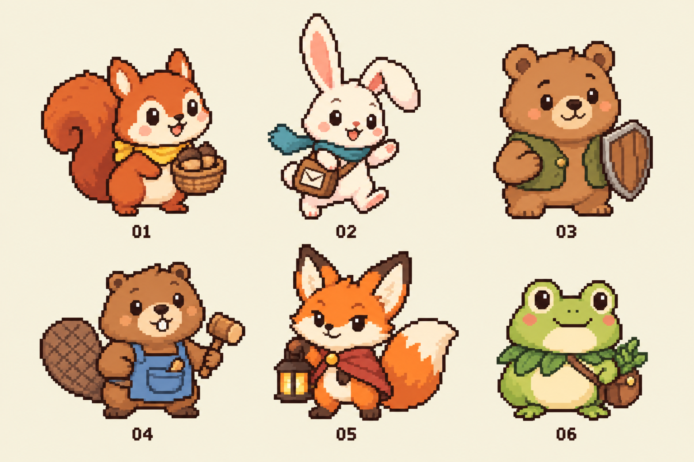

# 动物指挥官 · 松鼠、兔子、熊、狐狸、青蛙与后续提案

六名可爱像素动物的造型已采用，透明立绘已收入 `assets/ui/block_war/commanders/`。01 松鼠仍为默认指挥官，02 兔子、03 熊、05 狐狸、06 青蛙的完整技能组已实装。战场选择页可分别选择我方和敌方使用这五种动物；多人联盟中，同一边的电脑队友使用该边选定的指挥官，每名指挥官独立支付技力和冷却。04 海狸保留不可选择的占位；下列起始参数不代表已通过大样本对战平衡验证。

六名指挥官统一采用可爱的二维像素动物：大头、短手短脚、圆润表情，用耳朵、尾巴、体型和一件职业道具区分角色。角色自身配色不替代阵营色，HUD 用橙/青名称与部队旗色区分双方；透明立绘不使用圆形裁切或深色底盘。

造型板使用内置 image_gen 生成；[完整提示词](art/block_war_commanders_prompt.md)。采用批准造型做原生透明背景提取，按 Alpha 裁切并无损补边为六张独立 PNG，Godot 使用最近邻纹理过滤。[素材说明](../assets/ui/block_war/commanders/README.md) 记录提取与裁切过程；当前素材是静态立绘。

## 六个方向

| 编号 | 指挥官 | 轮廓、性格 | 擅长 | 必须保留的弱点 |
| --- | --- | --- | --- | --- |
| 01 | 榛果 · 松鼠管家（默认） | 圆脸、大卷尾、蜂蜜色小领巾、橡果篮；热心、有条理 | 征召、局部调动、守备与火攻的均衡组合 | 四技能共用技力，无法兼顾全部；火攻存在误伤 |
| 02 | 跳豆 · 兔子信使 | 长耳朵一立一垂、白色圆肚、青色短围巾、小邮包；机灵急性子 | 小队突击、短时停工、增援、两线切换 | 不凭空增加人口，正面换损没有常驻优势 |
| 03 | 栗团 · 小熊守卫 | 最宽的圆身、圆耳、小橄榄背心、宽木盾；温厚可靠 | 守住关键据点、抵挡一波进攻 | 反攻慢，保护效果到期后有空窗 |
| 04 | 木丁 · 海狸工匠 | 小门牙、扁桨尾、蓝灰围裙、短木锤；好奇、爱修东西 | 施工节奏、炮塔支援 | 依赖已有建筑，不能免费获得升级或常驻射程 |
| 05 | 狐狸 | 大尖耳、奶白脸颊、白尖蓬尾、砖红小披肩、方提灯；机灵、擅长扰乱阵脚 | 投弹削守、偷取士气、临阵招降、驱散驻军 | 不直接占领；招降范围小，恐慌只是转移敌军；费用较高 |
| 06 | 青蛙 | 低矮圆身、头顶大眼、奶油肚皮、叶片领与小药包；安静、善用时机 | 弱化、滞空、隐身、削减关键据点 | 不增加人口；滞空也阻住己军，隐身与雾气只能避开炮塔，大招消耗高 |

**01、02、03、05、06** 已开放选择，界面分别只显示“松鼠”“兔子”“熊”“狐狸”“青蛙”，重开对局保留双方选择。所有角色沿用已采用的像素立绘和下方四张技能卡片，不增加额外技能面板。

## 首轮技能组

表内“30 / 35”表示消耗 30 技力、冷却 35 秒。所有角色统一开局 20 技力、上限 100；对局前 100 秒自然恢复 1 点/秒，从第 100 秒起自然恢复 2 点/秒，暂停不推进该计时。能量塔恢复加成另行叠加，各角色没有额外常驻攻防或技力特权。全部沿用拖拽瞄准、松手施放。建筑技能拖到建筑，地面技能拖到范围。

建筑近战双方按自己的实际损兵恢复技力，使用该次交战前的气势：不足 3 星每人恢复 0.2 点，3 星至不足 5 星每人 0.15 点，5 星每人 0.1 点。攻打中立建筑时，自己的真实损兵同样计算，中立驻军的损失不归玩家领取。直接技能杀伤、行军途中伤亡、派兵与增援、施工消耗不产生这项恢复。

在不施放其他技能、没有能量塔和战损回能的条件下，第一次攒够 R 费用的时点如下；这是支付门槛，不保证当时存在有效目标。

| 指挥官 | R 费用 | 首次可支付时点 |
| --- | --- | --- |
| 兔子 | 65 | 45 秒 |
| 松鼠 / 熊 | 70 | 50 秒 |
| 狐狸 / 猪猪 | 75 | 55 秒 |
| 青蛙 | 85 | 65 秒 |

### 01 榛果：原四技能的均衡型指挥官（已实装）

| 键 | 技能 | 起始数值与限制 | 原生特效方向 |
| --- | --- | --- | --- |
| Q | 征召军令 | 30 / 35；自己或盟友住宅 +4 人/秒，6 秒，共 24 人；同目标不叠加 | 金赭谷粒飘向门口、断续地面细光 |
| W | 疾行战鼓 | 30 / 28；拖放半径 4.5 米区域，持续 8 秒；仅圈内自己的部队 +60% 移速，离开恢复 | 清晰风场边界、缓慢流动的细风纹、零星叶屑；圈内受益士兵才有脚后风迹 |
| E | 防护罩 | 35 / 45；自己或盟友建筑守备 +25 个百分点，8 秒；同目标不叠加 | 恢复旧版蓝色半透明球罩，流动高光、柔和边缘反光与少量上浮碎光 |
| R | 天降冲击 | 70 / 70；松手立即点燃，0.28 秒内从圆心扩散至 4.5 米；接触的双方士兵全部死亡，敌方/中立驻军基础伤害 25，不能占领 | 当帧出现的中心火焰与光照、迅速外扩的火舌、余火、火星、薄烟与焦痕 |

保留熟悉的四技能，削弱征召滚雪球，防护罩保留 8 秒窗口与 +25% 守备。火攻维持费用和驻军伤害，取消蓄热前摇。W 的价值来自把区域放在部队将经过的位置；圈外没有速度加成。数值、HUD 提示和电脑预测共用 `war_skill_rules.gd`，详细推导见 [技能平衡记录](block_war_skill_balance.md)。

### 02 跳豆：把已有的部队送到更有用的位置（已实装）

沿用已采用的白兔、青色围巾和小邮包造型，以信使的冲刺、封条急件、集合哨和兔洞表达突击、调动与干扰能力。四个技能分别解决短时集中攻势、暂时压制建筑功能、让区域内各方部队返程和远距离运兵。当前行军部队彼此不会交战，因此“包夹”指从不同方向抵达建筑或切换进攻目标，不能把缩窄队形、绕到部队背后当成伤害优势。以下为当前参数，仍需实战校准。

| 键 | 技能与拖放目标 | 起始数值与限制 | 已实现的模型与特效 |
| --- | --- | --- | --- |
| Q | 迅猛冲刺 · 地面选兵 | 25 / 25；松手瞬间选中半径 3.0 米内自己的露天行军，获得 8 秒移速 +100% 与攻击 +50 个百分点；增益随兵移动，后续入圈者不受益 | 短促红色爆发标出选兵，受益士兵带红色速度线与轮廓高光，保留阵营标识，步频随实际移速提高 |
| W | 封条急件 · 敌方建筑 | 25 / 30；使一座敌方建筑停工 6 秒：铁匠铺暂停攻防加成、能量塔暂停恢复加成、炮塔停止射击、住宅停止产兵 | 交叉纸封条与兔耳蜡印落下回弹，缎带摆动、细线地环流动；结束时封条抬起缩退、纸屑散开 |
| E | 归巢口哨 · 地面区域 | 20 / 26；半径 6 米内所有阵营的露天行军部队各自返回原始出发建筑，无人数上限 | 落点出现口哨与扩散波纹，受影响士兵转向并散出短尘迹；预览显示范围和返程方向 |
| R | 兔洞快递 · 自己的建筑 | 65 / 70；给予 15 秒一次性待命增益；下次有效派兵按所选比例运送最多 50 人，无距离上限；下令后先掘地 0.25—1.2 秒，再每 0.16 秒出洞一排，每排最多 6 人 | 待命标记留在来源建筑；下令后显示掘地，再展开出口、分排出兵与回填，不以施法动画代替真实派兵 |

#### 施法边界与反制

- **Q：选中一批士兵，冲刺增益随兵移动。** 松手时一次性选择半径 3.0 米内自己的露天行军，持续 8 秒；走出施法范围仍有效，后续走入的士兵不补领。盟友名下的部队、尚未出门或正在掘地等待的单位不受益；没有合格士兵时拒绝施法，不扣技力、不进入冷却。同类技能加速取最高值，冲刺提供 +100% 技能移速，再减去有效技能减速；技能移速倍率与气势移速倍率相乘，受击规则不变。
- **Q 的攻击与人口结算。** 持续期间技能攻击加成增加 50 个百分点。伤害为 `兵力 × (1 + 铁匠铺攻击 + 气势攻击) ÷ (1 + 守方铁匠铺防御 + 气势防御 + 炮塔守备) × (1 + 0.50 + 其他技能攻击) ÷ (1 + 技能防御)`；常驻与技能分别结算，每组内部先相加。半星不提供气势加成，中立守方没有铁匠铺和气势增益，但保留炮塔自身守备。增援自己或盟友建筑只增加实际抵达人数，不把攻击加成转成人口；进入任何建筑就消耗该行军士兵及其冲刺增益，占领后残余驻军仍按真实士兵计算。增益到期即失去加速与攻击优势，不留在建筑或下一次出兵上。
- **W：松手后使一个敌方建筑停工 6 秒。** 仅以敌方拥有的建筑为目标，不作用于自己、盟友或中立建筑；同一建筑不能在停工期间叠加或刷新。失效只暂停下列功能，驻军、出兵、增援、守备、升级和改建照常；不能由“失效”额外推导出清空人口或清除炮塔防御。
  - 铁匠铺：该座暂时不计入所属阵营的有效座数，攻击与防御按剩余座数重新计算。已经出发的部队按实际抵达时的有效攻防结算；封条不改变这些部队的行军速度。
  - 炮塔：停止发射新炮弹，已经射出的炮弹继续正常飞行和命中。装填计时正常推进，恢复后按当前装填状态正常射击，不补射停工期间错过的齐射。原有 25% / 40% / 60% / 70% 守备保留。
  - 住宅：自然产兵和征召等额外产兵均暂停。已有征召的持续时间继续流逝，失效结束后只恢复剩余时间内的效果；停工期间不积攒人口，也不在恢复后补产。
  - 到期立即恢复当前建筑类型的功能；途中完成升级或改建不会刷新或清除剩余停工时间，新形态按对应规则继续停工。建筑被攻占时清除停工，不把旧阵营的负面状态转给新占领者。
- **E：各方部队各自归巢。** 选择地面落点，影响半径 6 米内所有阵营已经出门的露天士兵，无人数上限；尚未出门、正在掘地等待出发、已经返回原始来源或没有合法返程路线的单位不重复改派。每人返回自己的原始出发建筑，从当前位置按正常规则行军，保留原兵力、阵营和炮弹目标，不瞬移、不免疫炮弹或火焰。来源已被敌方占领时仍然返回，抵达后按普通战斗结算。范围内没有合格士兵时不可释放。
- **R：先给自己的建筑待命，再下达派兵命令。** 技能松手只给所选己方建筑 15 秒的一次性增益，不立即运兵或扣人口；同目标不能叠加或刷新。期限内下一次有效派兵消耗增益，可以增援自己或盟友，也可以进攻敌方或中立建筑，无距离上限，但须有合法路线与出口。派出数为 `min(50, floor(可用人口 × 所选比例))`，可用人口不含已预约部队；没有强制保留 10 人或至少派 12 人的限制。例如 70 人按 100% 下令只派 50 人，余下 20 人留守；按 50% 则派 35 人。取消拖动、无效目标、无路或不足 1 人的命令均保留待命增益，计时继续；到期未使用即失效，不返还技力，建筑易手也清除待命。
- **R 的掘地与扣兵。** 有效下令后才开始 0.25—1.2 秒掘地，期间所选人数仍预约在来源建筑中，继续参与防守。掘地完成后先出一排，之后每 0.16 秒再出一排，每排最多 6 人；每名士兵实际离开来源、从出口出现时才扣除 1 名真实驻军。等待中的预约不能再次用于出兵、升级或改建，伤亡导致人口不足时缩减预约，来源易手时取消尚未离开的旧阵营预约。已经离开的士兵继续行军，不凭空增兵。
- **R 的出口与拦截。** 出口位于通往目标的合法地面路线、距建筑入口沿路 3 米的位置，必须有可用地面；不能出现在建筑内部、水面或不可行走区域。掘地完成时出口展开并播放出洞声。士兵出洞后仍需正常走完最后 3 米，照常受炮火、火攻和建筑守备影响；预先在出口放火可以烧死出洞士兵。目标易手不删除已经出发的部队，抵达仍按当前归属结算。

每个技能都以拖拽松手施放。Q 预览当前可选士兵的小范围落点，松手后只保留短促爆发与随兵特效；W 高亮将失效的单座敌方建筑，悬停技能图标时说明三种停工效果；E 以地面圆圈预览各方召回人数和返程方向；R 先高亮获得待命增益的己方建筑，后续从该建筑正常拖动派兵时再预览实际人数、出口与最后一段路线。技能目标或条件无效均不扣技力、不进入冷却；右键可取消瞄准或派兵拖动。预览人数沿用建筑人口的字体、颜色和浅色底。

#### 与松鼠的强度比较

松鼠能花 30 技力增加 24 人；跳豆的技能总人口净增为零，也没有常驻攻防加成。兔子的收益来自 Q 窗口内集中打出攻击、少损失一批兵、及时守住建筑或把后方驻军送到前线，不能只凭“移速更高”判断平衡。

W 暂保留 25 技力、30 秒冷却，以用户指定的 6 秒停工作为首测规则。各级住宅最多被阻止 6 / 7.5 / 8.4 / 9 人的自然产出，撞上完整征召窗口还可阻止额外的 24 人，实际价值取决于停产线、生效时机和征召剩余时间。对铁匠铺，例如双方无气势和技能、守方无铁匠铺时，带一个铁匠铺的 20 人进攻一级炮塔，停工前伤害为 `20 × 1.30 ÷ 1.25 = 20.8`，封住该铁匠铺期间为 `20 ÷ 1.25 = 16`；既有行军与换损箭头都须同步使用这个实时系数，所属军团同时失去该座带来的防御增益。对炮塔则提供完整 6 秒的停止新射击窗口，掩护人数取决于部队规模与经过时间。单名兔子的理论最高停工占空比为 `6 / 30 = 20%`，多人接续施放须另测。

Q 在 0 星气势且未减速时，冲刺速度为 `3.1 × 2 = 6.2` 米/秒，持续 8 秒；常驻移速倍率为 `1 + 0.10 × 完整气势星级`，再乘技能的 `1 + 加速 − 减速`。3.0 米半径只决定施法瞬间选中哪些士兵，不限制其之后的受益路程。攻击加成使它适合在即将抵达敌方或中立建筑的小队上使用。以固定结算时点为例，20 人带一个铁匠铺、冲刺期间进攻带护罩的三级炮塔，守方无铁匠铺且双方均为 0 星气势时，等效伤害为 `20 × 1.30 ÷ 1.60 × 1.5 ÷ 1.25 = 19.5`；若此时攻方 2 星、守方 1 星，则为 `20 × 1.40 ÷ 1.80 × 1.5 ÷ 1.25 ≈ 18.67`。实际逐兵结算使用抵达时的气势星级；恰好在冲刺到期时或之后抵达的士兵没有这 50 个百分点技能攻击。

四项都按冷却施放需约 `25/25 + 25/30 + 20/26 + 65/70 = 3.53` 技力/秒，高于前 100 秒的 1 点/秒和之后的 2 点/秒自然恢复；能量塔与实际战损可补充预算。Q+R 和 W+R 各消耗 90，E+R 消耗 85；Q+W+R 共 115，超过 100 点上限。开局仅 20 点技力，不使用其他技能且没有塔或战损回能时，5 秒攒够 Q 的 25 点，45 秒攒够 R 的 65 点。Q 的费用与冷却同时提高后，按冷却持续施放仍需 1 点技力/秒，但单次预算更高、最长持续覆盖率由 40% 降至 32%。R 一次最多转移 50 人，留守量由当前可用人口和玩家所选比例决定，不能把 50 人上限以外的人自动改成普通行军。

典型打法是用 W 暂停炮塔射击，为正常行军或兔洞援兵争取过塔窗口；也可以在敌军即将抵达时封住其铁匠铺，或在敌方住宅征召时让其停产。W 不造成直接伤害，过早封塔或封住已经满员且未征召的住宅会浪费窗口。R 把后方驻军送到另一条战线，Q 可强化已经出洞并即将攻入建筑的一批士兵；后续出洞者不会自动获得冲刺，错误兔洞出口仍会让援兵被火攻击杀。E 可以赶回逼近的敌军或召回己方部队，但同一范围的盟友攻势也会折返，需要同时评估所有阵营的路线。

#### 电脑使用与验证

兔子每 3 秒判断一次技能机会，避免短途小队在原先 6 秒的两次判断之间已经进城；松鼠、熊等其他指挥官保留原有判断间隔。

电脑使用相同的费用、冷却、施放目标条件、掘地时序、炮弹命中与火焰规则。Q 需先从开局 20 点攒够 25 点技力，寻找至少 5 名能有效受益的己方士兵小队，优先选 8 秒内可抵达敌方或中立建筑的进攻部队；W 比较三类收益：阻止炮塔对即将过境的己军射击、移除铁匠铺对即将交战部队的攻击加成、减少住宅未来 6 秒的实际产兵（含正在进行的征召），避免封住不会开火的炮塔或已停产的住宅；E 同时计算赶回敌军、回援己方与打断盟友进攻的收益；R 先选来源、目标和派兵比例，给来源施加待命后下达有效命令，检查留守人口、预计抵达收益和出口处已知火焰。判断仅使用当前可知状态，不读取玩家未来输入。

当前 Q 回归重点：3.0 米瞬时选兵、只选自己的露天行军、后入圈不补领、出圈后持续、空施法免费拒绝、8 秒到期边界、常驻与技能分组后的移速和攻防公式、友军增援不增额外人口、占领残余与入城后清除，以及开局技力下的电脑进攻选择。E/R 已有的全阵营返程、待命与掘地、分批扣兵、防守与伤亡、占领、暂停和人口守恒规则保持；W、四按钮拖拽与键盘施放、右键取消、选人和重开也需同时保持。

需要继续用对局数据校准：无炮塔地图上对松鼠的产兵压力是否过弱；封塔与兔洞组合是否让防线失去意义；W 对完整征召的压制是否过强；2v2/3v3 多兔子接续停工和集中运兵是否缺乏反应窗口。规则正确性测试不能替代轮换出生点后的胜率、对局时长与技能收益统计。

角色沿用已批准的像素动物立绘。技能图标使用界面下方既有四张卡片，保持与松鼠一致的手绘 SVG 轮廓、线宽、卡片尺寸、嫩绿色就绪光与悬停说明样式。Q 保留兔子轮廓，以尖锐红色速度线标明冲刺；其余三张仍为建筑封条、集合哨与兔洞，不另做大型彩图技能牌。

三维道具与粒子采用 `rabbit_seal.tscn`、`rabbit_rally.tscn`、`rabbit_burrow.tscn`、`rabbit_tunnel.tscn`、`rabbit_burrow_ready.tscn` 和 `rabbit_effects.tscn` 中预搭的原生场景。纸边与旗面用轻微顶点形变；Q 用短促红色选兵爆发和随兵速度线、轮廓高光表现持续效果，保留士兵阵营标识；土粒、脚尘与纸屑使用有发射上限的 `GPUParticles3D`。动效随模拟暂停，6 名指挥官分别保留自己的洞口和集合标记实例。此前 E/R 改版已在隔离的 Windows 桌面完成原生 Forward+ 渲染与截图检查，无切换桌面或系统输入操作；正常缩放和近景检查了当时四技能、待命倒计时、跨图掘地及分排出洞，不代表此次红色冲刺已完成视觉验收。

历史验证（2026-09-26，早于兔子 Q/E/R 改版）：兔子规则 `91/91`、兔子输入与电脑战术 `91/91`，原有技力 `182/182`、换损 `194/194`、施工 `210/210`、火攻 `50/50`、区域加速 `43/43`、行军 `29/29`、电脑技能 `98/98`、战场选择 `54/54`、联盟 `28/28` 通过。旧版实机预览：[下方四图标与 HUD](art/block_war_rabbit_hud.png)、[四技能动画](art/block_war_rabbit_skills.gif)。

### 03 熊：建设、牵制与据点互保（已实装）

2026-09-28 开放选择。Q、E 按已确认方案实现，E 使用整数伤亡；2026-09-30 将 R 改为震庭威慑，下表为当前费用、范围与冷却。

| 键 | 技能 | 当前效果 | 技力 / 冷却 |
| --- | --- | --- | --- |
| Q | 工具箱 | 正在升级或转换的己方建筑立即完工，返还本次实际消耗人口的 50% | 25 / 30 |
| W | 重重跺脚 | 半径 4.5 米区域内敌军减速 60%，持续 4 秒；己军、盟军不受影响 | 25 / 25 |
| E | 链式防守 | 与 18 米内最近的另一座己方建筑连接 8 秒；支援端承担一半驻军伤害，累计奇数多承担 1 人 | 30 / 35 |
| R | 震庭威慑 | 己方建筑技能防御 +100%，持续 5 秒；法术球立即开火，每 0.5 秒攻击 18 米内最多 3 名敌兵，优先最远目标 | 70 / 70 |

#### Q：按实际付款退款，松手立即完工

先照常支付人口开始施工，工具箱完成这一次已付费的升级或转换，并把退款加入该建筑的驻军。新等级、形态和功能在施放时立即生效。同一次施工只完成和返还一次；空闲、已完工、已取消或已易手的建筑不能用旧施工记录退款，无效施法不扣技力、不进入冷却。玩家和电脑均记录本次实际支付额，测试或其他免费施工不产生退款。

| 施工 | 实际支出人口 | 工具箱返还人口 |
| --- | --- | --- |
| 住宅 1→2 / 2→3 / 3→4 | 10 / 20 / 30 | 5 / 10 / 15 |
| 炮塔 1→2 / 2→3 / 3→4 | 30 / 60 / 90 | 15 / 30 / 45 |
| 建筑类型转换 | 20 | 10 |

退款不随剩余工时递减，不受住宅自然产兵停止线截断。铁匠铺仍不可升级；住宅转换成其他类型时清除旧征召。反复转换每次仍净消耗 10 人。技能收益为人口折扣与提前完工：住宅和炮塔的 1 → 2 级施工最多提前 5 秒，后续升级与改建最多提前 10 秒，需要继续观察高级炮塔退款的强度。

#### E：先计算伤害，再分担整数伤亡

先按受击建筑当前攻防系数计算伤害，再分担，支援端不再次计算自身防御。例：双方无气势、守方无铁匠铺或护罩时，带一座铁匠铺的 20 名普通士兵进攻一级炮塔，等效伤害为 `20 × 1.30 ÷ 1.25 = 20.8`；累计整数伤亡为 20，支援建筑与受击建筑各扣 **10** 人，余下 0.8 继续累计。

连接期间累计计算整个人口的伤亡，支援端累计承担 `ceil(累计整数伤亡 / 2)`。21 次各 1 点的攻击也得到 11 / 10，不会因每次向上取整而让支援建筑承担全部损失。攻防系数带来的不足 1 人余量只记在伤害累积中，达到 1 人才参与分摊；断链后未满 1 人的余量由下一次普通命中继续结算，不会凭空舍弃。

拖拽时预览最近的有效支援建筑，松手后固定对象。每栋建筑同时只参与一条连接，分担只从所选端流向支援端，不反向或递归传递。无可用支援建筑时不可施放；任一端易手立即断开。

支援端最多承担自己现有的整数人口，不强制保留驻军。缺少的份额交回受击端，支援端不足 1 人即断链。例如支援仅有 3 人时承受 21 点攻击，支援扣 3、所选端扣 18；支援端不会因为分担而改变归属。火攻的驻军伤害也遵循同一分担规则。

E 与 R 可组合：所选端的震庭威慑先参与技能防御结算，再分担伤亡；支援端的防御不会对转移的伤害再次减免。E+R 共耗 100 技力，保护结束后仍有较长冷却空窗。

锁链使用交错的椭圆铜质链节，沿垂弧和坡地切线排列，两端的铆接挂扣贴合实际建筑表面。两栋建筑底部显示成对的光纹；受击光脉冲沿链条传向支援方，挂扣和底纹按顺序响应。挂点复用原生 [TriangleMesh](https://docs.godotengine.org/en/stable/classes/class_trianglemesh.html) 射线求交并缓存，能随建筑换型、升级与选中缩放更新；底纹复用地形采样，暂停和断链时同步停止、清除。[实机预览](art/bear_link/preview.mp4)。

#### W、R：即时反馈与有限的保护窗口

W 松手立即减速，敌兵离开区域即恢复；重复的敌方减速区域不叠加。区域加速、兔子冲刺和减速会按实际路线穿越及剩余时间结算，长帧不会跳过区域。自己的冲刺与区域加速取较大者，再按 `1 + 技能加速 − 0.60` 计算技能移速；例如冲刺与减速同时生效时为 1.40 倍，再乘气势的常驻移速倍率。

R 当帧提高建筑技能防御，并在 18 米内锁定最多 3 名敌兵，优先最远目标；此后每 0.5 秒攻击一轮。每个目标对应一发真实追踪弹体，命中击杀 1 名士兵，并与炮塔共享目标预约，避免重复瞄准已经被锁定的士兵。五秒内最多 10 轮、30 发；没有有效目标的时机不累积补射。

震庭威慑提供 +100% 技能防御；无其他技能防御时，受防御影响的伤害减半。敌兵照常进入建筑交战，驻军耗尽仍可失守；友军正常增援，R 不恢复驻军。青蛙与狐狸的固定比例人口效果不受防御减免。

#### 电脑施放、表现与验证

电脑与玩家共用费用、冷却、目标条件和伤害代码。Q 比较退款与节省的施工时间；W 寻找即将抵达己方建筑或暴露在己方炮塔射程内的敌群，避免对远处无威胁的行军浪费技能；E 要求支援端能承担预计的一半伤害，并评估其自身威胁；R 优先保护即将失守的据点。每次决策只释放当前评分最高的可用技能，不读玩家未来输入。

下方仅增加既有卡片体系内的四个 SVG 图标，沿用统一字体、圆角、嫩绿就绪光与拖拽松手操作。Q 为木工具箱、短锤敲击和木屑；W 为熊掌地印、短促震纹和土粒；E 为真实立体链节，受击亮点沿链传向支援；R 为快速扫过的琥珀盾光、动态高光、带铜环的法术球和金色弹体。全部用预搭 `.tscn` 场景、原生粒子、MultiMesh 与着色器表现；技能生效不等待动画，暂停同时冻结模拟与粒子。

音效复用已校准的完工、战鼓、改建、护罩与弹体命中事件，本次未改动音频文件。

历史初版验证（早于震庭威慑改版）：退款与重复施法、捕获取消、整数分摊和连续逐兵到达、火攻分担、支援不足、E/R 组合、暂停、减速穿越与到期、远处目标优先、真实弹体、当时的门外等待，以及四个下方按钮的原生拖拽输入，**131 项通过**。加上施工、换损、菜单、区域加速、行军、既有电脑技能与兔子冲刺回归，共 **888 项通过**；原生演示与八局初版对局观察见[初版验收记录](block_war_bear_review.md)。

震庭威慑改版验证（2026-09-30）：熊规则 **172 项**、攻防分组 **79 项**、24 技能原生图鉴 **416 项**全部通过。图鉴使用真实施法、行军与弹体结算；演示中 30 名敌兵在防御期间正常入城，五秒结束后防御加成归零。[图鉴实机截图](art/codex_live/bear_deterrence.png)。

### 04 木丁：支付人口以后，加快关键建设窗口

| 键 | 技能 | 起始数值与限制 | 原生特效方向 |
| --- | --- | --- | --- |
| Q | 赶工 | 30 / 35；已付费的盟友施工剩余时间减少 3 秒，每次施工限一次 | 屋脚细木屑、两次短促敲击尘，接入原施工效果 |
| W | 校准炮口 | 35 / 40；盟友炮塔临时 +2 米射程，6 秒 | 炮口铜色微光、实际射程预览变化，无持续大光环 |
| E | 临时支撑 | 30 / 40；施工中的盟友建筑守备 +30 个百分点，6 秒，不与其他守备技能叠加 | 低位短促金属火星和木色支撑闪片 |
| R | 连发调度 | 65 / 70；一座盟友炮塔装填间隔缩短 30%，6 秒，目标数与单发伤害不变 | 随真实开火节奏增加炮口烟尘，不独立喷射假子弹 |

建造仍支付完整的升级人口或 20 改建人口；基础施工时间为住宅和炮塔 1 → 2 级需 5 秒，其余升级与改建需 10 秒。不能将赶工连续叠加为瞬建，也不为铁匠铺加入升级。

### 05 狐狸：偷取优势、扰乱阵脚（已实装）

| 键 | 技能与拖放目标 | 当前效果 | 技力 / 冷却 |
| --- | --- | --- | --- |
| Q | 从天而降 · 敌方或中立建筑 | 上方投下炸弹，损失当前驻军 50%，最多 30 人，向下取整；不直接占领 | 25 / 30 秒 |
| W | 顺手牵星 · 敌方建筑 | 从建筑所属英雄偷取最多 1 星士气；按双方实际星数转移，自己最多 5 星 | 40 / 50 秒 |
| E | 临阵招降 · 地面区域 | 永久招降半径 3 米内当前的敌方露天行军，保留位置、阵型、路线和原有状态 | 60 / 65 秒 |
| R | 惊慌失措 · 敌方建筑 | 80% 驻军分赴较近的最多 3 座同阵营建筑，向下取整，无距离上限；逃兵不改变阵营 | 75 / 80 秒 |

全部松手即生效。Q 的炸弹以 0.18 秒短落体接入暖色冲击、碎屑和薄烟；W 的立体金星沿短弧掠向己方；E 的小旗与纸屑伴随实际士兵换色；R 的三个短促惊叹号、外扩断续纹与真实逃兵共同表现恐慌。原生场景、着色器与粒子随暂停冻结，四个独立音效使用已许可的 CC0 音源。

Q 可由链式防守分担；常驻与技能防御均不改变固定削减量，不取消施工或降低等级。W 只扣除目标建筑所属英雄的士气，不扣其队友；不足一星或自己接近满星时只转移有效部分，空目标或自己满星免费拒绝。E 不影响盟友、未出门或掘地等待中的单位；保留原目的地，改归属后抵达按正常增援或战斗规则结算。AI 不用隐身敌兵的隐藏位置选择落点。

R 按可达路线长度寻找同阵营避难建筑，即使唯一去处在地图另一端仍会逃过去。原有待出门预约先取消，逃走的真实人口只扣一次；已离营部队不受影响。没有合法去处或没有可转移的整个人口时免费拒绝；防御不减少转移人数，链式防守不分担人口转移。

四项按冷却连续使用约需 3.49 技力/秒，高于前 100 秒的 1 点/秒和之后的 2 点/秒自然恢复；能量塔与实际战损可补充预算。攒满后 W+E 正好耗尽，R 后余 25 点，可以立即衔接 Q。已做单图换边 AI 首轮调校，不能据此宣称多人实战平衡。完整规则、实机动画、声音试听与测试记录见[狐狸验收记录](block_war_fox_review.md)。

### 06 青蛙：干扰行军、隐藏去向、打击重兵据点（已实装）

四项技能按用户确认的效果实现；费用、冷却、半径为首轮平衡参数。隐身与雾气虚弱持续到这次行军进入建筑，雾区本身仍持续 3 秒。全部拖拽松手即生效，粒子和动画不延后结算。

| 键 | 技能与目标 | 效果 | 技力 / 冷却 |
| --- | --- | --- | --- |
| Q | 弱化雾气 · 地面 | 半径 3.5 米的雾区持续 3 秒；接触敌军攻击 −20 个百分点至入城，雾内所有士兵避开炮塔 | 20 / 20；开局可用 |
| W | 浮力薄隔 · 圈选部队 | 半径 3.5 米内当前的敌我士兵滞空 3 秒，停止移动、免受炮塔命中，落地继续原路线 | 30 / 32 |
| E | 隐身 · 圈选己军 | 半径 4.5 米内当前的自己部队隐身至入城，仅留极淡轮廓，炮塔无法攻击 | 20 / 26 |
| R | 致命打击 · 敌方或中立建筑 | 当前驻军损失 80%，建筑立即降至 1 级 | 85 / 95 |

#### 作用范围与攻击结算

Q 是持续 3 秒的地面区域，敌人接触后获得持续至入城的虚弱，离开或雾散不会恢复；多片敌方雾气不叠加。弱化与冲刺等技能攻击先相加，防护罩计入独立的技能防御；铁匠铺、气势和炮塔守备在常驻攻防组内计算。例如双方均无铁匠铺和气势、守方无护罩时，20 名已被雾气弱化的普通敌兵抵达普通住宅，造成 `20 × (1 − 0.20) = 16` 人损失；冲刺与弱化同时存在时技能攻击倍率为 `1 + 0.50 − 0.20 = 1.30`。驻军增援始终按真实人数结算，包括受到敌方雾气影响的增援，不会凭空少运人。雾区到期边界以实际接触时刻判断；一帧内快速穿过完整雾区也会受影响，长短帧结果一致。雾内双方和盟友士兵都不会被炮塔攻击，未隐身者离开雾区或雾区消散后恢复正常受击。

W、E 只选中松手瞬间范围内已出门的士兵，后续走入者不会补领。W 影响敌我双方及盟友；E 只影响自己阵营，不替盟友部队隐身。相同状态不叠加、不刷新；空选区免费拒绝。W 的三秒内，其他增益与区域持续时间照常流逝；它不会取消行军或把士兵送回起点。

W 拦截炮塔新锁定，也使已发射的炮弹落空并释放目标预约；落地后恢复正常受击。它不提供通用无敌，火攻和熊的法术球仍能击杀滞空士兵。E 不再有六秒计时，隐身持续至进入己方、盟友、中立或敌方建筑；入城后再次派出的士兵不继承该状态。隐身同时阻止炮塔锁定和已出膛炮弹追踪，火攻与熊的法术球仍可命中。兔子劝返保留隐身和虚弱，两种状态都随这次行军结束。

#### R：整个人口损失与防守例外

仅允许敌方和中立建筑，不允许自己或联队队友的建筑。按 `floor(当前人口 × 0.8)` 扣除整个人口，保留原有自然产兵的小数进度；例如 100 人剩 20 人，21 人损失 16 人、剩 5 人。不更换归属、不直接占领，也不消灭已离营的行军。

常驻与技能防御均不减少 R 的固定比例削减，不额外乘气势攻防；链式防守不分担这次人口削减。R 取消目标正在进行的升级或转换，清除本次付款记录、不退款，保留当前建筑种类并降至 1 级，避免旧施工随后恢复等级；尚未离营的派兵预约同步缩减至剩余驻军。没有减员、降级或取消施工效果的目标免费拒绝，不扣技力、不进入冷却。

#### 表现、电脑与首轮平衡

Q 以低位灰绿雾层缓慢流动，配少量细雾粒；W 直接抬起实际士兵模型，薄膜保留克制的反光，三秒结束柔和落地；E 使用与普通士兵完全相同的模型和步态，以更低的不透明度保留轻微轮廓，去掉实体影子和会暴露行踪的加速拖尾、浮力薄膜；R 用快速斜扫和沿切线散开的叶屑，人口和等级立即变化。场景预搭原生 MultiMesh 与 GPUParticles3D，持续特效及粒子随暂停冻结。四图标沿用既有 SVG 线条、技能卡、字体与就绪光。音效复用已校准事件，没有替换音频文件。

电脑与玩家共用费用和施法规则：Q 对未虚弱的进攻部队施加持续虚弱，也会权衡薄雾掩护己军或敌军躲过炮塔的得失；W 比较拖住进攻者、掩护过塔己军和误停自己攻势的得失；E 保护即将经过敌方炮塔的己军，并掩护对敌方据点的攻势，不会重复给隐身队伍施放；R 优先人口较多或等级较高的有效目标。

开局 20 技力，前 100 秒自然回复 1 点/秒、之后 2 点/秒；不施放其他技能且没有塔或战损回能时，65 秒攒够 R。满技力施放 R 后只剩 15 点，无法立即衔接其他技能；Q+W+E 共 70，控制与隐蔽会推迟大招。四项按冷却使用约需 `20/20 + 30/32 + 20/26 + 85/95 = 3.60` 技力/秒，超过自然回复速度，额外预算取决于能量塔和实际战损。R 保留强力定位，用高费用、95 秒冷却和禁止直接占领约束；E 的收益主要来自真人的观察和预判，不能用电脑对局推导其完整价值。

专项测试、原生画面与对局观察见[青蛙验收记录](block_war_frog_review.md)。

## 统一的平衡约束与实装顺序

1. 同类产兵、守备、速度、减速技能只取一个有效值，不能通过多人重复投放获得无限增幅。常驻与技能分组计算攻防，每组内部加算后攻防相除；移速在技能组内按加速减去减速计算。
2. 同一角色双方对称；电脑使用相同技力、冷却、施放时序和友军误伤规则。难度调整先改变判断间隔与目标质量，不靠隐藏数值作弊。
3. 01 默认、02、03、05 和 06 可选已实装；继续校准五种角色的 1v1、2v2、3v3：轮换出生点和双方角色，分别统计胜率、结束时间、净增人口、及时增援、每点技力避免的损失。
4. 目标是轮换出生点后的对局胜率接近 50%，45%–55% 用作初步排查区间；不足够多的对局不能据此宣称平衡。要额外检查窄桥火攻、三个盟友集中保护、早期人口滚雪球和纯防守拖延。
5. 所有角色都保留完整的动物头部、爪子与物种特征，约两头身；用少量像素块表达眼睛、嘴巴和职业道具，避免配饰掩盖动物轮廓。每个材质控制在两至三个色阶，轮廓清楚，缩小后仍能辨认物种。技能图标继续使用现有方卡体系。

本次四项技能的实机粒子预览见 [Q/W/E/R 动画](art/block_war_skills_review.gif)。当前规则审查见 [技能平衡记录](block_war_skill_balance.md)。

历史验证（2026-09-27 E/R 改版，早于此次 Q 迅猛冲刺）：兔子规则 192、原生输入与 AI 87、真实离营 91、音效触发 38、六地图返程路线 1440 项通过；原有技力与拖拽 295、行军 29、加速 43、派兵输入 163、火攻 60、松鼠 AI 技能 178、原生输入 25 项通过，共 2641 项，无失败。覆盖 70 人仅派出 50 人且没有自动溢出派兵、敌我分别返程、原来源失守后交战、待命和掘地中失守、暂停、长短帧产兵一致性，以及有害口哨的 AI 回避；不作为新版 Q 的通过记录。

2026-09-27 迅猛冲刺验证：冲刺专项 55、兔子规则 192、战斗交互 97、战斗音效 28、行军 29、路线 17、区域加速 43、攻防换损 194、火攻 60、松鼠 AI 技能 178、真实离营 91、技力与拖拽 295，共 **1279 项通过**。覆盖小圈瞬时选兵、随兵增益、六秒到期与长短帧、攻击和真实人口分离、归巢保留状态、开局电脑选兵及抵达伤害预测。交互和音效使用 `--battle-only`，不包含另行改动中的菜单选择流程。隔离 Windows 桌面的原生 Forward+ 渲染已复核正常缩放与近景下的红色起手、随兵速度线、轮廓高光和到期恢复，最终渲染日志无错误。
