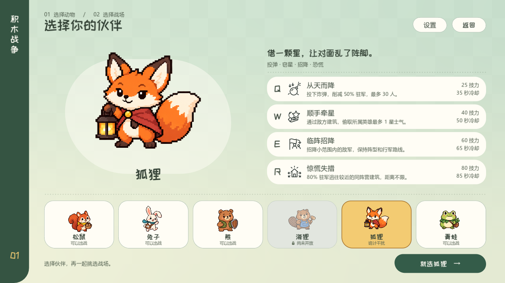

# 狐狸：四技能实装记录 · 2026-09-29

狐狸已开放给玩家、对手电脑和联机房间，图鉴包含四项技能与演示。沿用批准的像素狐狸立绘、现有四技能卡与拖拽松手施放方式；海狸仍为不可选占位。



[四技能原生渲染动画](art/fox_skills.mp4)：1280×720、正常速度、四格分别为 Q/W/E/R；较短片段在结束后保持末帧，不代表技能持续时间。

## 当前规则与费用

| 技能 | 技力 | 冷却 | 效果 |
| --- | ---: | ---: | --- |
| Q 从天而降 | 25 | 30 秒 | 敌方或中立建筑损失 `min(30, floor(当前人口 × 0.5))` 人 |
| W 顺手牵星 | 40 | 50 秒 | 从目标敌方建筑所属英雄转移最多 1 星士气给施法者 |
| E 临阵招降 | 60 | 65 秒 | 永久招降半径 3 米内施放瞬间的敌方露天行军 |
| R 惊慌失措 | 70 | 70 秒 | `floor(当前人口 × 0.8)` 名驻军逃向较近的同阵营建筑 |

2026-09-30 将 R 调整为 70 技力、70 秒冷却。当前开局 20 技力、前 100 秒自然恢复 1 点/秒，之后 2 点/秒；无其他收入或支出时，5 秒可支付 Q，50 秒可支付 R。满技力释放 R 后剩 30 点，可立即衔接 Q。

所有人口削减与转移使用整数，保留自然产兵的小数进度。目标无效不扣技力、不进入冷却；技能效果在松手当帧结算，表现动画不阻塞输入。以下美术、声音与首轮验证是首次实装时的记录，历史截图和审计结果不代表当前费用及冷却。

Q 不作用于自己或队友，不直接占领、不降级、不打断施工。普通攻防系数不修改固定人口削减；熊的无敌阻挡，链式防守分担整个人口伤害，例如 42 人遭到 21 点削减时，目标损失 10、支援建筑损失 11。削减后缩减尚未离营的预约，避免超额派兵。炸弹在真实模型屋顶上方生成，0.18 秒落下。

W 按实际显示的星数转移，不能把 1 星当作固定 500 分。供方 5 星、受方 0 星时，施法后为 4 星和 1 星；受方已有 4.75 星时最多取 0.25 星，对方也只失去 0.25 星。星数通过同一组非线性门槛分别换回双方积分，随即更新攻防和气势移速。只扣目标建筑所属英雄，不能扣其同盟队友；中立建筑、空士气或施法方满 5 星均拒绝。

E 按原行军命令拆分所选士兵，保持当前模型、位置、曲线、横向列位、行进距离、来源、目的地和持续状态。原队列未选中的人保持敌方归属，尚未出门和掘地等待的预约不被招降。新归属继续走原路线，进入自己或盟友建筑增援，进入敌方或中立建筑正常作战。已经飞出的友方炮弹不会再伤害改归同盟的士兵；敌方炮弹仍按现有受击规则生效。AI 只从可见敌兵选择落点，不能通过隐身坐标作弊。

R 寻找目标所属阵营的其他可达建筑，按真实路线长度排序，长度相同时以建筑 ID 稳定排序，最多选 3 座，以距离倒数分配整个人口。**没有距离上限**；唯一去处即使在地图另一端也会逃过去。逃兵仍属于原阵营，是实际行军，途中可被炮塔、火攻、招降等正常影响。目标原有的待出门预约先取消，逃兵人口只扣一次，已经出门的单位保持原命令。无同阵营可达去处、目标无敌或没有整个人口可转移时拒绝施放；链式防守不分担这种位移。

## 美术、原生效果与视觉检查

- Q：低面数铁球、铜箍、引信和微弱火星，短落体后衔接暖色冲击、碎屑与薄烟。
- W：有厚度的五角星沿短弧向己方飞去，轻旋转与金色尾迹；旋转范围保持星形可辨认。
- E：带阵营色的柔软小旗、快速扫纹与少量纸屑，实际士兵原地换色，阵型保持连贯。
- R：屋顶上方三枚错开的橙色惊叹号、向外扩散的断续纹，配合多路真实逃兵表现恐慌。

`fox_cast.tscn` 与 `fox_effects.tscn` 预先搭建 12 组实例和共享 GPU 粒子池，使用 MeshInstance3D、原生网格、CSGPolygon3D、GPUParticles3D 和空间着色器，不在游戏脚本内临时堆节点。读取可见模型的真实包围盒定位屋顶，避免高等级建筑吞掉模型；模拟时间驱动动画，暂停时粒子与着色器一起冻结。联机使用已验证的目标 ID 在远端取得同样的高度。

参考 Godot 官方文档：[3D 粒子](https://docs.godotengine.org/en/stable/classes/class_gpuparticles3d.html)、[粒子材质](https://docs.godotengine.org/en/stable/classes/class_particleprocessmaterial.html)、[球体网格](https://docs.godotengine.org/en/stable/classes/class_spheremesh.html)、[挤出多边形](https://docs.godotengine.org/en/stable/classes/class_csgpolygon3d.html)、[MultiMesh](https://docs.godotengine.org/en/stable/classes/class_multimesh.html)。四个图标延续既有 SVG 单色线条，不增加额外技能面板。

Godot 4.6.3 / Vulkan Forward+ 原生画面在未激活的独立 Windows 桌面捕获，使用 Dummy 音频，没有接管用户鼠标键盘或播放扬声器。复核四技能、选角、对手选择、HUD 与提示文字；修正了初版高层建筑遮挡和金星转至侧面的问题。

## 四个独立音效

仅新增四个技能声音，之前 52 个战役 WAV、UI 点击、两首 BGM 和混音总线字节不变。全部复用已核验的 CC0 音源，许可和具体材料见[来源说明](../assets/audio/CREDITS.md)及 `assets/audio/block_war/audio_manifest.json`。

| 声音 | 设计 | 默认设置 50 ms RMS | 真峰值 |
| --- | --- | ---: | ---: |
| Q | 很短的下落气流，180 ms 时接柔软重击；0.48 秒 | −26.83 dBFS | −19.07 dBTP |
| W | 一声收短的铃音与轻布料，无旋律；0.48 秒 | −29.61 dBFS | −18.10 dBTP |
| E | 小旗布料与很轻的锁扣；0.34 秒 | −29.70 dBFS | −14.33 dBTP |
| R | 两次低木敲与向外掠过的气流；0.54 秒 | −29.46 dBFS | −17.17 dBTP |

试听保留实际空间衰减、Combat 总线压缩和默认总音量 50%，不额外归一化；每段重复两次便于比较。使用静音原生总线采集与测量，未通过扬声器主观试听。


9 组采集没有丢帧；默认战斗叠加真峰值 −11.00 dBTP，总音量 100%、六方同时恐慌并叠加战斗/BGM 的压力片段为 −2.88 dBTP。测量细节见[数据](audio/fox/measurements.json)。这些数据约束响度和削波，音色喜好仍以实际试听为准。

## 验证与首轮平衡

最终狐狸专项 **211 项通过、0 失败**，覆盖整数损失、队友保护、无敌与链式防守、非线性星数转移、局部招降与阵型保留、飞行中炮弹归属、隐藏单位的 AI 视野、远距离逃亡、预约与人口守恒、四技能 AI 以及 JSON 快照恢复。

本轮集成检查另包括士气规则 395、士气 315、快照 1330、AI 技能 258、菜单流 54、角色音效触发 151、图鉴 1369 项通过；这些为狐狸接入期间各自运行时的结果，不替代之后其他任务对规则的修改验证。视觉回归包含图鉴原生截图；最后更新的费用与冷却在 1280 宽选角和提示中再次核对。

首次实装时做了 rift 单图、狐狸对松鼠/兔子/熊/青蛙分别交换出生点的 8 场 AI 首测，每场至 240 秒，并根据早期偷星与招降的收益提高 W/E 的费用和冷却。该次首测早于当前技力机制及 Q/R 调整，不代表新参数的对局结果。按上表当前费用与冷却，四技能连续轮转约需 3.56 技力/秒；W+E 消耗满槽，满技力使用 R 后余 30 点，可立即衔接 Q。R 保留 80% 驻军逃走和不限距离。

首测仍显示狐狸在这张地图上建立优势较快；6 场在 240 秒时未结束，不能把据点领先当成完整胜率，也不能宣称已达到 50% 平衡。短局未自然触发合适的 R 机会，受控进攻场景已验证 AI 会释放 R。后续平衡应覆盖其他地图、多人和真人决策，尤其观察招降的兵力双向收益；本轮未偷偷加入招降人数上限。

## 复现

```powershell
python tools/run_godot_private_desktop.py res://tests/block_war_fox_test.gd --headless --output .local/fox/test --timeout 55
python tools/run_godot_private_desktop.py res://tests/block_war_fox_visual.gd --output .local/fox/frames --timeout 150
python tools/run_godot_private_desktop.py res://tests/block_war_fox_audio_capture.gd --output .local/fox/audio --timeout 150
python tools/review_fox_audio.py .local/fox/audio
python tools/run_godot_private_desktop.py res://tests/block_war_fox_balance.gd --headless --output .local/fox/balance --timeout 180
python tools/build_network_manifest.py --check
```

四个声音可用 `python tools/build_war_audio.py --fox` 独立重建。验证辅助进程由私有桌面的 Job Object 回收；结束前另查进程，演示和试听保留在本文引用目录，原始帧、采集和隔离副本移除。
