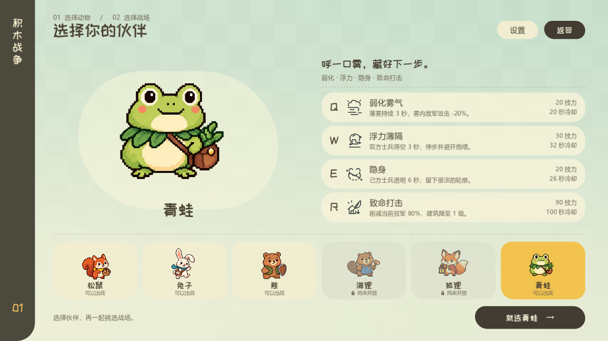

# 青蛙实装验收 · 2026-09-28

青蛙已开放玩家、对手及联队电脑选择；松鼠保持默认，海狸和狐狸继续占位。规则与首轮参数见[指挥官说明](block_war_commanders.md#06-青蛙干扰行军隐藏去向打击重兵据点已实装)。

## 实机表现

使用 Godot 4.6.3 的 Forward+ 原生渲染，在隔离 Windows 桌面以 Dummy 音频采集；没有切换桌面、发送系统输入或播放声音。最终渲染日志无错误。查看了 1280×720 和 1600×900 的选人、选图、四张下方卡片及悬停说明，近景和正常缩放的四种效果，以及起手、持续、落地/恢复和结束的逐帧画面。

[Q→W→E→R 连续演示（无声）](art/block_war_frog/skills.mp4)。单项：[弱化雾气](art/block_war_frog/q_mist.mp4)、[浮力薄隔](art/block_war_frog/float.mp4)、[隐身](art/block_war_frog/cloak.mp4)、[致命打击](art/block_war_frog/strike.mp4)。录像只在展示前后停留画面，技能过程按 24 帧/秒的实际模拟播放。

雾气保留可见但克制的灰绿厚度。浮力薄膜有反光、士兵真实离地，后续入圈者从下方继续走过；隐身使用极淡实体轮廓，去掉影子和暴露位置的附带拖尾。R 当帧变更驻军、等级，快速斜扫后沿打击方向留下少量叶屑，去掉初稿的整圈碎粒。没有新增或替换音频文件。

## 规则与回归

| 检查脚本 | 通过项 |
| --- | ---: |
| `block_war_frog_test.gd` | 109 |
| `block_war_menu_flow_test.gd` | 51 |
| `block_war_marches_test.gd` | 29 |
| `block_war_rabbit_rush_test.gd` | 73 |
| `block_war_tower_test.gd` | 131 |
| `block_war_exchange_test.gd` | 194 |
| `block_war_bear_test.gd` | 131 |
| `block_war_skill_energy_test.gd` | 295 |
| `block_war_morale_test.gd` | 109 |
| `block_war_fire_test.gd` | 60 |
| 合计 | **1182** |

以上未重复累计多次运行。期间工作区同步更新了兔子冲刺参数；青蛙专项与冲刺、换损、熊、气势和菜单回归已按更新后的参数复核，零断言失败。

专项覆盖：雾气只减敌方攻击、区域不叠加、敌我增援均不损人口、到期前后抵达与长短帧；敌我滞空、真实离地和三秒后续行、已出膛炮弹落空、恢复锁定、火攻和法术球依旧命中；自己士兵的隐身、正常锁定、透明池与普通池分离、影子及附带光效隐藏、暂停与六秒恢复；R 的敌方/中立目标、盟友拒绝、80% 整数减员、无敌拒绝且不收费、链式防守不分担、旧升级/转换取消、付款记录清除、出兵预约缩减；电脑四技能的真实收费，以及四按钮按住、拖动、松手的原生输入。

## 首轮对局观察

两张 1v1 地图分别对松鼠、兔子、熊，交换出生边，共 12 局，每局观察前 240 秒。使用双方电脑实际建造、派兵及技能逻辑。全部运行完成，但 12 局在观察窗口结束时均未分出胜负，因此不报告胜率。

本轮快照中，青蛙在裂谷对松鼠有一局 6:6、一局 8:5 的据点分布；在林湖对松鼠有一局 7:7、一局 3:11。对新版兔子的四局均暂时落后于对方据点数；对熊的四局为三局据点较多、一局相同。这只是短时间、固定电脑策略的观察，不足以据此增减伤害或宣称角色平衡。

R 每局使用 2—3 次，符合 100 秒冷却与积攒费用的约束；Q/W 都进入实际对局。E 仅在进攻玩家阵营时施放，其对真人观察的干扰价值无法由该电脑对局衡量。下一阶段实战重点是多人连续滞空、多个 R 集火高级据点、隐身在正常缩放下的辨认难度，以及大招与主动撤兵的博弈。

费用与冷却维持初版 `20/30/20/90` 和 `20/32/26/100`。原始结果及当时兔子攻击、范围参数见 [balance.json](art/block_war_frog/balance.json)，可通过 `tests/block_war_frog_balance.gd` 复跑；该脚本是对局观察工具，不是通过项统计的一部分。
