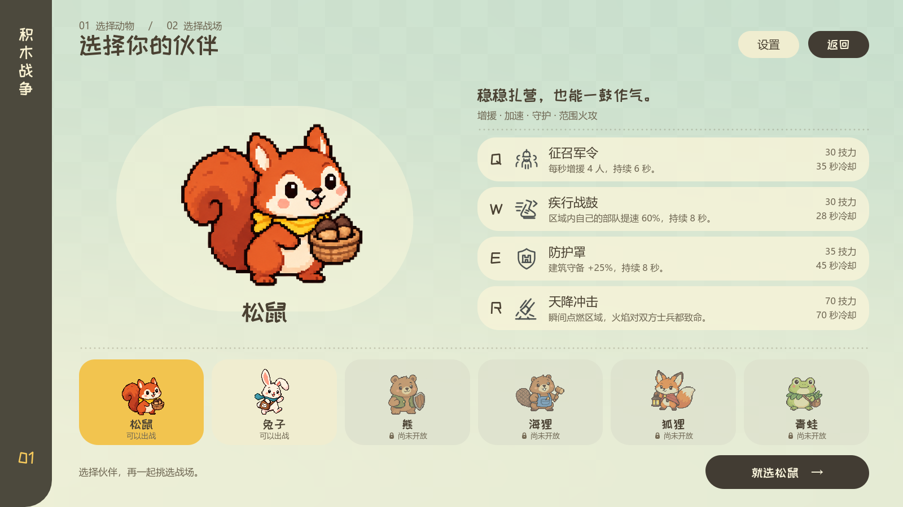
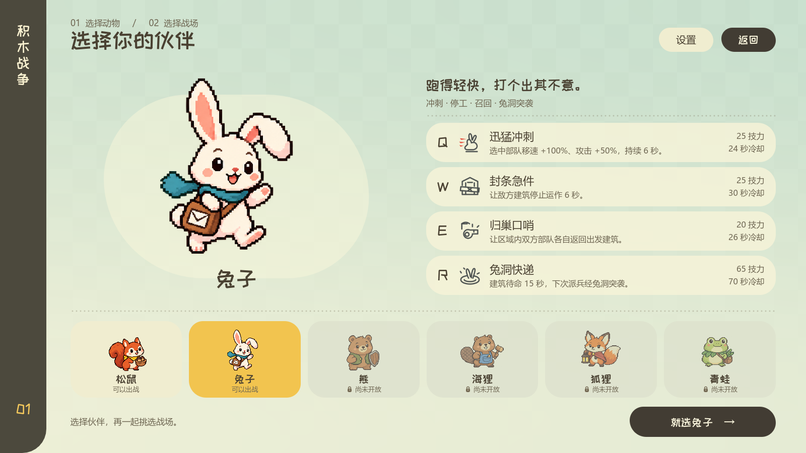
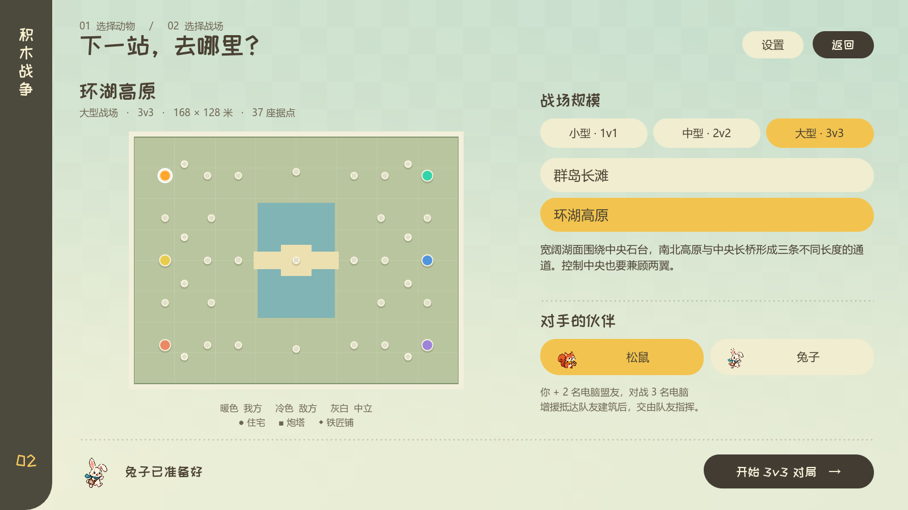
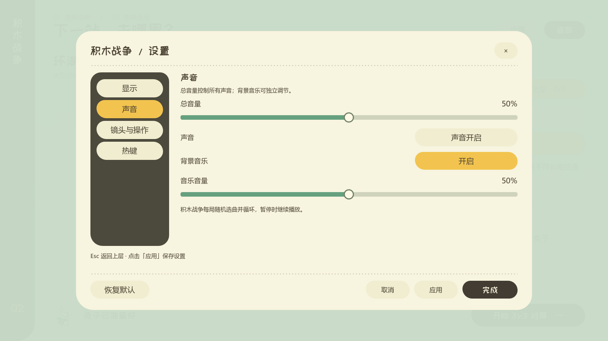
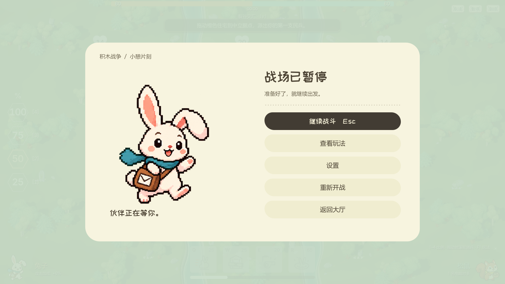
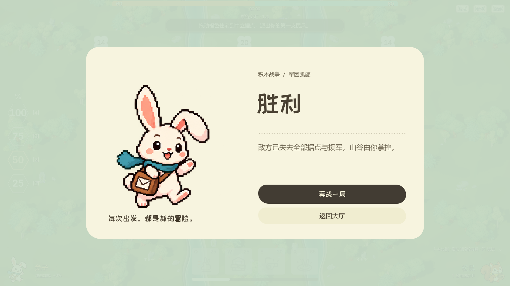

# 积木战争菜单改造

从大厅进入积木战争后，流程为「选择动物 → 选择战场 → 开始对局」。命令行 `--block-war` 保持直接进入战场。

## 动物选择

- 默认松鼠，可切换兔子。名称只使用动物种类。
- 熊、海狸、狐狸、青蛙保留已采用的像素立绘，显示「尚未开放」和锁标记。原生 Button 禁用且不接收键盘焦点，控制器也拒绝未实现的动物索引。
- 大立绘、四项技能、技力消耗和冷却同时显示；悬停可查看完整规则。图标、数值与描述使用当前技能规则。
- 地图页可以选择电脑使用的松鼠或兔子。返回上一步保留动物、地图和电脑选择；再战保留对局配置。

## 视觉与范围

参考暖白纸面、薄荷绿背景、深棕文字、柔黄选中态，使用轻微不对称圆角、点状分隔和留白。立绘保留透明背景与最近邻采样。

页面由 `.tscn` 中的原生 Control、Container、Button、TextureRect 组成；Theme / StyleBoxFlat 管理样式，背景使用轻量 canvas_item shader，切换立绘使用短 Tween。

新风格覆盖动物选择、战场选择、暂停、玩法、胜负与僵持结算，以及该模式中的设置、下拉菜单、悬停说明和显示设置确认弹窗。战斗中的技能栏、派兵比例、建筑操作、人口数字与战场渲染布局没有参与这次改造。

设置继续共用原有偏好与应用/取消逻辑，只在积木战争场景使用新 Theme。回到大厅恢复原主题；积木战争显示其实际快捷操作，不显示无关的第一人称选项。保留已校准的声音默认值与原有点击音。

## 验证

Godot 4.6.3，Dummy 音频驱动。自动输入只发送给测试 Viewport。Vulkan 截图通过私有 Windows 桌面运行，未切换用户窗口或发送系统输入。

| 检查 | 通过数 |
| --- | ---: |
| `block_war_menu_flow_test.gd`：入口、锁定、选择记忆、设置范围、暂停返回 | 45 |
| `block_war_map_select_test.gd`：六张地图启动与重开 | 54 |
| `settings_test.gd`：偏好、默认值、应用/取消、显示回滚 | 162 |
| `block_war_ui_stability_test.gd`：焦点、文字对比度、原战斗界面稳定性 | 29 |
| `block_war_input_test.gd`：原生鼠标/键盘与新入口流程 | 26 |
| `block_war_audio_feedback_test.gd`：技能和菜单声音事件 | 39 |
| `block_war_rabbit_integration_test.gd`：双方动物选择及技能集成 | 100 |
| **合计** | **455** |

`block_war_menu_visual.gd` 输出 19 张检查截图，涵盖 1600×900、1280×720、技能详情、设置四页及弹窗、暂停、玩法、三种结算状态和恢复后的大厅设置。代表性截图保存在 `docs/art/block_war_menus/`。

