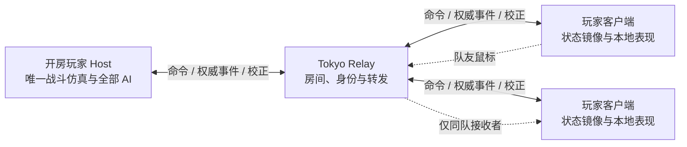

# 多人联机通信框架设计

日期：2026-09-29。本文保留最初框架设计，暂停与投降规则已按 1.2.0 更新；实装、部署与实测记录见 [实现文档](block_war_multiplayer_implementation.md)。最初源码审查基线为 `a42475a`，覆盖松鼠、兔子、熊、青蛙、士气、逐批出兵和六张地图。

用户已确定：**谁开房谁是 Host；Tokyo 服务器只提供 Relay；预留未来 Steam 传输替换；电脑能补到任意合法位置；只显示队友鼠标。** 本文中的频率、超时和带宽值是首轮验证起点，不是实测保证。

## 1. 总体选择

采用 **Host 唯一权威仿真 + 可靠的结果事件 + 低频状态校正 + 可恢复快照**。不使用各客户端独立结算的命令锁步，也不持续广播每个民兵的完整 Transform。

- Host 决定出兵人数、技能目标、生产、伤亡、占领、士气、电脑行为和胜负。Host 自己的输入也进同一命令队列。
- 客户端可以立即显示选中、拉线、范围预览、等待反馈；不得自行扣技力、改变真实驻军、判死、占领或触发胜负。
- Relay 决定房间成员身份、房主权限及消息可转发的收件人，不加载地图、不跑 AI、不校验战斗伤害。
- 持续行军按路线与权威时间本地播放；自然增长和倒计时从绝对状态锚点推算显示。每次规则变化由权威消息确认。
- 此架构以 Host 可信为前提，普通客户端不能伪造其他人的指令；它不提供针对恶意 Host 的竞技裁判能力。

## 2. 本仓库的接入阻碍

以下为审查时的关键位置，后续重构可能改变行号。

| 当前实现 | 联机必须处理的变化 |
| --- | --- |
| `block_war.gd:152–190` 从 `_process(delta)` 驱动仿真，内部按离营、施工、效果到期细分 | 外层固定 tick，只由 Host 执行；保留内部精确边界，网络发送频率另设 |
| `block_war.gd:190–248` 在规则步中调用 HUD、音频、GPU 特效 | 把规则结果输出为事件；视觉与声音订阅事件，不能影响规则时间 |
| `war_fire_wave.gd:10` 和 `war_effects.gd:41` 把火焰年龄、已命中建筑放在特效池 | 提取独立火焰状态与 effect_id；换画质、隐藏粒子、池复用不能改变伤害 |
| `war_marches.gd:22–57` 的订单和士兵为 RefCounted，删除会交换数组位置 | 新增稳定 order_id/unit_id；数组下标与 MultiMesh 槽位仅供本地渲染 |
| `block_war.gd:448–484` 和 `war_bear_skills.gd:138` 用对象引用锁定炮弹目标 | 线上使用 projectile_id/target_unit_id；预约、脱锁、落空、死亡均有明确状态 |
| `block_war.gd:15,99,105` 固定玩家 0，其他席位电脑，同队共用一个角色设置 | 改为席位清单、本地 faction_id、每席位角色与控制者 |
| `war_ai.gd:69` 升级直接改人口，出兵与技能走公共方法 | 玩家、Host、电脑统一进入命令执行入口，避免有些变化不进入事件流 |
| `_local_menu` 同时阻止仿真、出兵、技能和 AI | 多人模式分开“本地菜单打开”和“对局暂停”；Host 按 Esc 也不能停掉所有人 |
| `war_hud.gd:100,106`、`war_balance.gd`、`war_map_preview.gd` 将 0 当成你、其他当电脑 | 名称、攻防、技能账户、出生镜头、队伍面板和胜负都依据本地席位 |
| `war_marches.gd:372` 的 `get_units()` 只列暴露单位的部分字段 | 不能直接用作恢复快照，否则会丢预约、掘地等待、隐身、虚弱和炮弹锁定 |

现有规则没有发现依赖随机数的主要结算，但浮点积分、Curve3D 采样、同距索敌次序、士气即时变化都存在。已有长短帧测试不等于跨平台确定性证明；仅发送鼠标操作让每端重复模拟会有累计分歧。

## 3. 房间、位置与电脑

沿用地图的 1v1、2v2、3v3，两队共 2/4/6 个固定位置。每个位置可以放真人或电脑；位置不会因为换电脑、有人离开而自动重排。

身份必须分开：

| 字段 | 意义 |
| --- | --- |
| player_id | 房间内稳定的真人身份，重连不变 |
| transport_peer_id | 此次连接的原生 peer，重连可能变化 |
| slot_id / spawn_id | 房间位置及对应地图出生点 |
| faction_id | 建筑、行军、技力、士气使用的军团编号 |
| team_id | 队友判断与鼠标收件人过滤 |
| host_player_id | 开房者及战斗权威，不要求占第 0 位 |
| controller_kind / control_epoch | HUMAN、BOT、RECONNECTING 及控制权版本 |

首版仍让地图的交错 faction 对应两支固定队伍，明确保存 `slot → faction → team → spawn` 映射；房间移动玩家是换位置，不偷偷重写地图。协议不以 `% 2` 推断身份，规则层现有奇偶队伍判断逐步收敛到同一份映射。

- 房主可在任何未被真人占用的位置添加/移除电脑，给电脑选择已开放的角色。真人各自选角色、准备；已有真人的位置须先让其换位/离开，不静默覆盖。
- 例如房主可坐第 5 位，第 0 位放电脑；两个同队真人可以使用不同角色。电脑没有网络 peer，也没有共享鼠标。
- 第一版不引入不对称地图或自由混战。所选地图的所有参战位置需要由真人/电脑填满后开始；可提供房主主动点击的“空位补电脑”。
- 地图、席位、角色等战局配置变更产生 `room_revision`，清除真人准备状态。原子验证人数和位置，不让两个请求占同一位置。
- `MatchManifest` 锁定地图/路线/规则内容指纹、席位与角色、初始状态、match_id。全部真人加载并确认相同清单后，再启动倒计时和仿真。
- 第一版允许原玩家重连，不开放陌生人中途接管电脑。房间中任意位置补电脑与对局中的控制权移交是两种独立操作。

## 4. Tokyo Relay 与 Steam 边界

用户提供的截图显示入站 IPv4 UDP **42300–42399**。建议首个独立服务使用 **UDP 42300**，一个入口服务多个房间；ENet channel 是连接里的逻辑通道，不需要一个玩家/房间/通道占一个端口。其余端口留作测试、独立版本或后续实例。

部署配置来源为本机 `C:/Users/wh/Documents/.env` 中用户指定的 Tokyo 项；本轮仅确认文件存在，没有读取凭证、SSH 登录、启动监听或改变服务器。22 用于管理，不承载游戏数据。安全组放行不等于服务已监听或外网可用，部署阶段还需实际检查监听、系统防火墙和两台外网客户端连通性。不得覆盖 Bot Jump / Block RTS 已运行的服务。

建议独立 `block-conquest-relay` 服务、配置、日志和健康状态。客户端均主动连接公网入口，Host 家庭路由器不需要额外开放入站端口。

首选沿 Block RTS 使用 Godot 原生 `ENetConnection` / `ENetPacketPeer`，由 ENet 提供连接、确认重传与通道，不另造 UDP 可靠传输协议。应用层只有一个经过身份与房间检查的中继入口，不让客户端绕过它直发其他成员。不会启用 `SceneMultiplayer` 的自动客户端间转发；若后续换用 `ENetMultiplayerPeer` 高层封装，也必须关闭该自动转发。**传输服务端是 Relay，游戏权威是房间内的 Host**，不能用 `multiplayer.is_server()` 或高层网络里的 peer 1 判断谁有权结算战斗。

公网链路沿参考项目使用原生 DTLS，并验证预置/受信的 Relay 证书。完成受保护握手后才发送会话和重连凭证；ENet 的可靠 UDP 本身不提供加密或服务器身份认证。证书信任与轮换属于部署配置，私钥不进入客户端或仓库。

原生 API 顺序已核对：Relay 在 `create_host_bound` 后立即设置 `dtls_server_setup`；客户端先 `create_host`，再 `dtls_client_setup`，最后 `connect_to_host`。两侧配置 6 个通道并持续 `service(0)`，所有返回值正常后才进入下一阶段。使用校验主机名的 `TLSOptions.client`，不使用 `client_unsafe`。DTLS 是客户端与 Relay 每跳加密，不代替房间成员认证；低层连接句柄通过受控映射绑定 player_id，不引入固定 peer 1 的身份假设。

游戏只依赖传输接口，例如 `send_to_host`、`send_to_player`、`send_public_match`、`send_to_teammates` 和房间/连接信号：

- `RelayTransport` 负责 ENet 与中继信封。
- 未来 `SteamTransport` 映射 Steam Lobby、身份和原生可靠/不可靠消息；使用平台认证绑定玩家，不能信任客户端自报 SteamID。游戏命令、复制器、席位、AI、状态格式不改。
- Steam 接入时仍由开房者权威结算，直接给合法队友发鼠标；不能先广播给全房再让敌端隐藏。
- 现在不绑定具体 Steam 插件，也不实现 Steam 功能或 Host 自动迁移。

Relay 从实际连接绑定 `player_id`，由已确认的房间成员表确定收件人。客户端不能在消息里自称另一个 faction、Host 或队友。公共战斗包可由 Host 上传一次后扇出；私有账户、命令回执和鼠标按收件人投递。

## 5. 固定仿真与命令执行

推荐 Host **30 次/秒**固定外层仿真，与当前项目原生 physics 配置及 Block RTS 一致。继续在内部处理施工完成、离营、技能到期等精确子步；不把所有边界强行取整到 1/30 秒。性能不足应降低装饰和复制开销，再根据基准评估频率，不能直接丢弃未模拟的时间。

固定 tick 不要求 30 次/秒发全量状态。客户端渲染 30/60/144 FPS 均不改变仿真结果；慢客户端不阻塞 Host。Host 卡顿期间可有限分批追赶并显示延迟，所有人以同一条权威时间线为准。

统一命令：`Dispatch(source, target, percent)`、`Upgrade(building)`、`Convert(building, kind)`、`CastBuilding(skill, building)`、`CastGround(skill, xz)`。比例按钮本身是本地偏好，只随实际出兵指令发送。

每条命令包含 `match_id, control_epoch, command_seq, command_type, payload`：

1. Relay 验证连接身份、房间、消息类型、大小及合理的突发速率，给转发消息附可信发送者。
2. Host 验证控制权版本、顺序号、席位归属、比例、目标、地图边界、路线、人口、技力、冷却、对局阶段。
3. Host 在下一个固定 tick 开始时按接收序列执行。电脑和房主本人的命令使用同一入口与规则；电脑仍按原来的决策节奏思考，不因网络 tick 增加出手次数。
4. 返回 `CommandResult(command_seq, accepted/reason, applied_tick, event_seq)`。重传已处理的命令只重发回执，不能重复扣费或出兵。
5. 客户端画面里预览选中的单位仅供瞄准；真正技能命中集合由 Host 执行时的规则状态决定。首版不做回滚施法或回溯扣人口，不信任客户端自报时间来改写过去。

鼠标右键取消尚未提交的拖拽保持本地操作；已经确认发出的出兵指令不因一个迟到的“取消鼠标”被撤销。

## 6. 同步哪些内容、以什么频率发送

| 数据 | 同步方式 | 初始发送策略 |
| --- | --- | --- |
| 房间配置、准备、开始、控制权、结束 | 可靠版本事件 | 发生时发送 |
| 有效/无效命令结果 | 可靠回执 | Host 执行后立即发送 |
| 下令、预约、实际离营、伤亡、占领、升级/改建、技能命中 | 可靠权威事务 | 最迟该 tick 结束发出；同 tick 合批，无变化不发空事件 |
| 建筑真实人口/预约、阵营账户与规则状态 | 带版本的绝对锚点 | 规则事件携带涉及状态；常态 2 Hz 选择有变化的实体/字段组校正 |
| 路线上平稳行军 | 建立路线/状态时的基准 + 路程校正 | 常态 1–2 Hz；交战、门口拥堵和频繁变速群组可提高到 5 Hz |
| 技力恢复、自然产兵、冷却和效果倒计时 | 基准值、基准时间、增长率/结束时间 | 开始、速率改变、结束事件；客户端本地刷新显示 |
| 塔弹、法球 | 发射、脱锁、命中/落空事件 | 不持续同步每帧弹体位置 |
| 脚尘、步态、尾迹、音效与粒子 | 客户端从权威事件/状态生成 | 不同步每粒尘土，不保证粒子随机外观逐个相同 |
| 队友鼠标 | 可丢弃的小包 | 移动最多 30 Hz；静止 0.5 秒保活 |
| 时间同步、状态摘要 | 小包校时 / 可靠摘要 | 约 1 Hz 校时，约 2 秒一次规则状态摘要 |
| 完整恢复快照 | 可靠分块、原子安装 | 开局、重连、状态缺口无法追补时按需发送 |

频率指数据上网频率，不是画面刷新率；会按测量结果调整。后续校正不依赖上一份不可靠校正必达：每条包含实体 ID、字段组类型、该组版本、时间及该组的完整绝对值；关键变化仍在可靠事件中。建筑人口/预约/归属构成原子组，士兵路线/进度/等待状态构成运动组，技能账户构成另一组；独立组分别比较版本。不能因较新的停工时间包先到，就把较旧但仍需要的人口包按整座建筑版本丢弃。

## 7. 保持现有玩法精确一致

### 实际离营与人口

`population` 表示还在建筑里的真实驻军，`queued_population` 是其中已预约的子集。总人口计算不能把预约兵再算一次。Host 接受出兵只是建队列；每批真正出门时，将离营 ID、建筑人口/预约的新值放进同一个 `DepartureBatch`。

例如兔洞让 70 人建筑按 100% 下令：先预约最多 50 人，驻军仍为 70；掘地结束、士兵逐排实际出发才减少驻军。客户端不能收到出兵命令便提前显示 20。生产、受击、熊分摊、青蛙 R 或占领导致裁剪队列时，也把取消的 ID 与建筑新状态原子应用，避免重复扣兵或旧兵从新主人驻军里出发。

### 技能、士气和投射物

- 兔子冲刺、归巢、青蛙滞空/隐身：Host 广播实际受影响 unit_id 集合，不让各端按插值位置重新圈选。归巢保持 unit_id、换 order_id，保留原炮弹引用与持续状态。
- 兔洞待命、挖掘、出口、离营时间以及 50 人上限都是规则状态，洞口动画不决定出兵。
- 熊链式防守必须保留 `settled` 与 `damage_remainders`。两座建筑的损失、队列裁剪与连线结束同事务提交；不能只传取整后的人口。
- 熊震庭威慑提供 5 秒 +100% 技能防御，敌兵仍正常入城；法术球每 0.5 秒攻击 18 米内最多 3 名敌兵，优先选择最远目标。客户端必须依据权威状态展示真实到达与弹体命中，不自行延迟入城或结算伤亡。
- 青蛙雾气接触后的永久虚弱、入城前持续隐身、滞空及已出膛炮弹脱锁规则都要保留。当前“隐身”是透明表现及炮塔不可锁定，并非战争迷雾；首版不借联网暗改成敌端完全不知道这些单位。
- 士气点数、闲置计时和下一次衰减都进入规则状态。一次伤亡可立即改变后续士兵伤害；Host 保持既有规则顺序，客户端只应用结果。
- 塔弹和熊法球分别由 Host 索敌、预约和结算；脱锁时发最后落点，已死亡目标不重复结算。客户端播弹道与命中特效，不能凭动画触碰自行判死。

### 同步事务

`EventBatch(match_id, host_epoch, stream_id, tick, sim_time, first_seq, last_seq, transactions[])`；一个事务的伤亡、人口、预约、归属和士气变化全部安装后，才通知 HUD 刷新。人口/资源使用 Host 给出的最终绝对值，避免同时执行“本地增长 + 增量扣除 + 绝对校正”造成双算。

大量同类离营/死亡按 ID 区间、集合或位图批量编码；不为每个民兵单独发送一个 RPC。公共流使用全房相同的连续 public_seq，私有账户流按接收者各有 private_seq，不能混在一个全局序列里让其他人的私有消息造成假缺口。公共包因此可以只上传 Relay 一次后扇出。私人扣费事务注明所依赖的公共施法事务序号；客户端在依赖齐全后更新成功状态。字段组版本统一处理同 tick 多次变化，旧事件不得覆盖新锚点。

## 8. 状态模型与恢复清单

稳定 ID 使用 `(match_id, monotonic_id)`，unit/order/projectile/effect 各有明确类型。实际 ID 不复用，不依赖节点路径、数组下标、内存地址或 MultiMesh 序号。

| 范围 | 必须保留的权威状态 |
| --- | --- |
| 对局 | 协议/内容指纹、席位清单、运行阶段、tick/子步时间、事件基线、ID 分配器、胜利队伍 |
| 建筑 | ID、归属、种类、等级、完整小数人口、预约、施工目标/成本/截止时间、停工、兔洞待命、炮塔时钟 |
| 阵营 | 角色、技力、冷却、持续技能/征召目标、士气点数与衰减时钟 |
| 行军订单 | ID、源/目标、阵营、实际 strength、route_id、返程标志、兔洞离营距离、阵型/排队参数 |
| 士兵 | ID、order_id、路程、横列、待离营/延迟、离营序列、冲刺/滞空截止、隐身/虚弱、预约弹体、版本/死亡墓碑 |
| 区域与护盾 | effect_id、拥有方、中心/半径、倍率、起止时间、已受影响建筑/单位、建筑护盾 |
| 熊状态 | 连线两端、截止、累计分摊与小数余量；堡垒截止、下次法球时刻、门口阻挡 |
| 投射物 | ID、来源/拥有方、目标 ID、发射/结算时间、追踪状态、最后可见目标位置 |
| AI（仅 Host） | 决策时钟、下一次攻势/扩张/技能时刻；可派生缓存不入网络 |

路线沿用已烘焙的双向路径清单，开局比对地图、路线及相关规则内容指纹。正常派兵只发 route_id 和方向；若新增动态路线，可靠发送一次明确的控制点。版本不匹配拒绝开始，不能各自寻一条差不多的路。

以上为完整权威模型，不代表全部私有字段发给每个人。普通客户端镜像只收到其显示和还原运动所需的状态；本人技力/冷却仅向本人发，公开士气与部队状态按现有玩法显示。未公开的 AI 思考缓存不发。完整 Host 存档与按收件人裁剪的恢复镜像分开。

## 9. ENet 通道、序列与恢复屏障

使用原生可靠/不可靠传输，应用层只负责玩法版本、实体版本及事务边界。

| 逻辑通道 | 模式 | 内容 |
| --- | --- | --- |
| 0 | reliable | 房间、MatchManifest、加载/开局屏障、连接状态、恢复清单 |
| 1 | reliable | 玩家命令及命令回执 |
| 2 | reliable | 有序权威事件和状态摘要 |
| 3 | unreliable | 鼠标；按每个 player_id 的 cursor_seq 丢弃旧值 |
| 4 | unreliable | 运动/数值校正及校时；按实体的原子字段组版本取新值 |
| 5 | reliable | 恢复快照的限速分块 |

不可靠校正可能分包且包含不同实体，不能在一个 `unreliable_ordered` 流中让一份更新包淘汰另一个实体仍需要的旧包。鼠标也按玩家自带序列判断新旧，避免 Relay 同一连接汇集多个玩家时发生跨玩家比较。不同 channel 之间没有先后保证；优先级和发送预算由发送队列管理，开更多 channel 不会自动消除所有拥塞。

这里的 0–5 是自行划分的 6 个原生 ENet 通道。低层发送使用 `FLAG_RELIABLE`，或用于光标/校正的 `FLAG_UNSEQUENCED` 加应用层序列；不把高层 MultiplayerPeer 的 channel 0 自动分流约定套在 ENetConnection 上。

恢复流程：

1. Host 在一个已完成 tick 边界冻结逻辑快照副本，标记 snapshot_id、manifest、tick，以及公共/该收件人私有流各自的 seq 基线；继续正常仿真，不等待下载。
2. 接收端限量缓存基线之后的事件，组齐全部快照分块并校验长度/摘要。任何旧对局、旧控制权或旧 snapshot_id 数据均不得混入。
3. 原子替换镜像，再依序应用基线之后的事件。死亡墓碑或完整实体清单删除旧实体，旧插值帧不能把死兵复活。
4. ACK 完成且追赶到当前状态后，才允许恢复控制。若缓存超限/日志窗口已丢失，放弃本次镜像，请求更新快照，不能套一半继续玩。

跨 channel 的校正带事件依赖基线；必要事件尚未到齐时暂缓该校正。旧事件到达时按字段组版本和快照基线去重，不能回滚到更新锚点之前。任意跨实体的归属/队列/伤亡变化仍通过完整可靠事务确认，不能拆成各自独立的不可靠字段组。

约每 2 秒计算规范化状态摘要；只比较双方共同持有的复制字段，并区分“权威锚点数据”与“外推画面数据”。摘要注明事件流基线及所包含的字段组锚点版本，接收端保留短期版本窗口；对应版本未齐只能补齐/请求较新的基线，不能直接判为失步。到齐后才比较该版本的数据，不能把收到时刻的最新状态拿去比历史摘要。地图内容 hash 不能代替运行时状态摘要；位置量化、可见性和私有字段裁剪必须纳入摘要定义。

## 10. 延迟、画面与带宽预算

客户端维护 Host 模拟时钟偏移和 RTT，默认以约 80–120 ms 的可调缓冲播放远端运动；已确认的路线与状态可持续按 Host 时间播放，不把外推当作抵达或命中事实。正常 1–2 Hz 校正有 0.5–1 秒间隔，不能把这当断流。约 250 ms 异常窗口指“超过已约定的更新/心跳期限之后的额外延迟”或已发现的连续事件缺口；此时限制不确定部分的外推、提示并请求恢复。状态基线断层时跳到最新合理位置，不能补播几秒旧脚步与爆炸。

本地拖动、相机、范围预览始终即时；提交后显示待确认，收到 Host 结果才确认扣费和命中。敌我都会移动，因此 Host 接收时的真实圈选可能与玩家提交前的预览略有差异；首版明确这一点，不承诺零延迟或无成本回滚。

建议校正/快照分块单包载荷约 1 KiB 起测，结合 ENet/IPv4/IPv6 头部实测调整，避免大尺寸不可靠包在丢包环境下整批作废。可靠事务可分块但必须完整安装；装饰队列可丢弃，结算事件不能丢弃。

一个估算：若每单位路程校正记录约 10–16 字节，2000 名士兵全部按 2 Hz 校正就是 40–64 KB/s/收件人，尚未计入头部、事件和重传。因此必须合并同状态队列、分散校正时刻、优先误差大/状态改变的单位，不能把“低频”直接当成“低带宽”。稳定小队按订单共享锚点，个体横列、状态、堵门和偏差另外编码；不能为了省包抹掉逐兵差异。

首轮目标：常见 2000 兵战局平均每客户端约 64 KB/s 以内的战斗数据、单路鼠标约 2 KB/s 以内，恢复突发单独计量。只是预算，须以 6 人、拥挤交战、丢包与低带宽实测决定是否达标。传输压力升高时先降鼠标/装饰/非关键校正，不降低结算正确性。模拟性能与网络预算分别测量。

## 11. Bot Jump 风格的队友鼠标

保留 Bot Jump 的白色箭头、玩家颜色描边、昵称、按下圆环和平滑移动；外观适配现有 HUD 尺寸，覆盖层 `mouse_filter = IGNORE`，不挡选择、拖动、技能或相机操作。

战场发送 `match_id, presence_epoch, cursor_seq, world_x, world_z, visible, pressed`，Relay 从房间成员关系确定发送者和队友收件人；不信任包里声明的 team。每位接收者用自己的 Camera3D 投影，屏幕外/镜头后不显示，不锁边吸附成误导标记。

- 在地图上移动最多 30 Hz，无变化不发移动包，静止 0.5 秒保活。接收端使用类似 Bot Jump 的指数平滑，可从 `1 - exp(-24 * delta)` 起调。
- 进入下方技能按钮、菜单或其他 HUD，失焦、离开窗口、无有效地面落点时隐藏；不把技能按钮坐标错误投到战场上。
- 可用可靠的显示/隐藏 presence 事件及同版本鼠标包；新一轮显示提升 presence_epoch，旧包不能使已经隐藏的指针重新出现。超过约 1 秒无消息淡出，断线立即清掉按下环和指针。
- 同一房间的敌人不接收鼠标坐标，电脑不伪造鼠标。人数 6 时每个真人最多看两名真人队友的鼠标。
- 鼠标环只表示按下，不触发出兵或施法，也不代替权威成功反馈。首版不自动共享队友的精确技能瞄准、未提交派兵路线或私人菜单内容。
- 战局中队伍锁定；房间换队立即清除旧指针、更新转发名单。接收端再次核对本地队伍，旧 room_revision 包不得泄漏到新队伍。

Bot Jump 当前共享固定 1280×720 屏幕坐标、向全房广播；这两点必须改。若先经过敌方 Host 再转给队友，敌方 Host 已经得到原始鼠标，因此 Relay 直接按队扇出；这不需要 Relay 参与任何战斗计算。

## 12. 断线、菜单、房主离开

首轮建议沿用参考项目容易理解的时间窗口，后续可调：

- **非 Host 断线**：短暂保留原有指令和自动生产，约 10 秒后 Host 让 AI 接管该位置；对方可以在约 120 秒内凭短期重连身份恢复同一位置。既有军队、建筑、角色、技力、冷却、士气全部保留。
- **恢复真人控制**：先完成快照恢复，再在确定 tick 改 controller 并增加 control_epoch；AI 与真人不能同时下令，旧连接迟到包无效。电脑使用独立命令序列，不消耗真人重连序列。
- **Host 与 Relay 失联但进程还在**：Host 在线仿真进入网络暂停，客户端停止无限外推；约 30 秒内同一 Host 实例恢复连接、重新同步后继续。不能让 Host 离线继续打完，回来覆盖其他人的冻结状态。
- **Host 主动退出或进程丢失、超时未恢复**：首版结束对局并明确原因，不能称为另一队的战斗胜利。Relay 没有战局仿真，不能接替 Host；首版不承诺自动换房主继续。未来迁移要另做完整 Host 检查点、权限选举、AI 时钟及所有私有状态恢复。
- Esc/设置只是本地菜单，联网仿真、收包和队友画面继续。仍参战的任意真人可以通过菜单或原生 `pause` 映射（默认 F3）暂停／继续全局；投降者不能发起。规则时钟和动效冻结，通信、重连和投降处理继续。恢复不补算暂停时长。
- 投降者留下观战；房主投降不改变 Host 权威。建筑逐个、已出发部队按行军订单随机转给本侧剩余真人，建筑驻军立即乘以 0.6，待出发队列随建筑转交并裁剪至剩余人口。已在路上的军队不扣 40%，原士兵 ID、弹丸目标与增益保留。电脑和正在主动离房的人不接收资产。某侧全部真人投降即判负，即使电脑仍存活；开局纯电脑一侧仍按正常战斗结算。
- 非 Host 在进行中的对局主动离房视为投降。Relay 立即撤销连接和重连凭据，可靠保留 `forfeit_requested` 待办；Host 在下个权威边界完成交接并确认，暂停或 Host 断线不会丢失待办。大厅、加载与结果阶段按各自离房规则清理。临时断线继续保留上述电脑暂代与重连窗口。
- 重开是结果页返回房间、重新准备与新 match_id，不是一个客户端私自 reload 场景。普通玩家离开只影响其控制者，不能触发全房重开。

重连凭证仅进本机受保护存储/内存，不进公开日志或仓库。权限校验、有限数值、包大小、命令去重和突发限速都在协议入口完成；限速要容许可靠消息丢包重传后的集中到达，不能把正常网络抖动计为作弊。

## 13. 与 Godot 原生结构的结合

建议新增的角色职责（名称暂定）：`RoomSession`、`MatchCommands`、`MatchAuthority`、`MatchReplica`、`ReplicationCodec`、`TeammateCursors`、`RelayTransport`。不要求为每一层创建 Node：协议、编解码、数据模型优先 RefCounted/Resource；生命周期和界面使用已有 Session 与预搭 `.tscn` 节点。

在 `.tscn` 中预搭房间 UI、网络管理节点和最多 5 个远端指针槽，按实际队伍显示；民兵继续数组 + MultiMesh。`MultiplayerSynchronizer` / `MultiplayerSpawner` 可以用于适合的少量场景对象，但不把数千民兵改成每兵一个同步节点。先依据官方 API 与现有场景职责拆分，不堆动态探测和缺节点 fallback。

单机也逐步复用相同权威命令入口，只换成本地直达的 transport；规则测试不能只覆盖网络代码而让单机走另一份战斗规则。

## 14. 实施顺序与验收门槛

原始实施阶段如下；已经完成的检查与局限以实现文档记录为准：

1. **本地规则接缝**：稳定 ID、统一命令入口、local_faction/席位映射、固定 tick 与本地菜单分离、独立火焰规则状态；现有单机专项继续通过。
2. **可恢复复制闭环**：同一进程的内存 transport，Host + 多个只读镜像；规则事件、权威锚点、恢复基线、事务/墓碑；尚不需要公网服务。
3. **原生联机房间**：本机 Relay + 多个独立 Godot 进程验证 ENet、房间码、任意位置电脑、不同角色、准备/加载/开局、结果与断线恢复。
4. **队友鼠标与弱网**：真实不同镜头验证鼠标，对敌端捕获的应用消息确认无坐标；丢包、乱序、重复、带宽限制下校正/恢复和逐批扣人。
5. **Tokyo 部署**：独立服务配置、版本检查与日志，在真实两台外网设备验证，保留现有其他项目服务；完成后再称为公网联机可用。

重点测试矩阵：

| 场景 | 必须一致的结果 |
| --- | --- |
| 同建筑连续 50%/100% 指令、重发、被敌军击中 | 命令仅执行一次，预约不超额，驻军随实际离营减少 |
| 70 人兔洞出 50，掘地中易手/中蛙 R/熊分摊 | 未出门预约取消正确，无新主人替旧兵扣人口 |
| 同 tick 多方入城、分数驻军与士气跨星 | 相同归属、人口小数、士气和后续伤害 |
| 熊连线奇数伤亡、小数余量、震庭威慑到期与多目标弹体 | 恢复前后同样分摊；防御按时恢复，弹体预约、到达与死亡不重复结算 |
| 兔冲刺边界、归巢保持锁定；蛙永久隐身/虚弱 | 被选单位 ID、状态、命中/脱锁结果相同 |
| 飞行炮弹、火焰已命中集合、剩余 0.01 秒效果时恢复 | 不重放伤害，不丢尚未到期的效果 |
| 2/4/6 席位，真人非 0 位，Host 非 0 位，0 位电脑 | 所有权、技能账户、AI、相机、HUD、胜负均正确 |
| 六真人混合角色及真人/电脑混合 | 每军团独立资源，同队增援仍转给接收建筑主人 |
| 丢包 0/2/5/10%，抖动、乱序/重复，RTT 50/150/300 ms | Host 结果不变，事件可恢复，无人口重复扣除或死兵复活 |
| 30/60/144 FPS、Host/客户端短卡顿 | 时间不跳变，客户端帧率不影响规则 |
| 2000/4096 及超过初始 MultiMesh 容量的压力 | 测量 P95/P99、带宽与首次/最近更新时距，不静默截断单位 |
| 命令积压与大快照并发、恢复中断 | 控制事件不被装饰堵塞，快照只完整安装 |
| 不同镜头、HUD悬停、技能拖拽、失焦、敌方 Host | 队友鼠标指向同一世界位置，隐藏后不粘住，敌端无坐标包 |
| 旧 match/旧 controller/伪造身份/非有限坐标 | 不执行，不污染新对局，可靠重发只返回同一回执 |
| 非 Host 重连、Host 失联恢复/超时、Relay 重启 | 明确恢复或结束，不让两端各自继续产生不同结算 |

## 15. 参考依据

本机参考目录为 `C:/Users/wh/Documents/godot/`，均只读检查，没有复制部署凭证。

- Bot Jump：`bot-jump/scripts/shared_cursors.gd:41–48`（30 Hz、0.5 秒保活、固定屏幕坐标），`scripts/remote_pointer.gd:8`（指针外观与平滑），`scripts/online.gd:145`（独立不可靠通道），`server/relay.gd:184`（房间内广播）。借鉴外观和发送策略，改为世界坐标与仅队友路由。
- Block RTS：`Block-RTS/scripts/game.gd:157`（30 TPS Host），`scripts/match_commands.gd:23`（统一命令与权限），`scripts/network/match_replication.gd:11,214,325`（15 Hz 快照、按接收者裁剪、旧快照/删除处理），`scripts/network/relay_client.gd:405`（消息分流与预算），`server/relay_server.gd:431,558`（身份与重连）。借鉴权威、恢复和拥塞处理；本作利用预烘焙路线改用事件 + 低频校正。
- 不照搬 Block RTS 的 Host=owner 0 或开局按联盟重排位置；内容指纹也不当作运行时校验。其 15 Hz 全位置快照适合原有动态作战，不直接作为本项目的默认频率。
- Godot 官方：[高层多人、传输模式与通道](https://docs.godotengine.org/en/stable/tutorials/networking/high_level_multiplayer.html)、[MultiplayerPeer](https://docs.godotengine.org/en/stable/classes/class_multiplayerpeer.html)、[ENetMultiplayerPeer](https://docs.godotengine.org/en/stable/classes/class_enetmultiplayerpeer.html)。原生 ENet 仅 UDP；可靠有序只对同一逻辑流成立；不同 channel 不提供跨通道的因果顺序。
- 最终传输选型对应的官方 API：[ENetConnection](https://docs.godotengine.org/en/stable/classes/class_enetconnection.html)、[ENetPacketPeer](https://docs.godotengine.org/en/stable/classes/class_enetpacketpeer.html)、[TLSOptions](https://docs.godotengine.org/en/stable/classes/class_tlsoptions.html)、[SceneMultiplayer](https://docs.godotengine.org/en/stable/classes/class_scenemultiplayer.html)。选择低层原生 ENet 与 DTLS，绕开 SceneMultiplayer 自动转发，保留应用层唯一经过认证的房间路由。

以上为设计阶段的审查结论；实现阶段的架构、构建和验证入口见 [多人联机 1.1.0 实现与验证](block_war_multiplayer_implementation.md)。验收矩阵中的要求需以对应实测结果为准。
