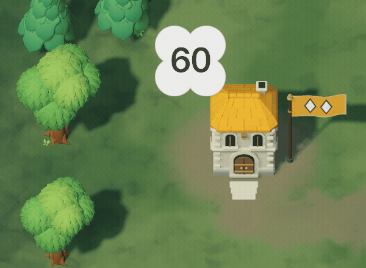
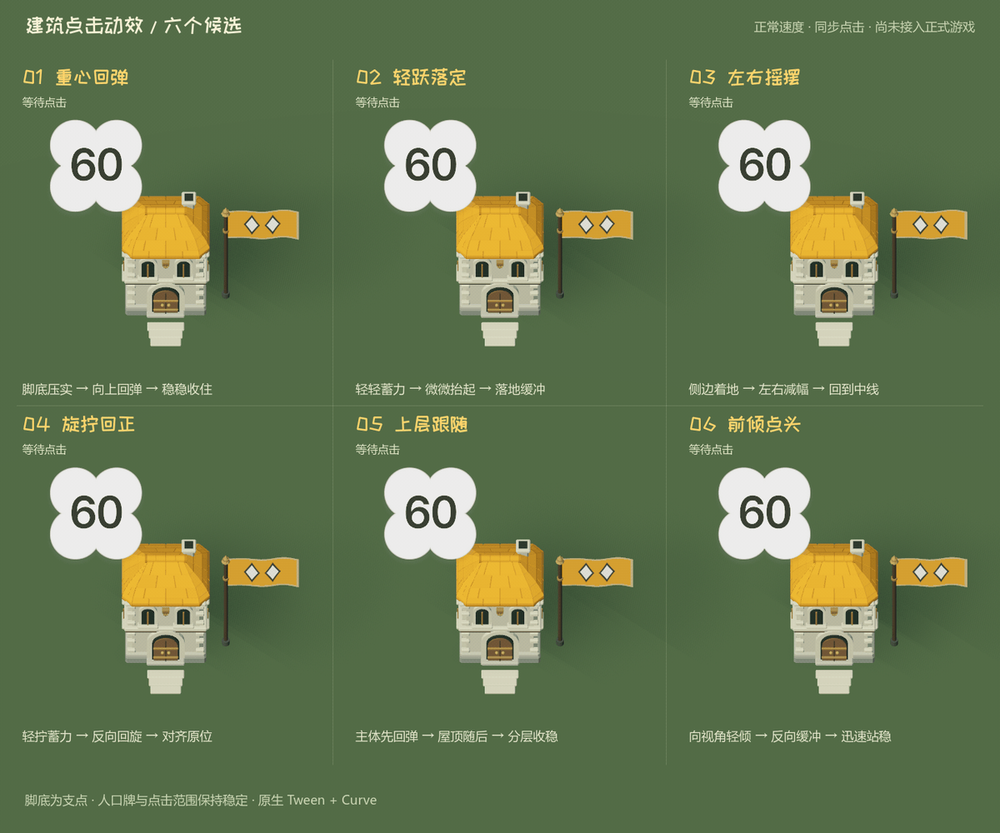

# 建筑点击动画：采用 01「重心回弹」

2026-09-23。用户选择 01「重心回弹」，已接入住宅、炮塔和铁匠铺的全部等级。正常速度实机录制如下；另外可查看[炮塔](art/selection_motion/live_01_tower.gif)和[铁匠铺](art/selection_motion/live_01_forge.gif)。



原六版比较使用当前二级住宅、材质与光照，由原生 Godot Tween 驱动 Curve 资源后直接录制。每个 GIF 为正常速度的 3 秒循环：第 0.6 秒同时点击，动作收稳后停留，再清除选择。下图保留选型时的候选录制。



| 编号 | 单独 GIF | 动作 | 收稳时间 |
| --- | --- | --- | --- |
| 01 | [重心回弹](art/selection_motion/01.gif) | 脚底压实，向上回弹，两次减幅后收住；上下伸缩时横向补偿体积 | 0.54 秒 |
| 02 | [轻跃落定](art/selection_motion/02.gif) | 轻微蓄力，抬起 0.25 米，落地压缩后回稳 | 0.62 秒 |
| 03 | [左右摇摆](art/selection_motion/03.gif) | 从脚底边缘左右摆动，逐次减幅回到中线 | 0.66 秒 |
| 04 | [旋拧回正](art/selection_motion/04.gif) | 绕竖轴轻拧、反向回旋，伴随少量纵向弹性 | 0.62 秒 |
| 05 | [上层跟随](art/selection_motion/05.gif) | 主体先弹，屋顶滞后跟随，分层收稳 | 0.68 秒 |
| 06 | [前倾点头](art/selection_motion/06.gif) | 朝相机轻倾，反向缓冲后迅速站稳 | 0.52 秒 |

已采用 01：脚底稳定，压实和回弹容易辨认，适合反复选择。02 更活泼，03/04 有更明显的方向感，05 强调屋顶惯性，06 最短促；这些版本仅保留在比较场景中。

## 实现边界

`tests/block_war_selection/review.tscn` 预先摆放六座建筑，曲线保存在 `presets/01.tres` 至 `06.tres`。预览只改变 `Building/Visual` 和 05 的屋顶局部位置，人口牌、点击碰撞区域和建筑世界位置保持固定。侧倾与前倾按接地边缘补偿高度，回弹保持近似体积，结束后回到作者原始变换。旗帜等环境待机动画在此预览中暂停，便于比较点击本身。

比较场景通过 `Tween.tween_method()` 采样，用 `Tween.custom_step()` 固定步进，六版同步且可重现。01 的曲线提取为正式资源 `assets/block_war/selection_rebound.tres`，游戏和比较预览共用同一条曲线；正式 `WarBuilding.set_selected()` 使用原生 Tween 播放 0.54 秒动作。

本体纵向先压缩至约 90%，上弹至约 107%，随后两次减幅收稳；横向随高度补偿，保持近似体积。快速点选会终止前一次 Tween，从当前高度平滑汇入首次压实，不回跳原位、不累积变形。取消选择立即隐藏选中圈，本体继续自然收稳。

占领、升级完成和改建完成终止选中回弹，从当前姿态开始原有完工动效；期间再点选只更新选中标记，避免两个 Tween 同时写入本体。炮管瞄准与后坐保留子节点控制，弹丸仍取实际变换后的炮口位置。暂停和战局结束冻结选中圈、本体、完工与后坐 Tween，节点退出时由 Godot 自动释放绑定 Tween。

原生能力参考：[Tween](https://docs.godotengine.org/en/stable/classes/class_tween.html)、[Curve](https://docs.godotengine.org/en/stable/classes/class_curve.html)、[Node3D](https://docs.godotengine.org/en/stable/classes/class_node3d.html)。

## 复现与验证

在仓库根目录执行（Godot 4.6、FFmpeg）：

```powershell
Godot --path . --script res://tests/block_war_selection/render.gd --fixed-fps 30 --audio-driver Dummy
./tests/block_war_selection/encode_gifs.ps1

# 正式游戏中的三类建筑（真实输入，自动完成后退出）
Godot --path . --script res://tests/block_war_selection/live_render.gd --fixed-fps 30 --audio-driver Dummy
./tests/block_war_selection/encode_gifs.ps1 -Live

# 动画衔接专项
Godot --headless --path . --script res://tests/block_war_selection_motion_test.gd --fixed-fps 60 --audio-driver Dummy
```

原生 PNG 帧输出至忽略的 `artifacts/block_war_selection/`；总览及六个单独 GIF 输出至本页的 `art/selection_motion/`。渲染入口附加 `--headless` 可仅执行动作检查，不输出图片。

本轮 36 项检查通过，覆盖六版动作幅度、完成时限、建筑及上层原位恢复、人口牌和点击区域稳定。人工检查动作关键帧与导出后的 GIF 画面，文字与模型不重叠。FFprobe 确认七个 GIF 都是 90 帧、3 秒；总览 1200×1000，单版 480×500。

正式接入后新增专项 74 项通过，覆盖全部十套等级模型的实际运动、固定锚点、体积、连点连续性、取消选择、原生暂停恢复、升级/改建/占领打断、炮管独立后坐及退出释放。施工 254 项、炮塔 127 项、原生输入 23 项与候选预览 36 项也通过，共 514 项。Vulkan 实机通过真实鼠标点击录制三类建筑各 90 帧，未调用预览动作控制器；对应 GIF 均为 600×440、正常速度、3 秒循环。
