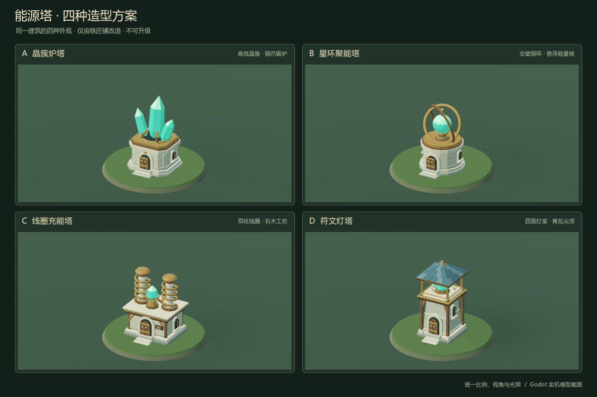

# 能源塔模型候选

## 当前阶段

本阶段制作四种真实 3D 建筑候选，并使用 Godot 原生场景、统一视角和光照截图，供用户选择。候选模型不接入对局，不改变现有建筑类型、技力恢复、派兵、占领奖励、改建入口或联机同步。

**先选模型，再接入玩法。** A—D 仅代表外观方向，具有相同的拟定玩法；当前没有默认选中方案。

| 编号 | 候选名称 | 外观方向 |
| --- | --- | --- |
| A | 晶簇炉塔 | 以炉体承托晶簇，突出可辨认的能量核心。 |
| B | 星环聚能塔 | 以环形结构围绕核心，突出聚能装置的轮廓。 |
| C | 线圈充能塔 | 以线圈和导能构件构成主体，突出充能设备的结构。 |
| D | 符文灯塔 | 以塔身、符文和顶部灯室构成主体，突出持续供能的灯塔形象。 |

这些描述限定比较方向，具体造型以候选模型和原生截图为准。转动、发光等展示动效不代表新增玩法效果。

## 已完成的模型与截图



[战场俯视角对照](art/energy_towers/energy_towers_battle_view.png) · [A 大图](art/energy_towers/a_detail.png) · [B 大图](art/energy_towers/b_detail.png) · [C 大图](art/energy_towers/c_detail.png) · [D 大图](art/energy_towers/d_detail.png)

四款均为可编辑的真实三维网格，发光核心独立为 `Glow` 材质组。已按现有建筑的 0.82 比例烘焙；A、B、C、D 的主体高度分别约为 4.08、3.57、3.55、4.26 米。圆形展示地台仅供比较，不属于建筑模型。D 的屋顶会遮住较多核心，A 与 C 在俯视角下仍直接展示能源装置。

候选的 `.glb`、原生 `.res` 网格与 `.tscn` 场景保存在 `tests/energy_towers/models/`，由现有发布规则排除。预览场景为 `tests/energy_towers/review.tscn`。无需修改正式建筑列表或网络内容清单。

重建步骤（使用已安装 numpy、trimesh 和 shapely 的 Python）：

```powershell
.local/architecture-venv/Scripts/python.exe tools/build_energy_tower_candidates.py
python tools/run_godot_private_desktop.py res://tools/bake_energy_tower_candidates.gd --output .local/energy-tower-review/bake --headless --timeout 30
python tools/run_godot_private_desktop.py res://tests/energy_towers/render.gd --output docs/art/energy_towers --timeout 55
```

最后一步原生渲染并输出两张对比图和四张单独近景，结束时关闭测试进程。截图经过完整布局及模型外观检查。

## 用户需求原文

> 能量塔，增加技力恢复速度。（首个提供每秒额外0.5技力，如果玩家拥有第二个则第二个提供0.25，第三个提供0.15，第四个往后提供0.1）如果从能源塔派出的士兵占领了某个敌方建筑，还会瞬间获得额外的10技力（不论玩家拥有多少个能量塔都不会影响这一项）这个建筑的获得方式是从铁匠铺改造，其他建筑不可 先建模多种能源塔并且截图供我挑选，该建筑类似铁匠铺无法升级

## 已确认的后续玩法

能源塔提高拥有者的技力恢复速度，每座塔提供的边际加成递减：

| 第几座能源塔 | 该座塔每秒额外提供的技力 | 对应总加成 |
| --- | --- | --- |
| 第 1 座 | +0.50 | +0.50 / 秒 |
| 第 2 座 | +0.25 | +0.75 / 秒 |
| 第 3 座 | +0.15 | +0.90 / 秒 |
| 第 4 座及以后 | 每座 +0.10 | 第 4 座为 +1.00 / 秒，此后每座再加 +0.10 / 秒 |

- 从能源塔派出的士兵占领敌方建筑时，立即获得额外 **10 点技力**。拥有的能源塔数量不改变这项奖励。
- 能源塔只能由铁匠铺改造获得，其他建筑不能直接改造为能源塔。
- 能源塔无法升级。

改造成本、改造耗时、改造回其他建筑的规则，以及部队经增援或转移后的来源认定等细节，用户尚未规定。本阶段不设定这些规则，也不自动套用现有其他建筑的改造参数。

## 与现有美术保持一致

现有建筑参考 `scenes/block_war/building.tscn`、`assets/models/block_war/architecture/` 与 `docs/art/block_war_rebuilt_buildings.png`。其特征是清楚的低多边形轮廓、分块石材、木件、少量金属、顶点色和受控的材质反光。现有石材与木材粗糙度约为 0.90，金属粗糙度为 0.60、金属度为 0.28；归属色主要用于屋顶、旗帜及装饰带。

读取现有 GLB 的位置边界可知，一级住宅主体占地约 2.70 × 2.55 米，最高点约为地面以上 2.68 米；铁匠铺主体约 2.74 × 2.36 米，最高点约 2.80 米。独立旗杆最高点约为 4.41 米。上述主体尺寸不包括旗帜、粒子与人口标记，候选应以这些比例为参考，避免仅靠大幅放大模型获得视觉优势。

## 原生预览建议

四张卡片分别使用场景内编排的 `SubViewportContainer → SubViewport → Node3D`。每个 `SubViewport` 启用 `own_world_3d`，并拥有自己的 `WorldEnvironment`、灯光、地台、候选模型与 `Camera3D`，避免四套场景互相照明或出现在同一相机内。

四个相机使用相同的正交投影、朝向、观察中心和 `size`，各卡片保持相同分辨率与宽高比。候选共用相同地台、材质基准及光照；可沿用 `woodland_daylight.tres` 与现有建筑评审场景的太阳方向。不要为每种模型分别缩放到填满画面，以保留真实比例差异。

静态截图可使用 `UPDATE_ONCE`；需要展示原生模型动画时使用 `UPDATE_ALWAYS`。截图应在渲染完成后读取视口纹理。候选比较场景不需要实例化完整对局或连接 Session 的玩法系统。

官方依据：

- [Viewport.own_world_3d](https://docs.godotengine.org/en/stable/classes/class_viewport.html#class-viewport-property-own-world-3d)：启用后，视口使用独立的 `World3D` 副本。
- [SubViewport](https://docs.godotengine.org/en/stable/classes/class_subviewport.html)：通过容器或视口纹理展示渲染结果，并提供单次或持续更新模式。
- [Camera3D 正交投影](https://docs.godotengine.org/en/stable/classes/class_camera3d.html#enum-camera3d-projectiontype)：物体不会因离相机的远近而改变屏幕尺寸，适合同条件模型比较。
