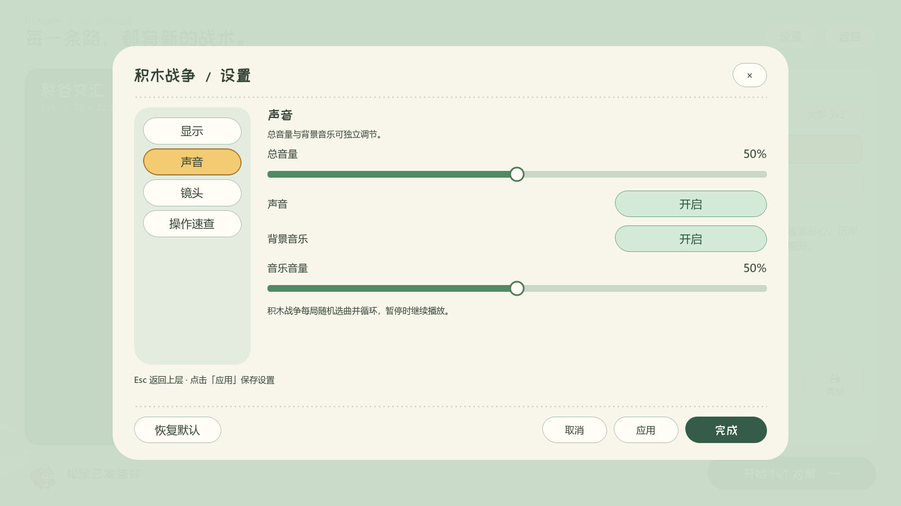
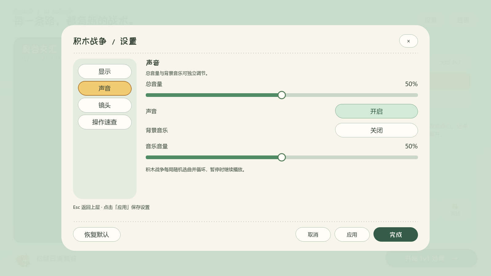
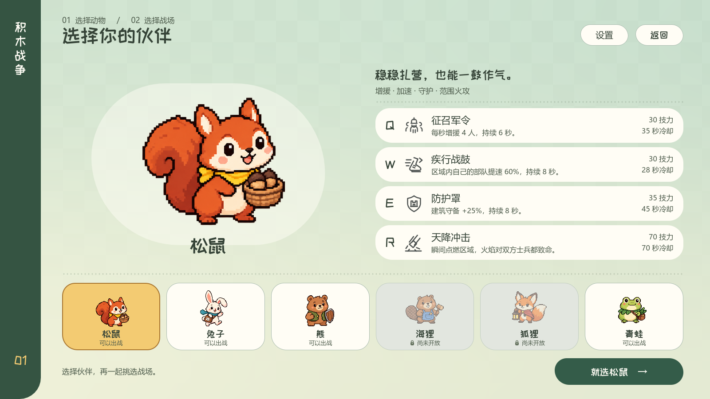
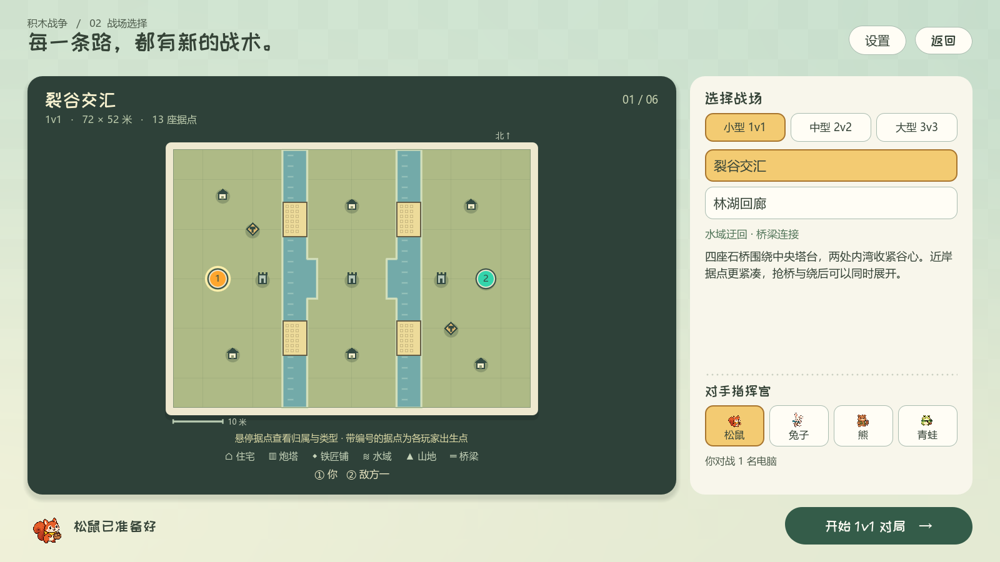

# 非战斗菜单配色检查

保留原有像素动物、字体、圆润轮廓和布局；统一主菜单、选人、选图及设置的按钮状态。

| 用途 | 底色 | 区分方式 |
| --- | --- | --- |
| 页面纸底 | `#F8F6EB` | 暖白，减少原来的黄灰混色 |
| 普通／关闭 | `#FFFDF5` | 浅绿细边，深绿文字 |
| 悬停 | `#E4F1E5` | 浅绿底与更清楚的边缘 |
| 当前分类／动物／地图 | `#F3CB72` | 麦黄色与较深描边；悬停保持黄色 |
| 功能开启 | `#D2EAD7` | 薄荷绿，文案统一为“开启” |
| 开始／完成 | `#345C49` | 深绿底、暖白文字 |
| 禁用角色 | `#E2E6DF` | 灰绿底、淡化立绘、锁与“尚未开放” |

声音开关过去直接绑定 `muted`，所以“声音开启”和“背景音乐开启”使用相反的选中颜色。现在按钮表示声音是否开启，只在写入设置草稿时取反；持久化字段、默认音量与实际音频行为保持原规则。

菜单交互使用主题提供的颜色，去掉额外的 RGB 提亮／压暗，保留原有 Tween 缩放。战斗按钮仍走原先的默认动画分支。共享菜单主题只用于 HUD 的暂停、帮助、结算等菜单层；战斗中的技能栏、建筑选项、部队提示及战场配色没有改动。

验证使用 Godot 4.6.3 / Forward+，通过 `tools/run_godot_private_desktop.py` 在独立后台桌面截图，Dummy 音频，不切换桌面或发送系统输入。

- `tests/menu_palette_visual.gd`：58 项检查，包含菜单原生按钮五种状态的文字对比度（均至少 4.5:1）、声音与音乐开启／关闭／混合状态、草稿取消恢复、悬停保持原定颜色；截图检查四个设置页、下拉、键盘焦点和 1600×900／1280×720 的布局。
- `tests/settings_test.gd`：37 项通过，验证设置应用、持久化和显示回退。
- `tests/ui_motion_test.gd`：36 项通过，验证原有动画、焦点和禁用状态行为。

保留四张最终实机截图，其余截图与测试日志为临时文件。

