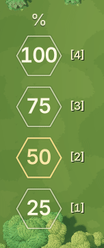

# 出兵比例选择器：独立透明轮廓

状态：用户已选定 **B 六角细框**，正式接入积木战争 HUD。保留独立竖排和透明内部，顶部仅使用 `%`，右侧继续显示 `[4] / [3] / [2] / [1]`。

## 正式版本

- `scenes/block_war/percentage_button.tscn` 是可复用的原生 Button 场景，由 `hud.tscn` 实例化四次，沿用原有 ButtonGroup、出兵信号、主键盘和小键盘输入。
- 每个六角选项为 70 × 62 px，间距 12 px；数字由 25 px 增至 28 px，快捷键为 15 px。标题和快捷键计入左侧区域的完整布局尺寸。
- 选中时暖金色在底部聚成小滴，沿左侧向上掠过，在顶部向两边迅速铺满细框。数字始终清晰，不参与位移动画。
- 完整切换为 **220 ms**：约 40 ms 聚拢、66 ms 上冲、94 ms 铺边、20 ms 收束。旧选项在 65 ms 内退回普通细线。连续输入立即打断前一次动画，重复刷新同一比例不重播。
- Shader 仅绘制抗锯齿边线、局部微光和小滴，选中后也不填充内部。每个实例通过 Godot CanvasItem 的实例参数独立驱动，同一材质不会串色。
- 动画使用原生 Tween，暂停或改变游戏速度不会拖慢界面反馈；隐藏或禁用按钮会收束当前动画。原生键盘焦点以第二道更细的内线提示。

2026-09-27 验证：`block_war_percentage_test.gd` 的 89 项 GPU 检查与 `block_war_dispatch_input_test.gd` 的 163 项无头输入检查通过。前者覆盖无信号更新、快速重选、材质隔离、暂停、隐藏和禁用；后者覆盖真实输入事件、拖动中的比例变化与 UI 遮挡。另在 1600 × 900、1280 × 720 下复查草地、树冠、水面和岸边，并录制 60 FPS 的实际 HUD 动画。

正常速度实拍：

原生 API 参考：[BaseButton](https://docs.godotengine.org/en/4.6/classes/class_basebutton.html)、[CanvasItem](https://docs.godotengine.org/en/4.6/classes/class_canvasitem.html)、[Tween](https://docs.godotengine.org/en/4.6/classes/class_tween.html)。

## 选型提案归档

`designs.html` 是自包含交互预览，使用当前林湖地图实拍。选项在普通、悬停和选中状态均无底色；没有连接线、共用底板、填充键帽或跨选项移动的高亮块。四个选项通过固定对齐、相同间距与简短的“出兵 %”共同说明归属。

## 四个方向

| 方案 | 轮廓 | 选中变化 | 取舍 |
| --- | --- | --- | --- |
| A 柔角菱形 | 柔化尖角的透明菱形 | 描边提亮、加粗至 2 px，并舒展 3% | 保留完整轮廓与柔和感，最接近原设计的轻量体验 |
| B 六角细框 | 平直顶边与斜侧边组成的细线六角形 | 线条提亮、加粗至 2 px，并舒展 3% | 三位数字周围余量较充足，几何感较明确 |
| C 四角留白 | 四段互不连接的短角线 | 角线从 11 px 延伸到 15 px，并加粗 | 透气感更强，围合感比 A、B 更弱 |
| D 数字短划 | 数字下方各自独立的短线 | 短线由 16 px 展开至 34 px | 装饰最少；可点击轮廓的提示也最弱 |

## 尺寸与交互

- 四版均自上而下排列 `100 / 75 / 50 / 25`，数字位置保持固定。数字 25 px，右侧 `[4] / [3] / [2] / [1]` 为 13 px 的透明文字提示。
- 每个独立点击区域为 94 × 54 px，选项间距 11 px；按钮组高 249 px，不含上方简短标签。视觉线条外的留白也可以点击。
- 主键盘与小键盘均保持 `1 → 25%`、`2 → 50%`、`3 → 75%`、`4 → 100%`，鼠标可以直接点选。
- 状态立即更新；180 ms 的颜色、线条长度或轮廓过渡可以被下一次输入打断。数字不位移，不滚动，不放大。
- 四版共享选中比例以便比较。没有自动循环或切换方案后自动播放；“播放切换”只演示一次 `25 → 50 → 75 → 100 → 75 → 50`。
- 保留原生键盘焦点与系统减少动态效果支持。预览设计控件可调整 120–260 ms 时长、阴影背景及减少动态效果。
- 数字与细线仅使用局部轻阴影帮助辨认复杂背景。未给透明 HUD 宣称固定对比度，实际效果需要在引擎内继续对照不同地图与光照。
- 预览标题、页脚、演示按钮和方案切换器不属于正式游戏 HUD；它们也不再使用大面积色块。

## 验证记录

2026-09-27，实际浏览器检查：

- 四版共 16 个鼠标选项和 32 次主键盘／小键盘切换通过；每版始终只有一个选中项。
- 核对每版容器及全部按钮的实际背景色均为完全透明，包含选中项。
- 736 px 与 320 px 内容宽度下均无横向溢出；各按钮均保持 54 px 点击高度。
- 在草地、树冠与石头附近实拍复查线条、数字和快捷键；数字未碰到菱形或六角形边缘。
- 演示可被数字键立即中断；一次完整演示结束后恢复 50% 并停止。
- 浏览器无脚本错误。本轮仅更新提案，没有修改 Godot HUD 或运行游戏验证。

以上 HTML 和浏览器记录保留选型时的四个方案；正式版本的尺寸与动效以上方说明及 Godot 场景为准。
