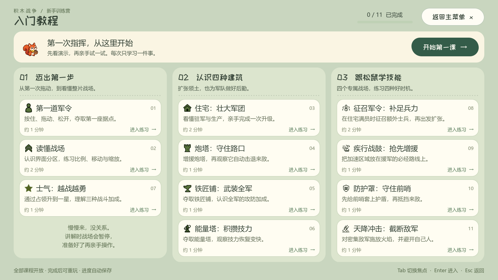
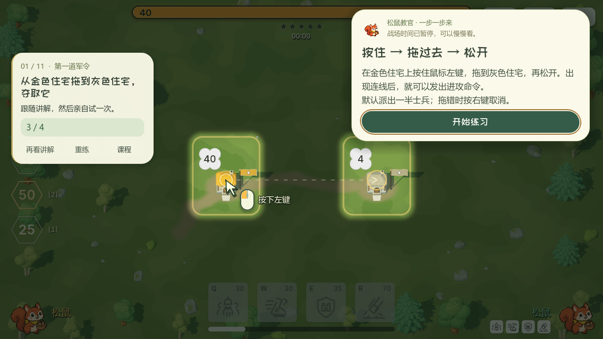

# 入门教程

主菜单新增「入门教程」，提供 11 个独立练习场景。课程按基础指挥、建筑、松鼠技能分组，全部开放，支持继续学习、单独重练和完成记录。进度保存于独立的 `user://tutorial_progress.cfg`，不覆盖单人选图、指挥官或联机偏好。

## 课程设计

| 课程 | 玩家实际完成的目标 |
| --- | --- |
| 第一道军令 | 看懂己方与中立旗帜、驻军数字，按住住宅拖到中立据点，等待真实占领 |
| 读懂战场 | 分区认识顶部战况、士气、技能与技力；点击 25%，滚轮缩放，中键拖动或方向键移动 |
| 住宅：壮大军团 | 认识自然生产和上限，点击升级，等待真实施工完成升至 2 级 |
| 炮塔：守住路口 | 从住宅增援炮塔，观察真实炮击，守住一波脚本编排的敌军 |
| 铁匠铺：武装全军 | 占领铁匠铺，获得真实全军攻防加成；说明它不产兵、不加移速 |
| 能量塔：积攒技力 | 占领能量塔，观察占领后实际恢复 5 点技力 |
| 士气：越战越勇 | 在临近一星的局面里占领据点，实际达到 500 点，再介绍一星攻防和移速倍率 |
| 征召军令：补足兵力 | 在自然满员的住宅上施放 Q，观察驻军达到 46，再派兵占领据点 |
| 疾行战鼓：抢先增援 | 先派兵，再向路上的援军施放 W；真实获得加速并抵达目标据点 |
| 防护罩：守住前哨 | 向己方前哨施放 E，随后放出敌军；确认护盾期间受到攻击并成功守住 |
| 天降冲击：截断敌军 | 将 R 拖向密集敌军，实际以火焰消灭至少 3 人；强调火焰也会伤到己军 |

每课的地图、建筑归属、驻军、装饰和道路独立保存为 `.tscn`。四种建筑和技能全部复用正式战斗的建筑、士兵、音效、特效和伤害规则，不以演示动画代替结算。关卡不启用自由决策的电脑，而是在必要节点下达真实敌军军令。

## 引导方式

讲解出现时冻结战斗模拟，包括生产、施工、技力、技能冷却、行军、炮弹与持续技能；讲解界面和鼠标动画继续播放。左上角始终显示当前目标、说明和本课步骤进度。柔和遮罩为目标建筑或界面分区留出带圆角的高亮窗口。

鼠标示范使用原生 `AnimationPlayer`：移到起点、按键高亮、按住移动、轨迹推进、目标脉冲、松开。左键拖动、中键拖动、点击和滚轮分别有对应图示与文字。示范指针不接收输入，练习必须由玩家自己完成。

四个技能练习在第一次有效施法前给玩家无限瞄准时间；部队不会在新手读懂操作前离开目标区域。士气课在正确派令前也不推进时间，避免教学初始士气因思考过久而衰减。进入下一步骤必须满足真实操作结果。

「再看讲解」暂停复习并保留目标累计进度；「重练」直接重建当前关卡，不必等待冷却；「课程」返回选课。重看讲解会恢复清晰的教学视野，专门练习缩放和移动时则保留玩家的镜头状态。Esc/F3 保留原生暂停菜单，返回后仍处于原来的讲解或练习阶段。

## 实现边界

- `scripts/tutorial/tutorial_catalog.gd`：课程名称、顺序、文案及步骤目标。
- `scripts/tutorial/tutorial_battle.gd`：继承正式战斗控制器，隔离课程初始化、输入范围、暂停和达成判据；不改正式战斗规则。
- `scenes/tutorial/maps/`：11 张独立场景；原生地图路由算法在小型练习地图加载时构建路线。
- `tutorial_overlay.tscn`：原生 CanvasLayer、Control、PanelContainer、Label、Button、Timer、AnimationPlayer。新教程的节点均保存在场景中；地图切换实例化完整的已编辑场景。
- `tutorial_progress.gd`：使用 Godot ConfigFile 只保存合法的课程完成 ID，未完成课程也可直接进入。

布局在 1600×900、1280×720、1024×576 的原生逻辑视口分别检查，并检查 1024×768 实际窗口的留边缩放和键盘导航。小屏降低密度、保留可读文字；说明卡避开目标建筑和操作轨迹；讲解百分比时目标卡移到按钮列右侧。提示条按文字重新计算高度，不覆盖整个左侧战场。

原生能力参考：[CanvasLayer](https://docs.godotengine.org/en/stable/classes/class_canvaslayer.html)、[Control](https://docs.godotengine.org/en/stable/classes/class_control.html)、[AnimationPlayer](https://docs.godotengine.org/en/stable/classes/class_animationplayer.html)、[PackedScene](https://docs.godotengine.org/en/stable/classes/class_packedscene.html)、[ConfigFile](https://docs.godotengine.org/en/stable/classes/class_configfile.html)。

## 验证记录（2026-09-30）

| 检查 | 结果 |
| --- | --- |
| `tests/tutorial_test.gd` | 162 项通过；原生鼠标逐关操作、11 关全部达成真实目标，讲解冻结资源、技能右键取消、独立保存进度 |
| `tests/tutorial_menu_test.gd` | 48 项通过；入口、11 卡片、开放状态、保存过滤、原生转场与返回焦点 |
| `tests/tutorial_navigation_test.gd` | 60 项通过；真实主菜单→选课→战斗→重进→完成→下一课导航，Esc/F3 与用户进度不受测试污染 |
| `tests/tutorial_boundaries_test.gd` | 27 项通过；失焦取消建筑/技能/中键拖动、暂停恢复、重看说明保留累计进度、长时间思考后的真实一星 |
| 地图路线 | 11 地图全部加载，42 条有向建筑路线可达，逐张原生截图检查 |
| 原生视觉 | 关键教学步骤 4 类 × 3 尺寸，目标建筑、操作按钮和说明完整可见；保存鼠标拖动动画录像 |
| PCK 资源检查 | 11 个地图、教程脚本和讲解覆盖层从实际导出资源包加载成功，初始讲解均暂停 |

检查在隔离 Windows 桌面执行，临时进度使用独立路径；不控制或关闭用户的正常编辑器。音频使用 Dummy 驱动。辅助进程在任务结束前通过 CIM 核实退出。

本次只新增本地教程入口与独立课程模块，没有修改联机战斗协议或中继服务。

## 预览





[原生鼠标引导动画](art/tutorial/drag_guide.mp4)

复验入口示例：

```powershell
python tools/run_godot_private_desktop.py res://tests/tutorial_test.gd --output .local/tutorial/review --godot .local/network/runtime/Godot_v4.7.2-stable_win64_console.exe --timeout 240
python tools/run_godot_private_desktop.py res://tests/tutorial_boundaries_test.gd --output .local/tutorial/boundaries --godot .local/network/runtime/Godot_v4.7.2-stable_win64_console.exe --timeout 115
```
