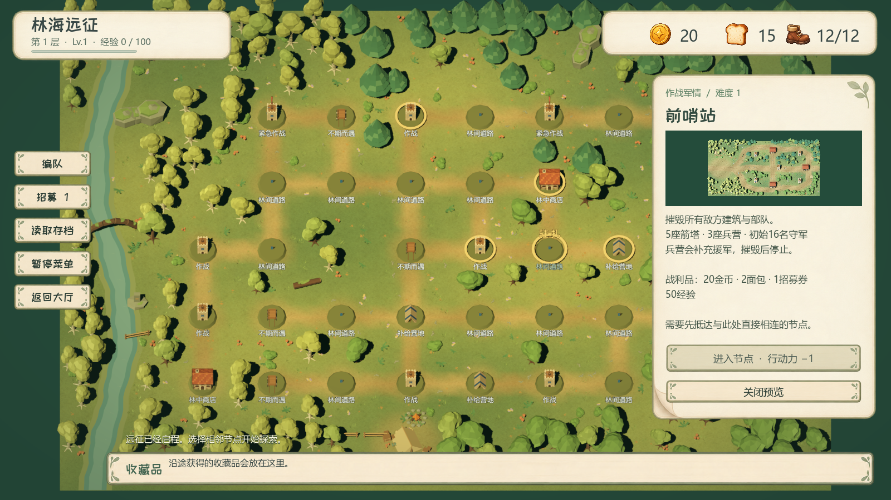
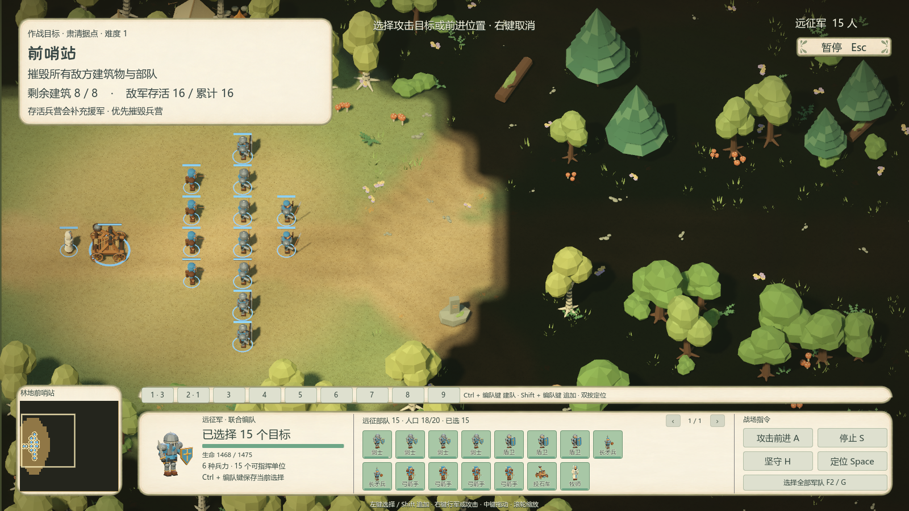

# 林海远征：森林、作战面板与守军更新

日期：2026-09-14。Godot 4.6.3 / Forward+，游戏版本0.15.0。本次交付在 `542a772` 基础上加入本任务文件，包含已提交的弩手更新，通过独立快照验证与导出；其余工作区修改未混入此包。前一核心版本的隔离对照保留在原始数据中，最终判断使用当前已提交核心的结果。

## 内容清单

- 恢复完整的底部 RTS 主面板：小地图、选中单位模型、生命与属性、每个在场单位的头像和血量、分页、1–9 快捷编组及攻击前进/停止/坚守/定位。继续使用原来的 RTS 选择和编组操作，待命名册仍在探索编队页管理。
- 前哨站复用普通 PvE 的 `SkirmishBot` 视野记忆、目标选择和编队命令。守军从禁止追击的 HOLD 改为可反击的驻守；受袭时附近部队会支援，视野外炮击触发沿已知路线侦察，不读取隐藏敌人的当前位置。
- 存活兵营生产援军，新兵集结后搜索进攻。摧毁兵营即停止生产；开场、暂停和结算期间不会生产；上限时丢弃当次增援。当前和累计敌军数分别显示，胜利条件覆盖所有新兵。开场字幕和地图简报同步说明增援机制。
- 三张完整原生景观：探索溪谷、横向前哨站、四路围剿营地。包含四种树、蕨草、灌木、花、蘑菇、苔石、树桩、倒木、根拱、帐篷、围栏、营地物资等。24 个 ArrayMesh 模型均有独立 `.tscn`，21 个 MultiMesh 资源保存小植被实例。
- 地面采用每米网格的草土绘色、绕行道路、空地和车辙，叠加生图工具生成的手绘地表纹理。探索场景按实际相机视角给 34 个节点、37 条道路留出树冠投影净空。节点预览直接复用相同森林景观。
- 金币、吐司、鞋子替换为统一卡通透明 PNG，按原生 Alpha 裁切和透明补边，TextureRect 等比显示；删除三套旧模型图标。





## 验证

以下运行于独立快照，脚本均正常退出。核心更新至542a772后，作战HUD、守军AI、战斗规则、地图交互及Windows产物再次检查通过；相同景观/主题资源的其余检查保留原隔离快照结果。GPU截图已人工检查；1280×720、1600×900、1920×1080的文字、头像、编组和按钮可见，浅底上的交互文字保留深色。

| 检查 | 结果 | 重点 |
|---|---:|---|
| 作战 HUD | 165/165 | 原生鼠标与 Shift/Ctrl 选择、编组、持续点击、翻页、单位死亡刷新、三种分辨率 |
| 守军 AI | 34/34 | 反击/支援/侦察、视野约束、集结、兵营时序、上限、死亡/暂停/结束后停止生产、紧急属性 |
| 战斗规则 | 32/32 | 普通/紧急胜负、实际导航、开场、围剿波次及基地唯一失败条件 |
| 森林资源与 GPU | 85/85 | 原生模型、顶点颜色、UV/mipmap、真实 MultiMesh 变换、节点投影净空、每米导航和入口可达 |
| 原生地图交互 | 52/52 | 点击节点、平移缩放、商店/事件/营地、编队招募与三种窗口大小 |
| 场景与存档衔接 | 30/30 | 地图→战斗→结算→围剿→读档→层间休整 |
| 全界面样式 | 573/573 | 文本安全区、装饰边角、三种分辨率的地图/招募/编队/简报 |
| Windows 包内容 | 252/252 | 107 项内容清单、资源值与哈希、原有六张地图；不等同联机测试 |
| Windows EXE 肉鸽流程 | 13/13 | 实际启动远征、军队、两张战场、结算、存读档和层间页 |

另有 10 项地形静态审计通过：前哨站 5326、围剿 4125 个 1m² 导航源面，按重炮 1.15m 半径和建筑占地扩大障碍后仍连通，建筑/守军/入口 Marker3D 保持原坐标。

独立 Windows 包：`builds/积木争霸-林海远征更新-Windows-x64.zip`。发布内容清单 SHA256 为 `0ab5215990c524413e401571a7696de4c2243d6f77370672446560abf9230a20`；所有上述检查的错误日志为空。

## 实战与限制

[当前已提交核心的实测](rogue-forest-refresh/final-balance.json) 包括参数与种子；[旧核心调参对照](rogue-forest-refresh/balance.json) 和[旧核心战略对照](rogue-forest-refresh/paired-strategies.json)仅作历史记录。使用正式导航、动画和弹道，没有注入伤害或强制胜利。统一远程战略、1级、18/20人口、种子24681；自动驾驶每3秒给单位最近目标下达攻击前进，支援单位随军。它会分散推进，不等同玩家集中兵力和拉扯。

首次生产从35秒延后到50秒、每营间隔从32秒改45秒；箭塔生命360→320，兵营520→440。保留5塔3营、初始16名普通守军、同时存活上限28、6秒兵营错峰、原攻击与护甲以及反击AI。调后普通前哨站：

| 初军 | 结果 | 耗时 | 阵亡/初军 | 兵营生产 |
|---|---|---:|---:|---:|
| 稳阵 | 失败 | 83.8秒 | 15/15 | 3 |
| 远射 | 胜利 | 125.0秒 | 11/16 | 3 |
| 机动 | 失败 | 82.1秒 | 16/16 | 3 |

围剿保持1800基地生命、150秒和原7波。相同远程战略下，未经成长的稳阵初军坚守150秒获胜，士兵全灭但基地剩64生命；远射初军同样获胜，剩6名士兵和6基地生命；机动初军在137.7秒基地被毁、士兵全灭。围剿本应在探索和成长后挑战，这些是裸初军压力样本。

**功能检查通过不代表平衡定稿。** 新AI明显增加了对兵种搭配与指挥的要求；普通首战的稳阵/机动自动样本仍偏难，围剿获胜样本也只剩很少基地生命。尚需玩家操作、更多种子、不同战略及成长组合的后续调平衡；本报告不推导胜率或低配置设备性能。

## 复现与资源编辑

```powershell
& 'C:/Program Files/Godot/Godot_console.exe' --path . --audio-driver Dummy --script res://tests/rogue_battle_hud_test.gd
& 'C:/Program Files/Godot/Godot_console.exe' --headless --path . --audio-driver Dummy --script res://tests/rogue_outpost_ai_test.gd
& 'C:/Program Files/Godot/Godot_console.exe' --path . --audio-driver Dummy --script res://tests/rogue_forest_test.gd
& 'C:/Program Files/Godot/Godot_console.exe' --headless --path . --audio-driver Dummy --script res://tests/rogue_outpost_balance.gd
& 'C:/Program Files/Godot/Godot_console.exe' --headless --path . --audio-driver Dummy --script res://tests/rogue_battle_balance.gd -- --siege-only --active-defense
```

关卡参数位于 `data/rogue/battles/outpost.tres`。景观与生成入口见 [美术资源说明](../assets/models/environment/rogue_forest/README.md)。`tools/build_rogue_presentation.py --map-only --preview-only` 只更新探索主场景和节点预览；`tools/build_rogue_icons.py` 从保留的原始透明图重新切出三种资源图标。
