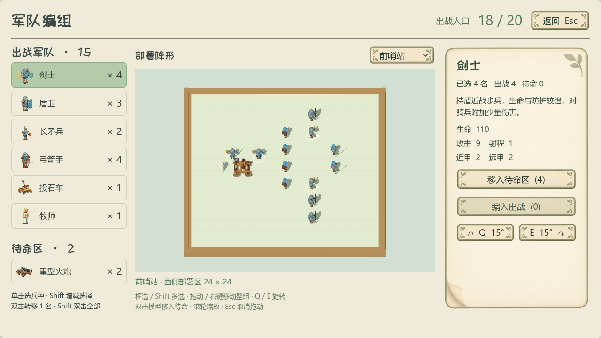
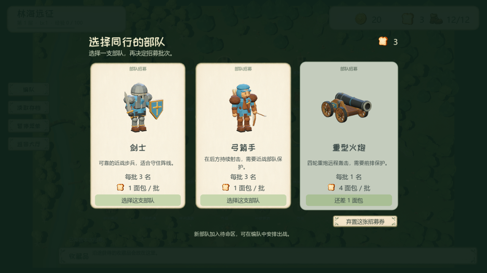
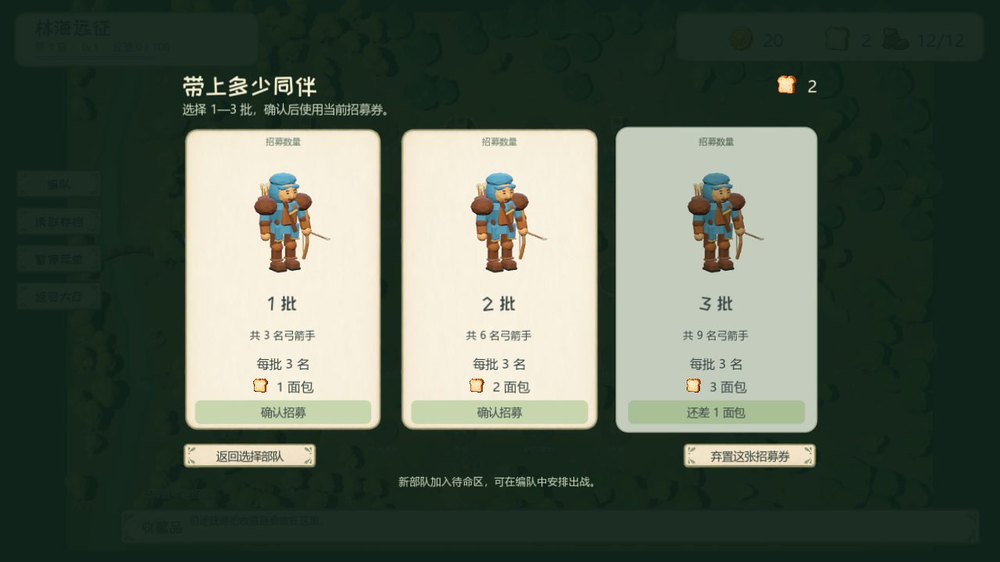
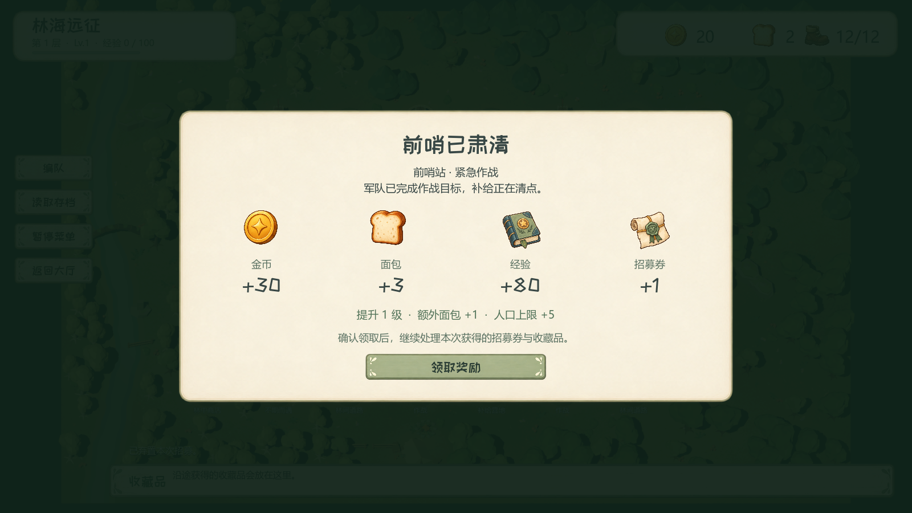

# 编队与即时招募更新

日期：2026-09-14。Godot 4.6.3 / Forward+，基于已提交的 `78b46b1` 核心。仅加入本次编队、招募、结算及对应图像、测试、文档；已有大厅、单位数值、竞技地图和工程设置的工作区修改保留，不混入发布包。

## 内容清单

- 出战/待命各自按兵种合并，显示模型头像和人数；根据行数分配空间，1280×720可以完整查看默认六种出战兵种及一种待命兵种。删除逐单位编号与人口重复文案，仅顶部显示总人口。
- 阵地原生射线拾取、框选、Shift/Ctrl追加选择、整组拖动、右键定位、Q/E绕中心旋转；双击模型转移该单位，双击名册转移1名，Shift双击名册转移该兵种全部。当前选择也可用按钮整体转移。两张战场分别记忆阵位；超人口、越界、碰撞、基地占地及存档失败均整体回滚。
- 招募券获得后立即使用：第一轮三选一兵种，第二轮三选一批数；可返回重选固定候选，明确弃置后结束，不能囤券。面包不足的卡片灰显，保留清楚的文字和差额。商店买券的金币不会因弃置退回。
- 前哨胜利的战利品页列出金币、面包、经验、招募券及升级额外收益；确认领取后自动招募，紧急作战再选收藏品，处理完成后退出节点。围剿仅显示行动力恢复和层间整备。
- 新增原生透明的招募文书、经验手册图标；卡牌采用柔和纸张、森林色背景、模型插画、轻微悬浮及两轮翻牌。灰态正文仍使用深色，背景遮罩保证标题与森林场景分离。
- 存档内部版本升至2，自动迁移版本1已有券，保留候选与顺序。开局/迁移券的每轮选择持久化；节点内的招募和战利品仍遵循最近完整节点检查点。写盘失败回滚内存并可重试，领奖与扣费都由状态层防重复。

## 操作预览

## 验证

| 检查 | 结果 | 覆盖 |
|---|---:|---|
| 规则与存档 | 776/776 | 固定候选、v1迁移、两轮成本、弓兵/加农炮批量、AP0完整处理、重复操作、批量布阵、磁盘失败回滚 |
| 原生编队GUI | 80/80 | 实际鼠标框选与双击、组移动/旋转、外部释放、非法阵位、三种分辨率 |
| 地图流程 | 54/54 | 自动招募、购买后回店、弃置确认/取消、暂停焦点及后台阻断、全部节点 |
| 实际场景转场 | 48/48 | 普通/紧急胜利→战利品→招募→藏品→围剿→失败读档→层间整备 |

最终组件、视觉及导出检查记录见同目录 `validation.json`。规则、转场和流程在基于已提交核心的独立快照再次验证。真实战斗结果在转场和导出测试中通过结算接口注入，这些检查验证连接与资源，不代表新一轮平衡实战；本次未修改战场数值。

复现入口：`tests/rogue_state_test.gd`、`rogue_army_ui_test.gd`、`rogue_reward_components_test.gd`、`rogue_flow_test.gd`、`rogue_transition_test.gd`、`rogue_style_capture.gd`、`rogue_interaction_color_test.gd`。前五个功能测试使用独立测试存档，视觉测试只操作内存；测试结束自行退出，不接触玩家存档。

## 原生资源与交付

`scenes/rogue/army_panel.tscn`、`army_board.tscn`、`army_group_row.tscn`、`army_unit_marker.tscn`为编辑器可直接调整的编队结构；`recruit_overlay.tscn`与`victory_rewards.tscn`为独立完整界面。地图实例化它们并连接Session命令，界面本身不持有经济规则。

招募券、经验图的原始透明生成图保留于`assets/ui/medieval/icons/rogue/source/recruit_rewards.png`；`tools/build_rogue_icons.py`只按固定格子切割、裁透明边并补透明留白，不通过背景颜色猜测Alpha。卡牌布局与翻牌节奏参考本地arc-nice的luoxi商人选择场景，按三张卡牌重新布局。

Windows包：`builds/积木争霸-编队与招募更新-Windows-x64.zip`，解压后运行`积木争霸.exe`。新存档可载入本项目版本1的远征；完成迁移后保存版本2。
